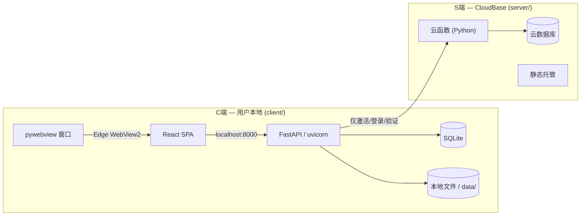

# CLAUDE.md

This file provides guidance to Claude Code (claude.ai/code) when working with code in this repository.

## Project

AI Novel (爱小说) — multi-user web platform for AI-assisted long-form novel writing. Users register, create novel projects, and work through a 6-phase workflow (init → settings → outline → prompt → write → archive) with AI, billed by token usage.

## how to work
Behavioral guidelines to reduce common LLM coding mistakes. Merge with project-specific instructions as needed.

Tradeoff: These guidelines bias toward caution over speed. For trivial tasks, use judgment.

1. Think Before Coding
Don't assume. Don't hide confusion. Surface tradeoffs.

Before implementing:

State your assumptions explicitly. If uncertain, ask.
If multiple interpretations exist, present them - don't pick silently.
If a simpler approach exists, say so. Push back when warranted.
If something is unclear, stop. Name what's confusing. Ask.
2. Simplicity First
Minimum code that solves the problem. Nothing speculative.

No features beyond what was asked.
No abstractions for single-use code.
No "flexibility" or "configurability" that wasn't requested.
No error handling for impossible scenarios.
If you write 200 lines and it could be 50, rewrite it.
Ask yourself: "Would a senior engineer say this is overcomplicated?" If yes, simplify.

3. Surgical Changes
Touch only what you must. Clean up only your own mess.

When editing existing code:

Don't "improve" adjacent code, comments, or formatting.
Don't refactor things that aren't broken.
Match existing style, even if you'd do it differently.
If you notice unrelated dead code, mention it - don't delete it.
When your changes create orphans:

Remove imports/variables/functions that YOUR changes made unused.
Don't remove pre-existing dead code unless asked.
The test: Every changed line should trace directly to the user's request.

4. Goal-Driven Execution
Define success criteria. Loop until verified.

Transform tasks into verifiable goals:

"Add validation" → "Write tests for invalid inputs, then make them pass"
"Fix the bug" → "Write a test that reproduces it, then make it pass"
"Refactor X" → "Ensure tests pass before and after"
For multi-step tasks, state a brief plan:

1. [Step] → verify: [check]
2. [Step] → verify: [check]
3. [Step] → verify: [check]
Strong success criteria let you loop independently. Weak criteria ("make it work") require constant clarification.

These guidelines are working if: fewer unnecessary changes in diffs, fewer rewrites due to overcomplication, and clarifying questions come before implementation rather than after mistakes.

## Commands

```bash
# Start C端 backend (dev mode, no License needed)
cd client/backend && mkdir -p data
DEV_MODE=1 DATA_ROOT=./data uvicorn main:app --reload --host 127.0.0.1 --port 8000

# Start S端 local simulator (for License testing)
python server/local_server.py

# Frontend only (for UI dev, hot reload at localhost:5173)
cd client/frontend && npm run dev

# Build frontend for production
cd client/frontend && npm run build

# Preview production build
cd client/frontend && npm run preview

# Type-check frontend
cd client/frontend && npx tsc --noEmit

# Run a single backend test
cd client/backend && python -m pytest tests/ -k "test_name"

# Run all backend API tests
cd client/backend && python -m pytest tests/ -v

# Run all frontend E2E tests (requires Docker running on :80)
cd frontend && npx playwright test

# Run ALL tests (backend + frontend)
bash scripts/test-all.sh
```

## Architecture



Single user desktop app. C端 runs everything locally (FastAPI + SQLite + React SPA in pywebview). S端 only handles License auth via CloudBase cloud functions. SSE for streaming prose generation.

## Directory Structure

```
ai-novel/
├── client/                    # C端 — 用户本地桌面应用
│   ├── backend/              FastAPI 后端
│   │   ├── main.py           FastAPI app, lifespan (auto-create tables), router wiring
│   │   ├── config.py         本地配置 (DATA_ROOT, JWT_SECRET, SERVER_API_BASE)
│   │   ├── db.py             SQLAlchemy + SQLite
│   │   ├── ai_client.py      动态 API Key 的 AI 客户端
│   │   ├── models/           SQLAlchemy ORM: User, Project, TokenLog, NovelFile
│   │   ├── auth_local/       License 验证模块 (S端通信 + 离线缓存)
│   │   ├── projects/         项目 CRUD
│   │   ├── settings/         设定管理 + AI 生成
│   │   ├── chapters/         卷章 CRUD
│   │   ├── workflow/         阶段机 + gate 验证
│   │   ├── prompt/           提示词组装
│   │   ├── write/            SSE 流式写作
│   │   ├── archive/          归档
│   │   ├── filesystem/       本地文件存储
│   │   └── story/            剧情推演
│   ├── frontend/             React 19 SPA (Vite + daisyUI)
│   └── packaging/            PyInstaller + pywebview 打包
├── server/                    # S端 — 腾讯云 CloudBase
│   ├── cloudfunctions/       云函数 (activate/login/verify/renew/devices/reset_password/generate_code/query_codes)
│   ├── lib/                  云函数共享库 (db/auth_utils/code_utils)
│   ├── static/               静态页面 (landing + 发码管理)
│   └── local_server.py       本地 S 端模拟器 (测试用)
├── docs/                     文档 (specs + plans)
└── reference/                项目模板 (YAML/MD templates)
```

## Key design decisions

- **Phase gate machine**: Each workflow transition (`init→settings`, `settings→outline`, etc.) has a validation gate. Gate fails → transition rejected, API returns what's missing.
- **6-phase workflow**: init → settings → outline → prompt → write → archive. write→outline is the only backward transition (start next chapter).
- **Dual storage backend**: Novel content stored either on local filesystem or in database via `STORAGE_BACKEND` env var. Abstracted behind a `StorageBackend` protocol in `filesystem/storage.py`.
- **SSE streaming**: One SSE connection per segment during Phase 5 writing. Frontend can open multiple parallel streams with per-segment pause/stop.
- **Token accounting**: Every AI call logs to `token_log` and deducts from user balance. Pricing by model (haiku: $0.80/$4.00 per M input/output; sonnet: $3/$15).
- **Multi-tenant isolation**: Filesystem `/data/{user_id}/`, DB queries scoped by user_id from JWT, no project sharing in v1.

## Key conventions

- **Novel data on filesystem or DB**: YAML/MD files at `/data/projects/{user_id}/{project_slug}/` (local backend) or `novel_files` table (database backend). PostgreSQL stores only user, project, and billing metadata.
- **Phase gates before transitions**: Functions in `backend/workflow/gates.py` validate prerequisites. Gate fails → 400 with list of missing items.
- **Project ownership**: All API endpoints extract user_id from JWT, cross-check `project.user_id` before any file or DB operation.
- **Template files**: `reference/` holds `.template` files. `backend/filesystem/init.py` copies them when creating a new project skeleton.
- **Token accounting**: TokenLog rows are created per AI call. User balance deducted accordingly. `billing/service.py` has model-specific rates.
- **Filesystem access**: Always use `get_storage()` from `filesystem/storage.py` rather than direct file I/O, to support both storage backends.

## Current state

Backend is complete (all router modules wired, token tracking active across all 3 AI call sites, dual storage backend). Frontend is fully built with React 19 + Vite + daisyUI including Writing Studio with SSE streaming, archives reader, threads timeline, and settings forms. Rate limiting middleware active. No tests written yet.

## Agent Dispatch Protocol

Claude acts as the **intelligent dispatcher** — the user describes what they want, and Claude automatically selects the right installed agent(s) to produce the output. No manual "Activate X" needed.

### Installed Agents

All agents are in `.claude/agents/`. Each is a specialized persona with its own methodology and deliverables format.

| Agent | Role | When to Use |
|-------|------|-------------|
| 🧭 **Product Manager** | Full product lifecycle: discovery, PRD, roadmap, stakeholder alignment | New feature requests, requirement analysis, defining MVP scope |
| 📐 **UX Architect** | Interface architecture, layout design, component structure | Splitting pages into components, designing UI layout, CSS system |
| 🔬 **UX Researcher** | User behavior analysis, usability testing, data-driven insights | Understanding user needs, evaluating UX, suggesting improvements |
| 🐑 **Project Shepherd** | Cross-functional coordination, task breakdown, timeline, risk management | Breaking features into dev tasks, estimating effort, tracking progress |
| 🎯 **Sprint Prioritizer** | Sprint planning, feature prioritization, resource allocation | Prioritizing backlog, planning iterations, balancing effort vs impact |
| 🏗️ **Backend Architect** | Scalable system design, API development, FastAPI architecture | API endpoints, backend architecture, C/S communication design |
| 🖥️ **Frontend Developer** | React 19 + TypeScript + daisyUI + Tailwind CSS | UI component implementation, frontend features, performance |
| 🗄️ **Database Optimizer** | Schema design, query optimization, indexing, SQLite/PostgreSQL | Slow queries, schema migration, indexing strategy, N+1 fixes |
| ⚙️ **DevOps Automator** | CI/CD, Docker, SSL, CloudBase deployment | Deployment config, GitHub Actions, SSL certs, backup strategy |
| 🧬 **Prompt Engineer** | LLM prompt design, testing, systematic optimization | Prompt assembly debugging, SSE streaming prompt tuning, model behavior |
| 👁️ **Code Reviewer** | Code correctness, security, maintainability, performance | PR review, refactoring advice, bug investigation |
| 🎭 **Test Automation Engineer** | Playwright E2E tests, flake elimination, CI parallelization | Writing/improving tests, debugging flaky tests, test strategy |

### Dispatch Rules

1. **Single agent tasks** — Claude identifies the primary agent, adopts its methodology, and produces output in that agent's standard format (e.g., Product Manager outputs PRD sections, DevOps Automator outputs deployment scripts).

2. **Multi-agent tasks** — For complex work, Claude orchestrates sequentially:
   ```
   Feature request → 🧭 Product Manager (PRD) → 📐 UX Architect (UI design)
   → 🏗️ Backend Architect (API) + 🖥️ Frontend Developer (components)
   → 🎭 Test Automation Engineer (tests) → 👁️ Code Reviewer (review)
   ```

3. **Agent output format** — Each agent's deliverables template (from its `.md` file) is followed exactly. Terse or incomplete output means the wrong agent was selected.

4. **User can still override** — If the user names a specific agent, use that one. If they say "as a PM", treat it as agent selection.

### Dispatch Examples

| User says | Claude does |
|-----------|-------------|
| "我想加个一键生成大纲的功能" | 🧭 PRD → 📐 界面拆分 → 🏗️ API + 🖥️ 前端 → 🎭 测试 |
| "帮我看看为什么这个页面加载慢" | 🗄️ 查SQL → 👁️ review前端代码 → ⚙️ 检查部署 |
| "帮我排下这周做什么" | 🎯 优先级评估 → 🐑 任务拆分 → 输出排期表 |
| "settings的AI生成不太稳定" | 🧬 调试prompt → 🏗️ 检查API错误处理 → 🎭 补充测试 |
