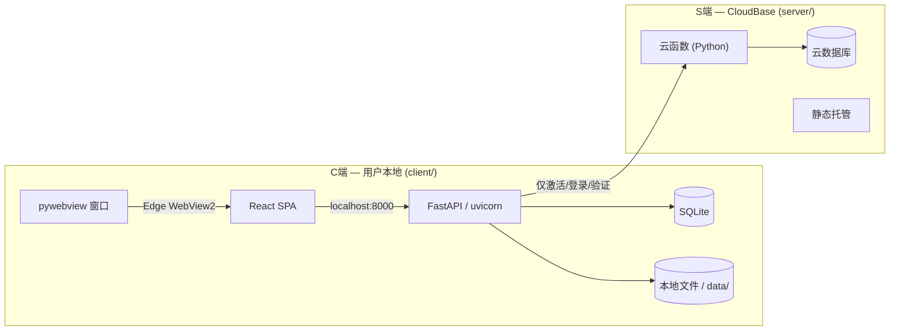

# CLAUDE.md

本文件为 Claude Code (claude.ai/code) 处理本代码库时提供指导。

## 项目

AI Novel（爱小说）—— 基于 C/S 架构的 AI 辅助长篇小说创作平台。单用户桌面应用，用户在本地创建和管理小说项目，按照六阶段工作流（init → settings → outline → prompt → write → archive）与 AI 协作创作，按 Token 用量计费。

## 工作原则

减少常见 LLM 编码错误的行为准则。按需与项目特定指令合并使用。

权衡：这些准则倾向于谨慎而非速度。对于简单任务，请自行判断。

### 1. 编码前先思考
不要假设。不要隐藏困惑。显化权衡。

在实现之前：
- 明确陈述你的假设。如果不确定，请提问。
- 如果存在多种解读，请全部呈现——不要默默选择。
- 如果存在更简单的方案，请说出来。必要时坚持己见。
- 如果有不清楚的地方，停下来。指出哪里令人困惑。提问。

### 2. 简洁优先
用最少的代码解决问题。不做任何推测性的设计。

- 不添加超出需求的功能。
- 不为只用一次的代码做抽象。
- 不引入未被要求的"灵活性"或"可配置性"。
- 不处理不可能发生的场景的错误。
- 如果你写了 200 行但 50 行就能搞定，重写它。
- 问自己："资深工程师会说这过度设计了吗？"如果答案是肯定的，简化它。

### 3. 精准修改
只碰你必须碰的。只清理你自己留下的混乱。

编辑现有代码时：
- 不要"改进"相邻的代码、注释或格式。
- 不要重构没坏的东西。
- 匹配现有风格，即使你自己不会那样写。
- 如果你注意到无关的废弃代码，提出来——不要删除它。

当你的变更产生孤儿代码时：
- 删除你的变更导致不再使用的 import/变量/函数。
- 不要删除既有的废弃代码，除非被要求。
- 检验标准：每一行变更都应能直接追溯到用户的请求。

### 4. 目标驱动执行
定义成功标准。循环验证直到通过。

将任务转化为可验证的目标：
- "添加校验" → "为无效输入编写测试，然后让它们通过"
- "修复 Bug" → "编写一个能复现它的测试，然后让它通过"
- "重构 X" → "确保重构前后测试都通过"

对于多步骤任务，简要列出计划：
1. [步骤] → 验证：[检查点]
2. [步骤] → 验证：[检查点]
3. [步骤] → 验证：[检查点]

强有力的成功标准让你能独立循环。弱标准（"让它跑起来"）需要不断澄清。

这些准则有效的情况是：diff 中不必要的变更更少、因过度设计导致的重写更少、澄清问题出现在实现之前而非犯错之后。

## 常用命令

```bash
# 启动 C端 后端（开发模式，无需 License）
cd client/backend && mkdir -p data
DEV_MODE=1 DATA_ROOT=./data uvicorn main:app --reload --host 127.0.0.1 --port 8000

# 启动 S端 本地模拟器（用于 License 测试）
python server/local_server.py

# 仅启动前端（UI 开发，热更新在 localhost:5173）
cd client/frontend && npm run dev

# 构建前端生产包
cd client/frontend && npm run build

# 预览生产构建
cd client/frontend && npm run preview

# 前端类型检查
cd client/frontend && npx tsc --noEmit

# 运行单个后端测试
cd client/backend && python -m pytest tests/ -k "test_name"

# 运行全部后端 API 测试
cd client/backend && python -m pytest tests/ -v

# 运行全部前端 E2E 测试（需要 Docker 在 :80 运行）
cd frontend && npx playwright test

# 运行全部测试（后端 + 前端）
bash scripts/test-all.sh
```

## 架构



单用户桌面应用。C端 在本地运行所有内容（FastAPI + SQLite + React SPA 封装在 pywebview 中）。S端 仅通过 CloudBase 云函数处理 License 认证。SSE 用于流式生成正文。

## 目录结构

```
ai-novel/
├── client/                    # C端 — 用户本地桌面应用
│   ├── backend/              FastAPI 后端
│   │   ├── main.py           FastAPI 应用，lifespan（自动建表），路由注册
│   │   ├── config.py         本地配置 (DATA_ROOT, JWT_SECRET, SERVER_API_BASE)
│   │   ├── db.py             SQLAlchemy + SQLite
│   │   ├── ai_client.py      动态 API Key 的 AI 客户端
│   │   ├── api_configs/      API Key 多配置管理（厂商检测/连接测试/CRUD/用量统计）
│   │   ├── models/           SQLAlchemy ORM: User, Project, TokenLog, NovelFile
│   │   ├── auth_local/       License 验证模块（S端通信 + 离线缓存）
│   │   ├── projects/         项目 CRUD
│   │   ├── settings/         设定管理 + AI 生成
│   │   ├── chapters/         卷章 CRUD
│   │   ├── workflow/         阶段机 + gate 验证
│   │   ├── prompt/           提示词组装
│   │   ├── write/            SSE 流式写作
│   │   ├── archive/          归档
│   │   ├── filesystem/       本地文件存储
│   │   └── story/            剧情推演
│   ├── frontend/             React 19 SPA (Vite + daisyUI)
│   └── packaging/            PyInstaller + pywebview 打包
├── server/                    # S端 — 腾讯云 CloudBase
│   ├── cloudfunctions/       云函数（activate/login/verify/renew/devices/reset_password/generate_code/query_codes）
│   ├── lib/                  云函数共享库（db/auth_utils/code_utils）
│   ├── static/               静态页面（landing + 发码管理）
│   └── local_server.py       本地 S端 模拟器（测试用）
├── docs/                     文档（specs + plans）
└── reference/                项目模板（YAML/MD templates）
```

## 关键设计决策

- **阶段门控机（Phase gate machine）**：每个工作流流转（`init→settings`、`settings→outline` 等）都有验证门。门控失败 → 流转被拒绝，API 返回缺少的内容。
- **六阶段工作流**：init → settings → outline → prompt → write → archive。write→outline 是唯一的反向流转（开始下一章）。
- **双存储后端**：小说内容可通过 `STORAGE_BACKEND` 环境变量存储在本地文件系统或数据库中。通过 `filesystem/storage.py` 中的 `StorageBackend` 协议抽象。
- **SSE 流式传输**：第五阶段写作期间每个段落一个 SSE 连接。前端可打开多个并行流，支持每个段落的暂停/停止。
- **Token 计费**：每次 AI 调用记录到 `token_log` 并从用户余额中扣除。按模型计价（haiku：输入/输出每百万 $0.80/$4.00；sonnet：$3/$15）。
- **多租户隔离**：文件系统路径 `/data/{user_id}/`，数据库查询通过 JWT 中的 user_id 限定范围，v1 不支持项目共享。

## 关键约定

- **小说数据存储在文件系统或数据库**：本地后端使用 `/data/projects/{user_id}/{project_slug}/` 下的 YAML/MD 文件，数据库后端使用 `novel_files` 表。PostgreSQL 仅存储用户、项目和计费元数据。
- **流转前必须通过阶段门控**：`backend/workflow/gates.py` 中的函数验证前置条件。门控失败 → 返回 400 及缺失项列表。
- **项目所有权**：所有 API 端点从 JWT 提取 user_id，在任何文件或数据库操作前交叉校验 `project.user_id`。
- **模板文件**：`reference/` 存放 `.template` 文件。`backend/filesystem/init.py` 在创建新项目骨架时复制它们。
- **Token 计费**：每次 AI 调用创建 TokenLog 记录，相应扣除用户余额。`billing/service.py` 包含各模型费率。
- **文件系统访问**：始终使用 `filesystem/storage.py` 中的 `get_storage()`，而非直接文件 I/O，以支持两种存储后端。

## 当前状态

后端已完成（所有路由模块已接入，3 个 AI 调用点的 Token 追踪已激活，双存储后端）。前端已完整构建，使用 React 19 + Vite + daisyUI，包含写作工作室（SSE 流式）、归档阅读器、时间线、设置表单。速率限制中间件已激活。尚未编写测试。

## 智能体调度协议

Claude 充当**智能调度器**——用户描述需求，Claude 自动选择正确的已安装智能体来产出结果。无需手动"激活 X"。

### 已安装智能体

所有智能体位于 `.claude/agents/`。每个都是专业角色，有自己的方法论和交付物格式。

| 智能体 | 角色 | 何时使用 |
|--------|------|----------|
| 🧭 **产品经理** | 完整产品生命周期：发现、PRD、路线图、利益相关方对齐 | 新功能请求、需求分析、定义 MVP 范围 |
| 🎨 **UI 设计师** | 视觉设计系统、像素级精确界面、组件样式、品牌识别 | UI 打磨、配色方案、字体、暗/亮主题、视觉一致性 |
| 🎭 **角色走查** | CRO 转化率优化、用户心理学模拟、LIFT/Cialdini/Fogg 框架 | 落地页优化、注册漏斗、转化瓶颈 |
| 🛡️ **品牌守护者** | 品牌识别系统、视觉一致性、品牌指南 | 品牌定位、视觉识别、S端 品牌一致性 |
| 📐 **UX 架构师** | 界面架构、布局设计、组件结构 | 页面拆分为组件、设计 UI 布局、CSS 系统 |
| 🔬 **UX 研究员** | 用户行为分析、可用性测试、数据驱动洞察 | 理解用户需求、评估 UX、提出改进建议 |
| 🐑 **项目牧羊人** | 跨职能协调、任务拆解、时间线、风险管理 | 将功能拆解为开发任务、估算工作量、跟踪进度 |
| 🎯 **冲刺排期员** | 冲刺规划、功能优先级排序、资源分配 | 优先级排序 backlog、规划迭代、平衡工作量与影响力 |
| 🏗️ **后端架构师** | 可扩展系统设计、API 开发、FastAPI 架构 | API 端点、后端架构、C/S 通信设计 |
| 🖥️ **前端工程师** | React 19 + TypeScript + daisyUI + Tailwind CSS | UI 组件实现、前端功能、性能 |
| 🗄️ **数据库优化师** | Schema 设计、查询优化、索引、SQLite/PostgreSQL | 慢查询、Schema 迁移、索引策略、N+1 修复 |
| ⚙️ **DevOps 自动化师** | CI/CD、Docker、SSL、CloudBase 部署 | 部署配置、GitHub Actions、SSL 证书、备份策略 |
| 🧬 **提示词工程师** | LLM 提示词设计、测试、系统化优化 | 提示词组装调试、SSE 流式提示词调优、模型行为 |
| 👁️ **代码审查员** | 代码正确性、安全性、可维护性、性能 | PR 审查、重构建议、Bug 排查 |
| 🎭 **测试自动化工程师** | Playwright E2E 测试、消除不稳定、CI 并行化 | 编写/改进测试、调试不稳定测试、测试策略 |

### 调度规则

1. **单智能体任务** — Claude 识别主要智能体，采用其方法论，按该智能体的标准格式产出（如产品经理输出 PRD 章节，DevOps 自动化师输出部署脚本）。

2. **多智能体任务** — 复杂工作按顺序编排：
   ```
   功能请求 → 🧭 产品经理 (PRD) → 📐 UX 架构师 (UI 设计)
   → 🏗️ 后端架构师 (API) + 🖥️ 前端工程师 (组件)
   → 🎭 测试自动化工程师 (测试) → 👁️ 代码审查员 (审查)
   ```

3. **智能体输出格式** — 严格遵循每个智能体的交付物模板（来自其 `.md` 文件）。输出简略或不完整意味着选错了智能体。

4. **用户仍可覆盖** — 如果用户指定了具体智能体，则使用该智能体。如果用户说"作为 PM"，视为智能体选择。

### 调度示例

| 用户说 | Claude 执行 |
|--------|-------------|
| "我想加个一键生成大纲的功能" | 🧭 PRD → 📐 界面拆分 → 🏗️ API + 🖥️ 前端 → 🎭 测试 |
| "帮我看看为什么这个页面加载慢" | 🗄️ 查 SQL → 👁️ 审查前端代码 → ⚙️ 检查部署 |
| "帮我排下这周做什么" | 🎯 优先级评估 → 🐑 任务拆分 → 输出排期表 |
| "settings 的 AI 生成不太稳定" | 🧬 调试 prompt → 🏗️ 检查 API 错误处理 → 🎭 补充测试 |
