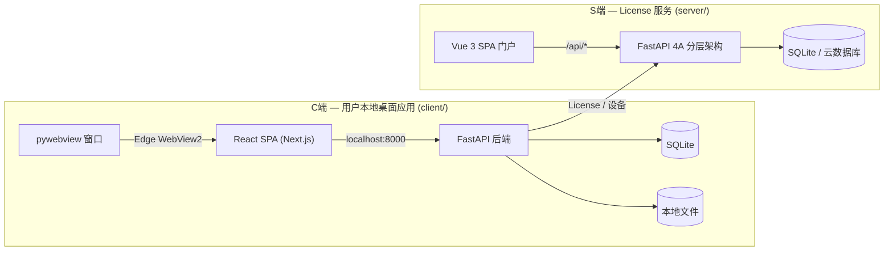

# CLAUDE.md

本文件为 Claude Code (claude.ai/code) 处理本代码库时提供指导。

## 项目

AI Novel（爱小说）—— 基于 C/S 架构的 AI 辅助长篇小说创作平台。单用户桌面应用，用户在本地创建和管理小说项目，按照六阶段工作流（init → settings → outline → prompt → write → archive）与 AI 协作创作，按 Token 用量计费。

## 工作原则

减少常见 LLM 编码错误的行为准则。按需与项目特定指令合并使用。

权衡：这些准则倾向于谨慎而非速度。对于简单任务，请自行判断。

### 1. 编码前先思考
不要假设。不要隐藏困惑。显化权衡。

在实现之前：
- 明确陈述你的假设。如果不确定，请提问。
- 如果存在多种解读，请全部呈现——不要默默选择。
- 如果存在更简单的方案，请说出来。必要时坚持己见。
- 如果有不清楚的地方，停下来。指出哪里令人困惑。提问。

### 2. 简洁优先
用最少的代码解决问题。不做任何推测性的设计。

- 不添加超出需求的功能。
- 不为只用一次的代码做抽象。
- 不引入未被要求的"灵活性"或"可配置性"。
- 不处理不可能发生的场景的错误。
- 如果你写了 200 行但 50 行就能搞定，重写它。
- 问自己："资深工程师会说这过度设计了吗？"如果答案是肯定的，简化它。

### 3. 精准修改
只碰你必须碰的。只清理你自己留下的混乱。

编辑现有代码时：
- 不要"改进"相邻的代码、注释或格式。
- 不要重构没坏的东西。
- 匹配现有风格，即使你自己不会那样写。
- 如果你注意到无关的废弃代码，提出来——不要删除它。

当你的变更产生孤儿代码时：
- 删除你的变更导致不再使用的 import/变量/函数。
- 不要删除既有的废弃代码，除非被要求。
- 检验标准：每一行变更都应能直接追溯到用户的请求。

### 4. 目标驱动执行
定义成功标准。循环验证直到通过。

将任务转化为可验证的目标：
- "添加校验" → "为无效输入编写测试，然后让它们通过"
- "修复 Bug" → "编写一个能复现它的测试，然后让它通过"
- "重构 X" → "确保重构前后测试都通过"

对于多步骤任务，简要列出计划：
1. [步骤] → 验证：[检查点]
2. [步骤] → 验证：[检查点]
3. [步骤] → 验证：[检查点]

强有力的成功标准让你能独立循环。弱标准（"让它跑起来"）需要不断澄清。

这些准则有效的情况是：diff 中不必要的变更更少、因过度设计导致的重写更少、澄清问题出现在实现之前而非犯错之后。

## 常用命令

```bash
# ═══ C端 ═══

# 终端 1：S端 后端（本地模拟）
cd server && python app/main.py

# 终端 2：C端 后端
cd client/backend && mkdir -p data
DATA_ROOT=./data SERVER_API_BASE=http://127.0.0.1:19000/api \
  uvicorn main:app --reload --host 127.0.0.1 --port 8000

# 终端 3：C端 前端（Next.js 开发服务器）
cd client/frontend && npm run dev

# C端 前端类型检查 / 构建
cd client/frontend && npx tsc --noEmit && npm run build

# ═══ S端 ═══

# 终端 1：S端 后端（FastAPI 4A 架构）
cd server && python app/main.py

# 终端 2：S端 前端（Vue 3 SPA 开发服务器）
cd server/frontend && npm run dev

# S端 前端类型检查 / 构建
cd server/frontend && npx vue-tsc --noEmit && npm run build

# S端 E2E 测试（Playwright，自动启动 dev server）
cd server/frontend && npx playwright test

# ═══ 通用 ═══

# C端 后端测试
cd client/backend && python -m pytest tests/ -v

# C端 E2E 测试（需要 Docker :80 运行）
cd client/frontend && npx playwright test
```

## 架构



C端 是单用户桌面应用（FastAPI + SQLite + React SPA，pywebview 封装），提供 AI 写作全流程。
S端 是 License 授权与设备管理服务（FastAPI 4A 分层架构），Vue 3 SPA 管理门户编译后由后端静态托管。
SSE 用于 C端 流式生成正文。

## 目录结构

```
ai-novel/
├── client/                    # C端 — 用户本地桌面应用
│   ├── backend/              FastAPI 后端
│   │   ├── main.py           FastAPI 应用，lifespan（自动建表），路由注册
│   │   ├── config.py         本地配置 (DATA_ROOT, JWT_SECRET, SERVER_API_BASE)
│   │   ├── db.py             SQLAlchemy + SQLite
│   │   ├── ai_client.py      动态 API Key 的 AI 客户端
│   │   ├── api_configs/      API Key 多配置管理（厂商检测/连接测试/CRUD/用量统计）
│   │   ├── models/           SQLAlchemy ORM: User, Project, TokenLog, NovelFile
│   │   ├── auth_local/       License 验证模块（S端通信 + 离线缓存）
│   │   ├── projects/         项目 CRUD
│   │   ├── settings/         设定管理 + AI 生成
│   │   ├── chapters/         卷章 CRUD
│   │   ├── workflow/         阶段机 + gate 验证
│   │   ├── prompt/           提示词组装
│   │   ├── write/            SSE 流式写作
│   │   ├── archive/          归档
│   │   ├── filesystem/       本地文件存储
│   │   └── story/            剧情推演
│   ├── frontend/             React 19 SPA (Vite + daisyUI)
│   └── packaging/            PyInstaller + pywebview 打包
├── server/                    # S端 — License 授权与设备管理服务
│   ├── app/                   核心代码（4A 分层架构）
│   │   ├── config.py          配置管理
│   │   ├── main.py            FastAPI 应用入口
│   │   ├── models/            SQLAlchemy ORM（6 张表）
│   │   ├── domain/            领域层（纯 Python，无框架依赖）
│   │   ├── infrastructure/    仓储 + 安全（JWT/密码哈希）
│   │   ├── application/       编排用例（11 个 use case）
│   │   └── interfaces/        API 接口层（3 组路由，17 端点）
│   ├── frontend/              Vue 3 SPA 管理门户（daisyUI + Tailwind）
│   │   ├── src/               源码（8 页面 / 16 组件 / Pinia / Router）
│   │   └── e2e/               Playwright 测试（82 条）
│   ├── alembic/               数据库迁移
│   ├── tests/                 契约测试 + 单元测试
│   └── README.md              启动/API 速查
├── docs/                     文档（specs + plans）
└── reference/                项目模板（YAML/MD templates）
```

## 关键设计决策

- **阶段门控机（Phase gate machine）**：每个工作流流转（`init→settings`、`settings→outline` 等）都有验证门。门控失败 → 流转被拒绝，API 返回缺少的内容。
- **六阶段工作流**：init → settings → outline → prompt → write → archive。write→outline 是唯一的反向流转（开始下一章）。
- **双存储后端**：小说内容可通过 `STORAGE_BACKEND` 环境变量存储在本地文件系统或数据库中。通过 `filesystem/storage.py` 中的 `StorageBackend` 协议抽象。
- **SSE 流式传输**：第五阶段写作期间每个段落一个 SSE 连接。前端可打开多个并行流，支持每个段落的暂停/停止。
- **Token 计费**：每次 AI 调用记录到 `token_log` 并从用户余额中扣除。按模型计价（haiku：输入/输出每百万 $0.80/$4.00；sonnet：$3/$15）。
- **多租户隔离**：文件系统路径 `/data/{user_id}/`，数据库查询通过 JWT 中的 user_id 限定范围，v1 不支持项目共享。

## 关键约定

- **小说数据存储在文件系统或数据库**：本地后端使用 `/data/projects/{user_id}/{project_slug}/` 下的 YAML/MD 文件，数据库后端使用 `novel_files` 表。PostgreSQL 仅存储用户、项目和计费元数据。
- **流转前必须通过阶段门控**：`backend/workflow/gates.py` 中的函数验证前置条件。门控失败 → 返回 400 及缺失项列表。
- **项目所有权**：所有 API 端点从 JWT 提取 user_id，在任何文件或数据库操作前交叉校验 `project.user_id`。
- **模板文件**：`reference/` 存放 `.template` 文件。`backend/filesystem/init.py` 在创建新项目骨架时复制它们。
- **Token 计费**：每次 AI 调用创建 TokenLog 记录，相应扣除用户余额。`billing/service.py` 包含各模型费率。
- **文件系统访问**：始终使用 `filesystem/storage.py` 中的 `get_storage()`，而非直接文件 I/O，以支持两种存储后端。
- **非代码不 git 跟踪**：git 只跟踪代码与必要文档。本地工具产物（`.reasonix/`、`reasonix.toml`）、调试截图（`live-*.png` 等）、测试报告（`playwright-report/`）、本地配置（`.claude/settings.json`）一律不入库——新增此类文件时加入 `.gitignore`，而不是提交。

## 当前状态

### C端 — AI 写作桌面应用
- **后端**：FastAPI 全功能就绪（所有路由模块已接入，双存储后端，Token 计费，API Key 多配置管理）
- **前端**：React SPA 完整构建（写作工作室 SSE 流式、归档阅读器、时间线、设定表单）
- **测试**：后端 66 个测试通过，E2E 测试覆盖核心流程

### S端 — License 授权与设备管理服务
- **后端**：4A 分层架构重构完成（Domain / Application / Infrastructure / Interfaces 四层，11 个 use case，Alembic 迁移）
- **前端**：Vue 3 SPA 完整实现（8 页面 / 16 组件 / Pinia / 双主题 / 双向路由守卫 / 82 个 E2E 测试）
- **CI**：5 个独立 workflow（C端 前后端构建 + S端 前后端构建 + C端 打包 exe）
