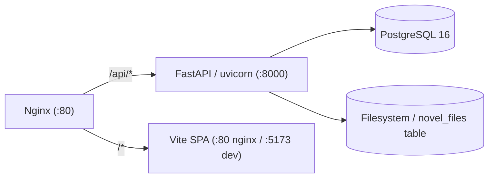

# CLAUDE.md

This file provides guidance to Claude Code (claude.ai/code) when working with code in this repository.

## Project

AI Novel (爱小说) — multi-user web platform for AI-assisted long-form novel writing. Users register, create novel projects, and work through a 6-phase workflow (init → settings → outline → prompt → write → archive) with AI, billed by token usage.

## Commands

```bash
# Start all services (Docker Compose)
docker compose up -d

# Backend only (for API dev)
docker compose up -d postgres && cd backend && uvicorn main:app --reload --port 8000

# Frontend only (for UI dev)
cd frontend && npm run dev

# Build frontend for production
cd frontend && npm run build

# Preview production build
cd frontend && npm run preview

# Type-check frontend
cd frontend && npx tsc --noEmit

# Run a single backend test
cd backend && python -m pytest tests/ -k "test_name"
```

## Architecture



Single Docker Compose host. SSE for streaming prose generation. No Redis, no task queue.

Frontend is a React 19 SPA built with Vite, served by nginx in production. During development, Vite dev server runs on :5173 with `/api` proxied to :8000.

## Backend structure

```
backend/
  main.py              — FastAPI app, lifespan (auto-create tables), router wiring
  config.py            — env vars: DATABASE_URL, JWT_SECRET, ANTHROPIC_API_KEY, DATA_ROOT, STORAGE_BACKEND
  db.py                — async SQLAlchemy engine + session factory + Base
  models/              — SQLAlchemy ORM: User, Project, TokenLog, NovelFile
  auth/                — JWT register/login/me + Bearer middleware
  projects/            — project CRUD + filesystem skeleton init
  settings/            — read/write YAML settings (world/style/anti-ai/hooks/characters)
  chapters/            — volume + chapter CRUD with gate confirmation
  workflow/            — phase state machine + gate validation functions
  prompt/              — assembler (perspective conversion, context injection, prompt generation)
  write/               — SSE streaming per segment + 6 quality checks
  archive/             — finalize prose to archives/, update threads + characters + hooks
  billing/             — token usage logging + usage summary API
  filesystem/          — YAML/MD reader/writer, project skeleton init, storage abstraction
```

### Storage abstraction (`backend/filesystem/storage.py`)

Novel content can be stored either on the local filesystem (`LocalFileBackend`) or in the database (`DatabaseFileBackend` via the `novel_files` table). Selected by `STORAGE_BACKEND` env var (`"local"` or `"database"`). All filesystem access goes through a `StorageBackend` protocol so callers don't depend on the backend directly.

All routers follow the same pattern: `router = APIRouter(prefix=...)`, endpoints use `Depends(get_current_user)` + `Depends(get_db)`, and cross-check project ownership.

## Frontend structure

```
frontend/src/
  App.tsx               — root component, react-router-dom v7 Routes
  main.tsx              — entry point, renders App
  pages/                — flat page components (one per route):
    LandingPage, LoginPage, RegisterPage, DashboardPage,
    ProjectLayout (nested routes via <Outlet>), ProjectRedirectPage,
    SettingsHubPage, WorldSettingsPage, StyleSettingsPage,
    AntiAiSettingsPage, HooksPage, CharactersListPage, CharacterEditorPage,
    OutlinePage, PromptsPage, WritePage, ArchivesPage, ThreadsPage
  components/
    auth/AuthGuard.tsx  — redirect to /login if no token
    project/ProjectNav.tsx — phase-based tab navigation
    settings/           — settings forms
    ui/                 — daisyUI + Tailwind primitives
    ClientShell.tsx     — top-level layout wrapper
    Navbar.tsx, Footer.tsx
  lib/
    api.ts              — fetch wrapper with JWT injection + 401 redirect
    auth.ts             — login/register/logout helpers, localStorage token
    env.ts              — runtime env var loader (from /env.js or VITE_ fallbacks)
    toast.tsx           — toast notification utility
    utils.ts            — clsx + tailwind-merge helper
```

UI framework: **daisyUI** (Tailwind CSS component library). React 19, react-router-dom v7 for routing. No global state management — each page manages its own state with useState/useEffect.

Runtime environment config: `frontend/public/env.js` is loaded at runtime (not build-time) so the same build can be deployed to different backends. Falls back to `VITE_*` build-time env vars.

## Key design decisions

- **Phase gate machine**: Each workflow transition (`init→settings`, `settings→outline`, etc.) has a validation gate. Gate fails → transition rejected, API returns what's missing.
- **6-phase workflow**: init → settings → outline → prompt → write → archive. write→outline is the only backward transition (start next chapter).
- **Dual storage backend**: Novel content stored either on local filesystem or in database via `STORAGE_BACKEND` env var. Abstracted behind a `StorageBackend` protocol in `filesystem/storage.py`.
- **SSE streaming**: One SSE connection per segment during Phase 5 writing. Frontend can open multiple parallel streams with per-segment pause/stop.
- **Token accounting**: Every AI call logs to `token_log` and deducts from user balance. Pricing by model (haiku: $0.80/$4.00 per M input/output; sonnet: $3/$15).
- **Multi-tenant isolation**: Filesystem `/data/{user_id}/`, DB queries scoped by user_id from JWT, no project sharing in v1.

## Key conventions

- **Novel data on filesystem or DB**: YAML/MD files at `/data/projects/{user_id}/{project_slug}/` (local backend) or `novel_files` table (database backend). PostgreSQL stores only user, project, and billing metadata.
- **Phase gates before transitions**: Functions in `backend/workflow/gates.py` validate prerequisites. Gate fails → 400 with list of missing items.
- **Project ownership**: All API endpoints extract user_id from JWT, cross-check `project.user_id` before any file or DB operation.
- **Template files**: `reference/` holds `.template` files. `backend/filesystem/init.py` copies them when creating a new project skeleton.
- **Token accounting**: TokenLog rows are created per AI call. User balance deducted accordingly. `billing/service.py` has model-specific rates.
- **Filesystem access**: Always use `get_storage()` from `filesystem/storage.py` rather than direct file I/O, to support both storage backends.

## Current state

Backend is complete (all router modules wired, token tracking active across all 3 AI call sites, dual storage backend). Frontend is fully built with React 19 + Vite + daisyUI including Writing Studio with SSE streaming, archives reader, threads timeline, and settings forms. Rate limiting middleware active. No tests written yet.
