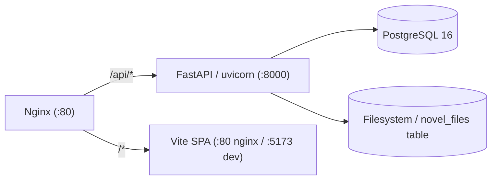

# AI Novel · 爱小说

AI 辅助长篇小说创作平台。通过结构化的六阶段工作流，将故事从构思推进到归档——世界构建、大纲、提示词工程、流式内容生成和归档。

面向中文小说作家，AI 作为创作伙伴而非代笔。每一个故事决策都由你掌控。

## 六阶段工作流

```
init → settings → outline → prompt → write → archive
```

| 阶段 | 说明 |
|------|------|
| **1. Init** | 创建项目，搭建小说骨架 |
| **2. Settings** | 世界设定、角色、文风、Anti-AI 模式、线索钩子 |
| **3. Outline** | 卷结构、章节大纲、情感节拍 |
| **4. Prompt** | 段落拆分、视角转换、逐段提示词组装 |
| **5. Write** | SSE 流式生成 + 6 项质量检查，实时暂停/取消 |
| **6. Archive** | 归档定稿，更新角色、线索和钩子 |

每个阶段切换都要通过验证门——缺少前置条件无法跳级。

## 技术栈

| 层 | 技术 |
|----|------|
| 后端 | Python 3.12, FastAPI, SQLAlchemy 2.0 (async), Anthropic SDK |
| 前端 | React 19 + Vite, TypeScript, daisyUI, Tailwind CSS |
| 数据库 | PostgreSQL 16 |
| 流式 | SSE (Server-Sent Events) |
| 部署 | Docker Compose — nginx, uvicorn, Vite SPA, postgres |

## 架构



小说内容（设定、章节、提示词、归档）以 YAML + Markdown 文件形式存储于磁盘或数据库 `novel_files` 表中。PostgreSQL 仅存储用户、项目和计费元数据。

## 快速开始

```bash
# 克隆
git clone https://github.com/modoojunko/ai-novel.git
cd ai-novel

# 配置
cp .env.example .env
# 编辑 .env — 设置 JWT_SECRET, ANTHROPIC_API_KEY, CORS_ORIGINS

# 启动所有服务
docker compose up -d

# 冒烟测试
./scripts/e2e-test.sh
```

应用运行于 `http://localhost:3000`（生产）或 `http://localhost:5173`（开发）。API 地址为 `http://localhost:8000`。

## 本地开发

```bash
# 后端
docker compose up -d postgres && cd backend && uvicorn main:app --reload --port 8000

# 前端（需先启动后端）
cd frontend && npm run dev
```

前端开发服务器自动将 `/api` 请求代理到 `localhost:8000`。

## 存储后端

通过 `STORAGE_BACKEND` 环境变量切换：

- `local`（默认）— 文件存储于 `DATA_ROOT` 目录
- `database` — 文件存储于 PostgreSQL `novel_files` 表

## 许可证

GNU GPLv3。详见 [LICENSE](LICENSE)。

## 联系方式

商务咨询：**alexee_zhu@foxmail.com**
