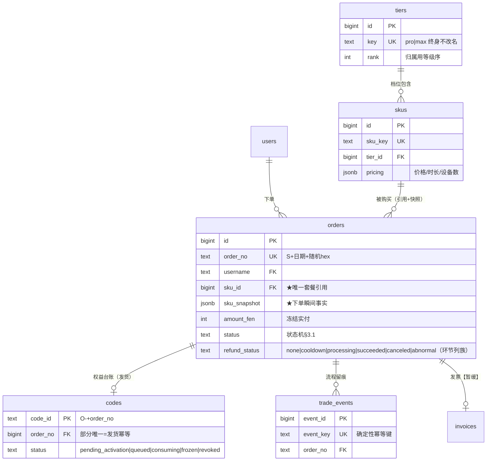

# S端 扫码支付系统 · 后端详细设计

> 状态：**设计稿，待人工评审**（评审通过后转 openspec 任务拆分）。2026-08-29 由 Backend Architect 产出。
> 口径唯一事实源：《S端 扫码支付探索纪要》`docs/prd/s-payment-explore.md`（下称"纪要"）+《业务与财务手册》`docs/prd/s-payment-finance-handbook.md`（下称"手册"）。本文自包含：评审者只需本文 + 纪要即可判断。
> 范围：**Change 1「支付地基」全后端 + Change 2 的网关接口与集成清单**。S端 前端、C端、法律文案不在本文范围（C端 零改动已定）。
> **本文所有 DDL / 接口签名 / 伪代码均为设计稿，非最终代码**——给到"照着可以直接写"的粒度，但实现期允许在不改变语义的前提下微调命名与组织。

---

## 0. 全局约定（先读，全文遵守）

| # | 约定 | 说明 |
| --- | --- | --- |
| G1 | **金额一律 int 分**（`*_fen` 后缀，Python `int`，PG `BIGINT`/`INT`） | 全链无浮点；唯一允许的四则：整数乘除 + 显式 round_half_up |
| G2 | **时间戳一律 UTC** | 新表新列全部 `TIMESTAMPTZ`，Python 侧 `datetime.now(timezone.utc)`（aware）；展示层才转北京时间。存量 codes 的 naive 列按"已存 UTC"解释（纪要 C4：CloudRun 容器 UTC） |
| G3 | **生产库无多表事务** | `DB_BACKEND=pg_http` 走 PostgREST，`commit()` 是 no-op。全部一致性靠：**单语句 CAS + 唯一约束幂等 + 补偿扫描**（纪要 §13 A1 方案二定稿）。本文任何地方**不得出现跨表原子性的假设** |
| G4 | **表即状态机** | 状态住列（status + 时间戳列），转移 = 单条条件 UPDATE；半截检测 = 查表；恢复 = 幂等重放；并发 = 唯一约束/部分唯一索引。应用层**零业务内存状态**（允许无状态缓存与只读缓存，但不作为正确性依据） |
| G5 | **对象纪律**（纪要 §3 对象归属矩阵） | 订单只管钱；待激活/排队/消耗/冻结是 codes 台账行（套餐对象）的状态；退款是订单流程环节（`out_refund_no = out_trade_no = order_no`，单据链定稿） |
| G6 | **权益发货复用 licensing** | 到货行 = `source='order'` 的 codes 行，初始态**待激活**；激活复用 `activate_code` 的顺延计算（`base = max(现有到期, 今天)`）；`License.merge` 跳过 `revoked` 行（本设计扩展为跳过 `frozen`，见 §3.5） |
| G7 | **通知通道 = Server酱 webhook**（纪要 B3） | 所有资金类告警经 `NotifyService` 发 Server酱；CLS 只做日志与查询 |
| G8 | **SQL 一律参数绑定** | 运行期数据访问全部经 PostgREST 查询参数（天然参数化）；裸 SQL 只出现在迁移 DDL 中（静态语句，无用户输入拼接） |
| G9 | 发票功能**暂缓**（决策 #8，2026-08-29） | 相关设计全文保留并标注【暂缓】，上线版本不含发票入口；月度计税报表**保留**（报税不等发票） |

### 0.1 与现状代码的关系（嫁接点）

| 现状 | 位置 | 本设计的动作 |
| --- | --- | --- |
| 六表 ORM + alembic | `server/app/models/`、`server/alembic/` | 新增支付域 ORM；生产建表仍走"本地 alembic 生成 → MCP `managePgDatabase(applyMigration)`"管道 |
| PostgREST 客户端（无 CAS 能力） | `server/app/infrastructure/repositories/pg_http/client.py` | **扩展**：`compare_and_update()`（`Prefer: return=representation`）、唯一冲突异常语义（§2.12） |
| `codes` 表 = 激活码 | `server/app/models/code.py` | 加列（source/order_no/grant_start/frozen_at/revoked_at）+ 存量回填 + 部分唯一索引（§2.8） |
| `TIER_POLICY` 硬编码（时长档当 tier） | `server/app/config.py` | 重构为 `tiers` × `skus` 两张配置表，tier×period 正交；legacy 值经别名兼容（§2.2、§3.5） |
| `License.merge` 取"到期最晚行"的 tier | `server/app/domain/licensing/license.py` | 改为"已激活行按等级序取最高 + 跳过 revoked/frozen"（§3.5） |
| `POST /api/license/activate`（输码） | `server/app/interfaces/web_api/license.py` | **拆除**（决策 8.5：在线购买为唯一付费通道）；admin 出码 API 保留但标 deprecated（内部留作修复工具） |
| 限流中间件（仅 login/authorize） | `server/app/interfaces/middleware.py` | 扩展为按路径配置表（§5.7） |
| 部署：GH Actions 生成 cloudbaserc.json + envParams | `.github/workflows/s-server-deploy.yml` | envParams 增补支付 secrets（§10.3）；定时任务宿主**不选** GH Actions（§7.2） |

---

## 1. 架构总览


### check-auth 扩展（C端 提示条数据——评审 A4 补入）

C端 唯一改动点是到期提示条（纪要 U1 拍板），数据来自 check-auth 扩展字段（向后兼容、只加可选字段）：

```
GET /auth/check-auth 响应新增（可选字段，无支付数据时省略）：
  "days_remaining": 3,                     // 自然日（今日 0 点到 expires_at 的天数，floor）
  "attention": {                           // 账号动态（L1 被动提醒，均为 bool）
    "refund_processing": false,            // 有进行中退款（含冷静期）
    "verify_pending": false                // 有冻结待核对订单
  }
```

实现位置：`client_api/authorize.py` check-auth 响应组装处，从 licensing + payments 查询聚合。
对 C端：仅消费可选字段渲染提示条，不改变 tier 生效机制（仍=重启自愈拉取）。

### 1.1 部署上下文（纪要 §3.1 落地版）

```
┌──────────────┐  扫码付款   ┌──────────────┐  T+1 结算   ┌──────────────┐
│ 用户浏览器    │──────────► │   微信支付    │──────────► │ 商户银行卡    │
│ (S端 Vue 静态 │            │  (含商户平台)  │  扣手续费   │  (银行流水=   │
│  托管/收银台)  │◄────────── │              │            │   第三本账)   │
└──────┬───────┘  code_url  └──────┬───────┘            └──────────────┘
       │ 下单/轮询/退款(登录态 JWT)    │ 回调/查单/退款/账单(v3, 验签)
       ▼                                ▼
┌──────────────────────────────────────────────────────────┐
│ FastAPI @ CloudRun（novel-s-server，经 www.awesomenovel.com/api 网关） │
│  payments 上下文：状态机用例 + PaymentGateway 接口 + WechatPayGateway 实现适配（真实/mock 可切）    │
└──────────────┬───────────────────────────┬───────────────┘
               │ PostgREST                  │ HTTP(带 X-Cron-Token)
               │ 单语句CAS + 唯一约束幂等      ▼
               ▼                      ┌─────────────────────┐
┌─────────────────────────────────┐   │ CloudBase 定时触发器    │
│ CloudBase PG：                   │   │ → 云函数薄壳(≈20行)     │
│  orders(含退款列族) / trade_events │   │ → 打回 4 个 cron 端点   │
│  tiers / skus / codes(+列)       │   └─────────────────────┘
│  reconciliation_reports          │
│  invoices【暂缓，随迁移建表】       │
└─────────────────────────────────┘
        ▲ 告警（Server酱 webhook，B3）
```

Change 1 阶段微信支付一侧由 **MockPaymentGateway** 替身（同进程、同接口），购买入口开关默认关闭，全链路可在生产环境用 mock 演练（§6.3、§10.1）。

### 1.2 一致性模型（无事务环境下的钱务正确性骨架）

| 层 | 机制 | 实现位 |
| --- | --- | --- |
| 微观原子（单步不出错） | **单语句 CAS**：`UPDATE … WHERE pk=? AND status=旧值`，经 PostgREST `PATCH` + `Prefer: return=representation`，响应数组为空 = CAS 输 | `PgRestClient.compare_and_update()`（§2.12） |
| 微观原子（插入不重复） | **唯一约束/部分唯一索引幂等键**：`orders.order_no`、`codes(order_no) WHERE source='order'`、`trade_events.event_key`、orders.refund_status 状态机（合并后唯一守卫） | §2 各表 DDL |
| 中观幂等（断了能重来） | 显式状态机 + 微信幂等键（`out_trade_no`/`out_refund_no` 均为订单号）+ **补偿扫描为核心自愈机制**（paid 未 fulfilled 分钟级修复） | §4 用例、§7 任务 |
| 宏观收敛（救不了的能发现） | 日对账（内部 ↔ 微信交易账单 + 退款账单，三键比对）+ Server酱告警；银行流水月度人工核对 | §4.13、手册 §六 |

**幂等应答铁律**（A1 ③）：回调/查单确认"可回成功应答"的条件是订单**已 paid 且已 fulfilled**（codes 行存在），缺任一则继续补做，绝不提前回成功——杜绝"已收款不发货且无告警"的最危险破绽。

### 1.3 代码落位（DDD 四层，payments 为新增限界上下文）

```
server/app/
├── models/                          # ORM（alembic 源）
│   ├── order.py            # OrderORM          → orders
│   ├── refund.py           # 退款折算纯函数（数据在 orders.refund_* 列族）
│   ├── trade_event.py      # TradeEventORM     → trade_events
│   ├── tier.py             # TierORM           → tiers
│   ├── sku.py              # SkuORM            → skus
│   ├── reconciliation.py   # ReconciliationORM → reconciliation_reports
│   └── invoice.py          # InvoiceORM        → invoices【暂缓】
├── domain/payments/                 # 纯 Python，无框架依赖
│   ├── order.py            # Order 实体 + 订单状态机转移表（§3.1）
│   ├── entitlement.py      # 权益台账行实体 + 四态（§3.2）
│   ├── refund.py           # Refund 实体 + 折算纯函数（§3.3）
│   ├── pricing.py          # 定价纯函数（§3.4）
│   ├── order_no.py         # 单号生成（§3.6）
│   └── errors.py           # 领域异常类型表（§3.7）
├── application/payments/            # 用例编排（§4，一文件一用例）
│   ├── create_order.py  fulfill_payment.py  poll_order.py
│   ├── manual_query_order.py  cancel_order.py
│   ├── preview_refund.py  request_refund.py  complete_refund.py
│   ├── activate_code.py
│   ├── scan_orders.py（T1）  scan_repairs.py（T2）
│   ├── scan_refunds.py（T3，扫 orders.refund_status）  daily_reconcile.py（T4）
│   ├── monthly_tax_report.py  invoice_registry.py【暂缓】
│   └── notify.py           # NotifyService（Server酱）
├── infrastructure/
│   ├── repositories/pg_http/
│   │   ├── client.py       # 扩展 compare_and_update / 唯一冲突语义（§2.12）
│   │   ├── order_repo.py  refund_repo.py  trade_event_repo.py
│   │   ├── sku_repo.py  tier_repo.py  recon_repo.py  invoice_repo.py【暂缓】
│   │   └── code_repo.py    # 扩展：台账行查询/冻结/回收/激活 CAS
│   ├── wechatpay/
│   │   ├── gateway.py      # PaymentGateway Protocol 实现：WechatPayGateway（微信）/ AlipayGateway（预留）/ Mock
│   │   ├── real.py         # wechatpayv3 实现（§6.2）
│   │   └── mock.py         # MockPaymentGateway（§6.3）
│   └── notify/serverchan.py
├── interfaces/
│   ├── web_api/payments.py          # 登录态路由（§5.2）
│   ├── callback_api/wxpay.py        # 回调端点，验签即门（§5.3）
│   ├── admin_api/payments.py        # ADMIN_TOKEN 路由（§5.4）
│   ├── cron_api/                    # 4 个任务端点 + X-Cron-Token（§5.5）
│   └── dev_api/mock_wxpay.py        # dev 注入端点，仅 mock 模式注册（§6.5）
└── domain/licensing/license.py      # 改 merge 归属规则（§3.5，动改而非新增）
```

领域层不 import infrastructure；application 依赖 repo Protocol（`repositories/base.py` 既有风格）；interfaces 经 `factory.py` 组装。与 identity/devices/licensing 三域共存互不侵入，唯二交叉点：`License.merge`（改归属）与激活顺延计算（复用）。

### 1.4 Change 1 / Change 2 边界

| | Change 1「支付地基」（本文全量） | Change 2「真实支付接入」 |
| --- | --- | --- |
| 数据层 | 全部 DDL + 回填 + 触发器 + 种子（一次迁移到位，含 invoices【暂缓】表） | 无 schema 变更 |
| 网关 | MockPaymentGateway + PaymentGateway Protocol | RealGateway（wechatpayv3）+ secrets 配置 |
| 回调 | dev 注入端点驱动 mock 回调 | 生产 notify 端点 + 验签 + 微信商户平台配置回调 URL |
| 定时 | 4 任务上线（对账在 mock 下记 skipped） | 全量生效，首日对账验证 |
| 开关 | 购买入口**默认关**；mock 全链演练通过 | 1 分钱生产演练（§10.4）后开闸 |
| C端/S端 前端 | S端 购买页随 Change 1（开关后隐藏） | 开闸文案/演练 |

---

## 2. 数据层设计

### 2.1 表总览

```
tiers (配置) ──1:N── skus (配置) ──下单冻结引用── orders（含退款列族 refund_*）
                                        │                │
                                        │ order_no       │ refund_no(=order_no)
                                        ▼                ▼
codes (台账行, source='order')    trade_events (append-only, 拒改触发器)
                                        ▲
reconciliation_reports ──派生──────┘   invoices【暂缓】── order_no/refund_no
```

金额列全部 `INT`（分，上限 21 亿分 = 214 万元/单，远超业务）；不使用 `NUMERIC`，杜绝浮点与格式歧义。

> **★ 代理主键原则（2026-08-29 用户裁定：符合关系型规范与 ontology）**：全部实体表主键 = `BIGINT IDENTITY`（代理键，无业务含义）；业务标识（tier.key / sku.sku_key / order.order_no / refund.refund_no）= `TEXT NOT NULL UNIQUE`——身份证与名字分离。对外 API/URL 用业务标识（防枚举），内部 FK 用 id（引用稳定）。orders.order_no 的高熵安全属性保留在业务键上。


### 2.0 对象关系图（ER——下单后各对象如何生长）

> 订单是根对象：下单后其余对象全部从它派生/挂靠。★ = 本次重构后口径。



**ASCII 版（下单后的时间轴视角）**：

```
            [tiers]──1:N──[skus]
                           │ 被购买
                           ▼ (sku_id 引用 + sku_snapshot 快照)
用户 ──下单──▶ [orders] ◀═══════ 根对象（一切从这里生长）
                │
                ├─（退款环节=orders 行内 refund_* 列族；2026-08-29 合并，无独立表）
                │    refund_status: cooldown → processing → succeeded
                │                    └→ canceled（冷静期取消，可重申）
                │
                ├─1:1─▶ [codes]      权益台账（code_id='O-'+order_no）
                │         ├─ pending_activation（待激活·囤）
                │         ├─ queued → consuming（激活·顺延）
                │         ├─ frozen（退款冻结）
                │         └─ revoked（退款回收）
                │
                ├─1:N─▶ [trade_events] 每次状态变化一行（append-only）
                │
                └─1:N─▶ [invoices]   发票台账【暂缓】
                          └─ blue/red（红冲链）

[reconciliation_reports]  独立对象（按日对账，无 FK 挂靠）
```

**关键基数**：
- orders : codes = **1:1**（一单发一行权益；部分唯一索引 `uq_codes_order_no` 保证）
- 退款 = **orders 行内列族**（无独立表；canceled 后可重申复用同 refund_no；部分退款开放时再拆表）
- orders : trade_events = 1:N（每个状态转移一行，event_key 幂等）
- skus : orders = 1:N（引用+快照：订单记 sku_id，同时冻结 sku_snapshot）

### 2.1a users 表代理主键迁移（2026-08-30 用户裁定：username→id，一次性到位——线上仅个位数用户，无兼容包袱）

```sql
-- 一次性迁移（maintenance window 内执行，按顺序）：
ALTER TABLE users ADD COLUMN id BIGINT GENERATED ALWAYS AS IDENTITY;
-- 逐表回填 + 换列：
--   codes：ADD user_id BIGINT；UPDATE codes SET user_id=u.id FROM users u WHERE codes.bound_username=u.username；DROP bound_username
--   device_grants：同法（username→user_id）
--   device_registry：旧列名 user_id(String) 内容实为 username——ADD user_id_new BIGINT 回填后改名
ALTER TABLE users DROP CONSTRAINT users_pkey;  -- 原 username PK
ALTER TABLE users ADD PRIMARY KEY (id);
ALTER TABLE users ADD CONSTRAINT uq_users_username UNIQUE (username);
-- orders（新表）直接建 user_id BIGINT REFERENCES users(id)
```

**应用代码同批切换**（一次性，无兼容层）：ORM 三处 `ForeignKey("users.username")` → `ForeignKey("users.id")`；`bound_username`/`device.user_id` 属性名全部改 `user_id`；`License(username=)` 等 domain 构造同步。上线=旧列已 DROP，不留过渡期。
**API 对外仍用 username**（登录/URL/客服口径不变），内部 FK 全走 id——五表统一代理键原则。
**改动面盘点（一次性切换的实际工作量）**：
- models 4 文件 7 处（users/code/grant/device 的 PK 与 FK 定义）
- domain+application 16 文件（License(username=)、bound_username 取值路径等）
- 迁移顺序：加 id 列 → 三张存量表回填 user_id → DROP 旧列 → 切 PK/UK → 应用代码同批部署 → e2e 回归
- 风险：线上个位数用户，极端情况可全量重建（导出 users/codes → 新 schema 导入），预计 30 分钟内完成


### 2.2 `tiers`（套餐档位配置表）

```sql
-- 设计稿，非最终代码。生产经 MCP managePgDatabase(applyMigration) 执行。
CREATE TABLE tiers (
    id              BIGINT GENERATED ALWAYS AS IDENTITY PRIMARY KEY,
    key             TEXT NOT NULL UNIQUE,          -- 'pro' | 'max'（终身不改名的稳定标识）
    display_name    TEXT NOT NULL,                 -- 'PRO' | 'MAX'
    rank            INT  NOT NULL,                 -- 等级序：归属计算用，越大越高（max=30 > pro=20）
    selling_points  TEXT NOT NULL DEFAULT '[]',    -- JSON 数组字符串，卖点列表（收银台卡片）
    status          TEXT NOT NULL DEFAULT 'live'
                    CHECK (status IN ('live', 'planned', 'retired')),
                    -- planned = 收银台预告占位（决策 #7）；retired = 不再展示但历史行可解释
    created_at      TIMESTAMPTZ NOT NULL DEFAULT now(),
    updated_at      TIMESTAMPTZ NOT NULL DEFAULT now()
);
-- rank 非唯一（free/trial 同档、pro 别名同档是设计意图）
-- CREATE INDEX idx_tiers_rank（普通索引，排序用） ON tiers (rank);
```

**种子数据**（迁移内 `INSERT ... ON CONFLICT (key) DO NOTHING`，全静态、无用户输入）：

```sql
INSERT INTO tiers (key, display_name, rank, selling_points, status) VALUES
  ('free',      '免费版', 10, '["基础功能","1 台设备"]', 'live'),
  ('trial',     '试用',   10, '["全功能 7 天"]',         'live'),
  ('pro',       'PRO',    20, '["全部功能","多设备"]',    'live'),
  ('max',       'MAX',    30, '["全部功能","更高设备额度","优先支持"]', 'planned'),
  -- legacy 兼容别名：存量 codes.tier 里的时长档值，rank 对齐 pro，merge 归属不降级
  ('monthly',   '月付(旧)', 20, '[]', 'retired'),
  ('quarterly', '季付(旧)', 20, '[]', 'retired'),
  ('yearly',    '年付(旧)', 20, '[]', 'retired'),
  ('lifetime',  '永久',   99, '[]', 'retired');
```

> legacy 键不重写存量 `codes.tier`（保留历史可解释性）；`tier_rank()` 解析时未知键 rank=0（视同 free）。是否改为一次性数据迁移重写 `codes.tier='pro'` → 见 Open Question Q2。

### 2.3 `skus`（SKU 配置表：tier × period 二维）

```sql
CREATE TABLE skus (
    id                BIGINT GENERATED ALWAYS AS IDENTITY PRIMARY KEY,
    sku_key           TEXT NOT NULL UNIQUE,         -- 'pro_monthly' 等（稳定标识；对外展示/内部引用用 id）
    tier_id           BIGINT NOT NULL REFERENCES tiers(id),
    period            TEXT NOT NULL CHECK (period IN ('monthly', 'quarterly', 'yearly')),
    period_days       INT  NOT NULL CHECK (period_days > 0),        -- 30 / 90 / 365
    base_price_fen    INT  NOT NULL CHECK (base_price_fen > 0),     -- 基准价（分）
    discount_permille INT  NOT NULL DEFAULT 1000
                      CHECK (discount_permille BETWEEN 1 AND 1000), -- per-SKU 折扣（千分比，900=9折）
    on_sale           BOOLEAN NOT NULL DEFAULT true,
    sort              INT  NOT NULL DEFAULT 0,     -- 收银台排序
    created_at        TIMESTAMPTZ NOT NULL DEFAULT now(),
    updated_at        TIMESTAMPTZ NOT NULL DEFAULT now()
    device_limit    INT NOT NULL DEFAULT 1,             -- ★设备额度（per-SKU，纪要 §四）
);
CREATE UNIQUE INDEX uq_skus_tier_period ON skus (tier_id, period);

-- 种子（示例价，上线前 ADMIN API 改真值）
INSERT INTO skus (sku_key, tier_id, period, period_days, base_price_fen, discount_permille, on_sale, sort) VALUES
  ('pro_monthly',   'pro', 'monthly',   30,  3000, 1000, true, 1),
  ('pro_quarterly', 'pro', 'quarterly', 90,  8100,  900, true, 2),
  ('pro_yearly',    'pro', 'yearly',   365, 29200,  800, true, 3);
```

纪要遗留待定 3「skus 放 global_config 还是独立表」→ **本设计拍板：独立表**。理由：二维唯一约束（tier×period）与"后台加行即上新"都需要结构化行，global_config 键值无法承载唯一约束与并发改写安全。全局折扣系数作为批量工具落在 ADMIN API（逐 SKU 改 `discount_permille`），不再单设全局字段。

### 2.4 `orders`（订单表）

```sql
CREATE TABLE orders (
    id                BIGINT GENERATED ALWAYS AS IDENTITY PRIMARY KEY,
    order_no          TEXT NOT NULL UNIQUE,         -- 高熵随机串（§3.6；= 微信 out_trade_no；防枚举+防泄露单量）
    user_id            BIGINT NOT NULL REFERENCES users(id),   -- ★代理键引用（对外仍 username）
    sku_id             BIGINT NOT NULL,             -- ★唯一套餐引用（无 FK：SKU 可 retired）
    sku_snapshot       JSONB NOT NULL,              -- ★下单瞬间快照（历史事实，不随 SKU 改动）：
                       -- {tier_key, tier_display, period, period_days,
                       --  base_price_fen, discount_permille, device_limit}
    amount_fen         INT  NOT NULL CHECK (amount_fen > 0),  -- 冻结实付 = snapshot.base × snapshot.discount（§3.4）
    status             TEXT NOT NULL DEFAULT 'pending',        -- 状态机见 §3.1
    prepay_status      TEXT NOT NULL DEFAULT 'none'
                       CHECK (prepay_status IN ('none', 'created', 'failed')),  -- 统一下单子状态
    code_url           TEXT,                        -- 微信 code_url（渲染二维码）
    attach_sent        TEXT,                        -- 上送微信的 attach 原文（'username|sku_key'——灾难恢复钥匙，纪要 §三）
    transaction_id     TEXT,                        -- 微信支付单号 4200…
    payer_openid       TEXT,                        -- 付款人 openid（P1 争议举证；标注：非用户资料）
    channel           TEXT NOT NULL DEFAULT 'wxpay',    -- ★支付通道（wxpay|alipay 预留，回调路由/对账分组/退款幂等键用）
    agreement_version  TEXT NOT NULL,               -- 协议快照（决策 #9 留痕）
    agreed_at          TIMESTAMPTZ NOT NULL,        -- 用户同意时刻
    created_at         TIMESTAMPTZ NOT NULL DEFAULT now(),
    paid_at            TIMESTAMPTZ,
    fulfilled_at       TIMESTAMPTZ,
    refunded_at        TIMESTAMPTZ,
    closed_at          TIMESTAMPTZ,
    cooldown_ends_at   TIMESTAMPTZ,                 -- ★冷静期终点（refund_pending 态非空；T5c/T6 CAS 与 §4.9b 扫描依据）
    -- ── 退款环节（2026-08-29 合并：退款=订单流程环节，不设独立表——用户裁定）──
    refund_status      TEXT
                       CHECK (refund_status IN ('none', 'cooldown', 'processing', 'succeeded', 'canceled', 'abnormal')),
    refund_amount_fen  INT,                        -- 折算额（确认时刻锁定，秒级公式）
    refund_reason      TEXT NOT NULL DEFAULT '',
    refund_operator    TEXT,                       -- 'user:x' | 'admin'
    refund_wx_id       TEXT,                       -- 微信退款单号 5030…
    refund_not_enough  INT NOT NULL DEFAULT 0,     -- NOT_ENOUGH 自动重试计数
    refund_requested_at TIMESTAMPTZ,
    refund_accepted_at  TIMESTAMPTZ,
    updated_at         TIMESTAMPTZ NOT NULL DEFAULT now()
);

CREATE INDEX idx_orders_user_created  ON orders (username, created_at DESC);   -- 我的订单
CREATE INDEX idx_orders_scan_pending  ON orders (created_at) WHERE status = 'pending';   -- T1 扫描
CREATE INDEX idx_orders_scan_paid     ON orders (paid_at)    WHERE status = 'paid';      -- T2 补偿
CREATE UNIQUE INDEX uq_orders_transaction ON orders (transaction_id)
    WHERE transaction_id IS NOT NULL;   -- 微信单号唯一：重放定位 + 对账键
CREATE INDEX idx_orders_refund_scan ON orders (cooldown_ends_at)
    WHERE status = 'refund_pending';                       -- §4.9b 冷静期到点扫描
CREATE INDEX idx_orders_refund_retry ON orders (refund_accepted_at)
    WHERE refund_status = 'processing';                     -- T3 NOT_ENOUGH 重试扫描
CREATE INDEX idx_orders_refund_half ON orders (refund_accepted_at)
    WHERE refund_status = 'succeeded' AND status != 'refunded';   -- 扫描 D：退款半截恢复
```

要点：
- **套餐引用 + 快照分离**（评审重构：用户口径"订单里引用套餐 id 就好"）：`sku_id` 是唯一引用；`sku_snapshot`（JSONB）存下单瞬间的全部事实（tier/period/价格/设备数）——满足 I5"三年后看订单仍可解释金额"、SKU 改价不影响已下单、退款折算用冻结值与现价无关（纪要 ⑦）。`tier_id` 列删除（冗余：sku→tier 一步可达）。
- `status` 不含"待激活"——待激活是 codes 行状态（对象纪律，G5）。`exception` 覆盖 failVerify（已收款核对冻结）；failCreate 不设独立状态，用 `prepay_status='failed'` 挂在 pending 上（可重试，§4.1）。
- 订单超时时长（15 分钟）为常量 `ORDER_TTL_SECONDS = 900`，配置化与否 → Open Question Q5。

### 2.5 退款环节（★已合并进 orders 表——refund_* 列族；本节保留设计说明）

```sql
-- 【退款表已合并进 orders（2026-08-29 用户裁定：退款=订单流程环节，本体论自洽）】
-- 独立表仅在"多次部分退款"场景才必要；当前政策=一单一次折算退完+冷静期取消后可重申（复用同 refund_no=order_no，
-- 前次 canceled 终态不撞微信幂等）。将来开放部分退款时再拆表（迁移约 1 天）。
-- 原独立表的扫描索引/唯一约束等价迁移到 orders 列上的部分索引：

### 2.6 `trade_events`（append-only 审计流水 + 拒改触发器）

```sql
CREATE TABLE trade_events (
    event_id    BIGINT GENERATED ALWAYS AS IDENTITY PRIMARY KEY,
    event_key   TEXT NOT NULL UNIQUE,     -- 逻辑事件幂等键（构造规则见 §4.0），重放安全
    event_type  TEXT NOT NULL,            -- 'order.created' / 'refund.succeeded' / …（§4.0 事件字典）
    order_no    TEXT,                     -- 可空（orphan.notify 等无订单事件）
    refund_no   TEXT,
    actor       TEXT NOT NULL,            -- 'user:<name>' | 'wechat' | 'cron:t1' | 'admin' | 'system'
    payload     JSONB NOT NULL DEFAULT '{}'::jsonb,  -- 微信回执摘要/操作上下文（脱敏，无完整证书类数据）
    created_at  TIMESTAMPTZ NOT NULL DEFAULT now()
);

CREATE INDEX idx_trade_events_order ON trade_events (order_no, created_at);   -- 订单时间线（§5.2）
CREATE INDEX idx_trade_events_type  ON trade_events (event_type, created_at); -- 报表/巡检

-- ── 拒改触发器（纪要 C7：append-only 库层加固）──
CREATE OR REPLACE FUNCTION trade_events_immutable() RETURNS trigger AS $$
BEGIN
    RAISE EXCEPTION 'trade_events is append-only: % forbidden', TG_OP;
END;
$$ LANGUAGE plpgsql;

CREATE TRIGGER trg_trade_events_no_update
    BEFORE UPDATE OR DELETE ON trade_events
    FOR EACH ROW EXECUTE FUNCTION trade_events_immutable();
```

> 留存：按税法账簿凭证 10 年（T2 口径），无清理任务（三张资金表只增不删）。迁移/灾难重建的 `repair.*` 事件也经 INSERT 进入本表（修复留痕）。

### 2.7 `reconciliation_reports`（日对账结果）

```sql
CREATE TABLE reconciliation_reports (
    bill_date         DATE PRIMARY KEY,      -- 对账日（北京时间自然日）
    status            TEXT NOT NULL
                      CHECK (status IN ('balanced', 'mismatch', 'error', 'skipped')),
                      -- skipped：mock 网关或账单未出（Change 1 阶段）
    internal_pay_count    INT NOT NULL DEFAULT 0,
    internal_pay_fen      BIGINT NOT NULL DEFAULT 0,
    wx_pay_count          INT NOT NULL DEFAULT 0,
    wx_pay_fen            BIGINT NOT NULL DEFAULT 0,
    internal_refund_count INT NOT NULL DEFAULT 0,
    internal_refund_fen   BIGINT NOT NULL DEFAULT 0,
    wx_refund_count       INT NOT NULL DEFAULT 0,
    wx_refund_fen         BIGINT NOT NULL DEFAULT 0,
    mismatch_detail   JSONB NOT NULL DEFAULT '[]'::jsonb,  -- 不平明细数组（逐笔三键 + 差异类型）
    error_msg         TEXT,
    created_at        TIMESTAMPTZ NOT NULL DEFAULT now(),
    updated_at        TIMESTAMPTZ NOT NULL DEFAULT now()
);
-- 重跑幂等：同 bill_date UPSERT（对账报告属派生报表，可重算覆盖；trade_events 落
-- reconcile.completed:{bill_date}:{attempt} 事件留每次运行痕迹）
```

### 2.8 `codes` 加列 + 存量回填 + 部分唯一索引

```sql
-- ── 加列（语义补丁：codes 从"激活码"升级为"权益台账"）──
ALTER TABLE codes ADD COLUMN source      TEXT NOT NULL DEFAULT 'admin';  -- 'admin'(存量人工) | 'order'(订单发货)
ALTER TABLE codes ADD COLUMN order_no    TEXT;                            -- source='order' 时必填
ALTER TABLE codes ADD COLUMN grant_start TIMESTAMPTZ;                     -- 激活起点（排队中=未来时刻）
ALTER TABLE codes ADD COLUMN frozen_at   TIMESTAMPTZ;                     -- 退款冻结时刻（折算基准）
ALTER TABLE codes ADD COLUMN revoked_at  TIMESTAMPTZ;                     -- 回收时刻

-- ── 存量回填：已激活行的 grant_start = activated_at（纪要 §四）──
-- 存量 activated_at 为 naive 时间戳，容器 UTC（纪要 C4），显式按 UTC 解释转换
UPDATE codes SET grant_start = activated_at AT TIME ZONE 'UTC'
 WHERE activated_at IS NOT NULL;

-- ── 发货幂等键：一订单恰好一行台账（A1 ①）──
CREATE UNIQUE INDEX uq_codes_order_no ON codes (order_no) WHERE source = 'order';

-- ── 激活并发互斥：同一用户同时至多一行处于 activating 中间态（§4.12）──
CREATE UNIQUE INDEX uq_codes_activating_per_user ON codes (user_id)
 WHERE status = 'activating';

-- 扫描辅助
CREATE INDEX idx_codes_scan_activating ON codes (updated_at) WHERE status = 'activating';
```

台账行 `status` 值域扩展为：存量 `unused`/`active` + 新增 `pending_activation`（待激活）、`activating`（激活进行中，瞬时中间态）、`frozen`（退款冻结）、`revoked`（已回收）。列 `status` 上的既有 CHECK 无（ORM 默认值），迁移补 CHECK 需先核对存量值域——实现期在迁移中 `DELETE`/`UPDATE` 校验后追加：
```sql
ALTER TABLE codes ADD CONSTRAINT ck_codes_status CHECK (status IN
  ('unused', 'active', 'pending_activation', 'activating', 'frozen', 'revoked'));
```
> 建表管道注意：生产已有 codes 表，全部走 `ALTER`（expand）；`ck_codes_status` 属 contract 阶段，确认存量无脏值后再加（expand-and-contract）。

订单台账行的 `code_id` 生成规则：`'O-' + order_no`（如 `O-S20260829-1A2B3C4D5E6F7A8B`）——**绝不生成用户可见/可输入的码串**（决策 8.5），仅作内部主键与关联。

### 2.9 `invoices`（开票台账）【暂缓：设计保留，随 Change 1 迁移建表，不建任何入口】

```sql
CREATE TABLE invoices (
    invoice_id           BIGINT GENERATED ALWAYS AS IDENTITY PRIMARY KEY,
    invoice_no           TEXT UNIQUE,               -- 数电票号码（开出后登记）
    order_no             TEXT NOT NULL REFERENCES orders(id),
    refund_no            TEXT,                      -- 红票关联的退款单
    kind                 TEXT NOT NULL CHECK (kind IN ('blue', 'red')),  -- 蓝字/红字
    title                JSONB NOT NULL DEFAULT '{}'::jsonb,  -- 抬头信息（名称/税号/邮箱）
    amount_fen           INT NOT NULL CHECK (amount_fen > 0),
    status               TEXT NOT NULL
                         CHECK (status IN ('requested',      -- 用户已申请，待人工开票
                                 'issued',                    -- 已开出并登记
                                 'pending_red_flush',         -- 退款联动：待红冲
                                 'red_flushed',               -- 已红冲
                                 'superseded')),              -- 未开票退款：不再开票
    red_invoice_no       TEXT,                      -- 红字发票号
    red_confirmation_no  TEXT,                      -- 红字确认单号（与红票号是两个号码，纪要 §四）
    requested_at         TIMESTAMPTZ,
    issued_at            TIMESTAMPTZ,
    created_at           TIMESTAMPTZ NOT NULL DEFAULT now(),
    updated_at           TIMESTAMPTZ NOT NULL DEFAULT now()
);
CREATE INDEX idx_invoices_order   ON invoices (order_no);
CREATE INDEX idx_invoices_pending ON invoices (status) WHERE status = 'pending_red_flush'; -- 运营待办（MCP 直查）
```
启用时的完整用例（申请/登记/红冲联动/SMTP 流水线）→ §4.14，全程【暂缓】标注。

### 2.10 pg_http 访问模式矩阵（每表：怎么查、CAS 条件、幂等键）

生产数据访问唯一通道 `PgRestClient`（PostgREST 单表 CRUD）。下表是每张表在 pg_http 约束下的访问契约——**"CAS 条件"列就是每次状态转移的 WHERE 子句**（调用 `compare_and_update(table, {PK, status=旧}, changes)`，返回 False = 输了竞态）：

| 表 | 读模式 | 写模式与 CAS 条件 | 幂等键（唯一约束） |
| --- | --- | --- | --- |
| orders | PK `order_no`；`(username, created_at desc)`；`status='pending' AND created_at<阈值`（T1）；`status='paid'`（T2） | 建单 INSERT；`pending→paid`（WHERE status IN ('pending','closed')，closed 命中即复活）；`paid→fulfilled`；`pending→closed`；`fulfilled→refund_pending`；`refund_*→refunded`；`pending→exception` | PK order_no；`uq_orders_transaction` |
| orders.refund_* 列族 | `status='refund_pending' AND cooldown_ends_at<=now`（§4.9b）；`refund_status='processing'`（T3 重试）；`refund_status='succeeded' AND status!='refunded'`（扫描 D） | refund_status 列族 CAS；直接写 orders 行 | orders.status 状态机即唯一守卫（一单一退款流） |
| trade_events | `(order_no, created_at)` 时间线；按 event_type 巡检 | **只 INSERT**（触发器拒改） | `event_key` UNIQUE（重放安全） |
| codes | PK code_id；`(bound_username, status)`；`(order_no)` | 台账 INSERT（发货）；`pending_activation→activating→active`（激活两段）；`pending_activation/active→frozen`（退款冻结）；`frozen→revoked`（回收）；`frozen→active`（仅 ADMIN 解冻） | **部分唯一** `uq_codes_order_no`（发货幂等）；`uq_codes_activating_per_user`（激活互斥） |
| tiers / skus | 全表小结果集，每次请求直读（无缓存或 60s 只读缓存，不作正确性依据） | 仅 ADMIN API 改 | `uq_skus_tier_period`；`idx_tiers_rank（非唯一）` |
| reconciliation_reports | PK bill_date | UPSERT（重跑覆盖） | PK bill_date |
| global_config（复用） | key 点查：`payments.purchase.enabled`、`payments.agreement.version` 等 | 仅 ADMIN API 改 | PK key |
| invoices【暂缓】 | `(order_no)`；pending_red_flush 待办 | 登记INSERT；状态 CAS | `invoice_no` UNIQUE |

**跨表"先 A 后 B"的全部顺序约定**（无事务下的固定写序，崩溃由补偿扫描修复）：
1. 发货：`orders pending→paid` **先**，codes 行 INSERT **后**，`paid→fulfilled` 最后（§4.2）；
2. 退款申请：refunds INSERT（守门）**先**，codes 冻结**后**，orders `fulfilled→refund_pending` 最后（§4.9）；
3. 退款完成：orders.refund_status `→succeeded` **先**，codes `frozen→revoked`，orders.status `→refunded` 最后（§4.11）——全在同表列族+codes 行。
原则：**钱的状态先落，货（权益）的状态后落，订单的汇总态最后**——任何一步后崩溃，都留下"可由扫描任务识别并重放"的中间形态。

### 2.11 `PgRestClient` 需要的扩展（基础设施唯一动改点）

现有 `client.py` 的 `update()` 不返回受影响行数、`insert()` 唯一冲突表现为裸 `httpx.HTTPStatusError(409)`。Change 1 扩展三件事（签名设计稿）：

```python
class UniqueViolationError(Exception):
    """INSERT 撞唯一约束（PostgREST 409 / PG 23505）。用例层捕获 = '已存在' 幂等信号。"""
    def __init__(self, table: str, constraint: str | None): ...

def compare_and_update(self, table: str, filter: dict, changes: dict) -> bool:
    """单语句 CAS：PATCH + Prefer: return=representation。
    返回 True = 命中并更新（CAS 赢）；False = 响应数组为空（WHERE 未命中，CAS 输）。
    filter 必含主键；changes 不含 None 值（延续现有语义）。"""

def insert_or_conflict(self, table: str, doc: dict) -> bool:
    """INSERT；撞唯一约束返回 False（不抛），其余错误照常抛。"""
```

实现要点：`Prefer: return=representation` 头（与现有 `delete()` 同款手法，`client.py:88-96` 先例）；409 响应体解析 PG 错误码 `23505` 提取约束名；`to_iso()` 支持timezone-aware UTC datetime（`isoformat()` 已天然输出 `+00:00`，PostgREST timestamptz 可接受）。**不引入**存储过程/RPC（A1 方案二定稿：只依赖条件更新与唯一约束两条数据库基本功）。

---

## 3. 领域层设计

### 3.1 订单状态机（转移表）

**状态字典**（`orders.status`）：

| 状态 | 含义 | 时间戳列 |
| --- | --- | --- |
| `pending` | 已建单等待支付（含统一下单失败可重试，看 `prepay_status`） | created_at |
| `paid` | 支付信号已确认（回调或查单），发货进行中/待补偿 | paid_at |
| `fulfilled` | 权益台账行已落账（钱货两讫，订单主流程终结） | fulfilled_at |
| `refund_pending` | **冷静期**（5 分钟；退款细节在同表的 refund_status 列族）：金额已锁定、权益已冻结，用户可取消 | cooldown_ends_at |
| `refund_processing` | 微信已受理（含 NOT_ENOUGH 自动重试、等待终态） | — |
| `refunded` | 退款成功，权益已回收（终态） | refunded_at |
| `closed` | 已关单（超时/用户取消；**可复活**） | closed_at |
| `exception` | 已收款核对冻结（金额不符等，终态-人工处置） | — |

**转移表**（领域层常量 + 纯函数校验；每行 = 一次 `compare_and_update`）：

| # | from | 触发 | to | CAS WHERE（除 PK 外） | 附带动作 | trade_events |
| --- | --- | --- | --- | --- | --- | --- |
| T1 | pending | 支付确认（回调/查单/手动查） | paid | `status IN ('pending','closed')` | 写 transaction_id/paid_at/payer_openid；from=closed 即**复活** | `order.paid`；复活加 `order.revived` |
| T2 | paid | 发货完成（codes 行已插入） | fulfilled | `status='paid'` | fulfilled_at | `order.fulfilled` |
| T3 | pending | 关单铁律（微信关单成功后） | closed | `status='pending'` | closed_at | `order.closed`  + **扫描 D**（refund_status=succeeded 半截→重放 complete_refund 步骤 2-3）|
| T4 | pending | 回调金额 ≠ 订单金额（failVerify） | exception | `status='pending'` | 告警，绝不发货 | `order.exception` |
| T5 | fulfilled | 用户确认退款（进入冷静期） | refund_pending | `status='fulfilled'` | 冻结 codes + 金额按此刻锁定 + cooldown_ends_at=now+300s | `refund.requested` + `entitlement.frozen` |
| T6 | refund_pending | 冷静期到点自动提交（§4.9b；与 T5c 竞态先 CAS 者赢） | refund_processing | `status='refund_pending' AND cooldown_ends_at<=now()` | — | `refund.cooldown_expired` |
| T5c | refund_pending | 用户取消退款（§4.9a；冷静期内） | fulfilled | `status='refund_pending' AND cooldown_ends_at>now()` | codes frozen→active；refunds→canceled | `refund.canceled` + `entitlement.unfrozen` |
| T7 | refund_pending / refund_processing | 退款成功（回调/查退款） | refunded | `status IN ('refund_pending','refund_processing')` | 同时回收 codes 行 | `refund.succeeded` + `entitlement.revoked` |
| T8 | refund_processing | ADMIN：线下退款完成登记 | refunded | `status='refund_processing'` | operator=admin | `refund.offline_settled` |
| T9 | refund_processing | ADMIN：协商放弃微信退款、恢复套餐 | fulfilled | `status='refund_processing'` | codes `frozen→active`（人工解冻，手册 §四口径） | `refund.abandoned_unfreeze` |
| T9e | exception | ADMIN：全额退款处置（A9 端点 full_refund） | refunded | `status='exception'` | 跳过冻结（exception 无 codes 行）；SET refund_status='succeeded', refund_operator=admin（exception 单跳过冷静期与冻结） | `refund.exception_full` |
| T10 | refund_pending | T3 提交返回 NOT_ENOUGH | refund_pending（停留） | —（orders.refund_not_enough++） | `refund.not_enough_retry` |

领域层提供 `ORDER_TRANSITIONS: dict[tuple[str, str], Transition]` 与 `can_transition(from, trigger) -> bool`；应用层不手写字符串比较。**所有转移单向有序**（除 T1 的 closed→paid 复活与 T9 人工回退），非法转移在领域层抛 `InvalidTransition`（防御性，正常路径由 CAS 兜住并发）。

> failCreate（统一下单失败）不进状态机：`prepay_status='failed'` 仍属 pending，可无限次重试（out_trade_no 幂等，同参数重试安全）。

### 3.2 权益台账行状态机（codes 行，四态 + 存储最小化）

**存储态**（codes.status 列）：`pending_activation` → `activating`（瞬时） → `active` →（时间流逝自然耗尽，无终态列）；`active/pending_activation` → `frozen` → `revoked`。

**领域派生态**（展示与计算用，不落库——"表即状态机"下时间派生态不需要定时器翻转）：

| 派生态 | 判定 | 语义 |
| --- | --- | --- |
| 待激活 | status='pending_activation' | 已到货未入队：不计时/不占额度/退款全额/永不过期 |
| 排队中 | status='active' AND grant_start > now | 已激活、前面有单在耗（起点=激活时点的当前最远到期日） |
| 消耗中 | status='active' AND grant_start <= now < expires_at | 正在消耗 |
| 已耗尽 | status='active' AND expires_at <= now | 自然到期（不置终态，时间即状态） |
| 冻结中 | status='frozen' | 退款流程中，停止使用（冻结期间不补偿；失败不解冻，2026-08-29 修订） |
| 已回收 | status='revoked' | 退款成功作废 |

**账户级口径**（纪要 子决策）：
- 剩余时长（秒）= `Σ_active行 max(0, expires_at − max(now, grant_start))`；展示为天数（向上取整）+ 最远到期日；待激活单另计"N 个待激活"，不计入剩余。
- 会员判定 = 今天落在某 active 行 `[grant_start, expires_at)` 内（与剩余时长是两个概念，退中间单产生空窗属自洽）。

### 3.3 折算纯函数（退款金额，按秒）

```python
# domain/payments/refund.py —— 设计稿签名
def calc_refund_fen(
    amount_paid_fen: int,            # 订单冻结实付（绝不传现价）
    entitlement: EntitlementRow,     # codes 行（status/grant_start/expires_at/frozen_at）
    now: datetime,                   # aware UTC
) -> RefundQuote:
    """返回 RefundQuote{refundable: bool, refund_fen: int, remaining_sec: int,
                         reason: 'full_pending' | 'prorated' | 'too_small' | 'expired'}"""

# ── 公式（纪要 十一.1 终版 + A2/A3）──
# 待激活行：全额
#   refund_fen = amount_paid_fen
# active 行（冻结时刻 = now，申请即冻结故二者同刻）：
#   remaining_sec = max(0, expires_at − max(now, grant_start))          # clamp（A2）
#   total_sec    = expires_at − grant_start                              # 行的实际总跨度
#   refund_fen   = min( round_half_up(amount_paid_fen × remaining_sec ÷ total_sec),
#                       amount_paid_fen )                                # 封顶（A2）
# 拒退：remaining_sec <= 0（已到期）→ reason='expired'
#       refund_fen  < 1 分 → reason='too_small'（分币地板，A3：0 分角落由 1 分自然颗粒消解）
```

**round_half_up 的纯整数实现**（无浮点）：
```python
def round_half_up(numerator: int, denominator: int) -> int:   # 均为正整数
    return (2 * numerator + denominator) // (2 * denominator)
# refund_fen = round_half_up(amount_paid_fen * remaining_sec, total_sec)
```

**验证向量**（与手册 §四例题一一对应，进单元测试 §9.2）：

| # | 场景 | 输入 | 期望 |
| --- | --- | --- | --- |
| V1 | 月卡 30 元剩 9.7 天 | 3000 分，剩 838080s / 总 2592000s | 970 分 |
| V2 | 同 V1 价翻倍 | 6000 分 | 1940 分（价格无关性） |
| V3 | 年卡第 100 天整退 | 36500 分，剩 265×86400s / 365×86400s | 26500 分 |
| V4 | 排队中退款（grant_start 在未来） | grant_start=now+30d | remaining=total → 全额（clamp 生效） |
| V5 | 囤单未激活退款 | status=pending_activation | 全额，reason='full_pending' |
| V6 | 月卡剩 45 分钟 | 3000 分，剩 2700s | 3 分（小额也退，边缘公平） |
| V7 | 月卡剩 10 分钟 | 3000 分，剩 600s | 拒退 reason='too_small' |
| V8 | 已到期 | 剩 <= 0 | 拒退 reason='expired' |
| V9 | 折算 > 实付（构造） | remaining > total（不可能，但防御） | min 封顶 = 实付 |

### 3.4 定价纯函数（下单金额）

```python
# domain/payments/pricing.py
def calc_price_fen(sku: Sku) -> int:
    """现价 = round_half_up(base_price_fen × discount_permille, 1000)。
    例：8100 × 900 / 1000 = 7290 分（季卡 9 折）。取整方向 round_half_up 与退款一致（单一取整口径）。"""
```
下单瞬间服务端算价并冻结三字段；客户端只传 `sku_key`（服务端解析为 id）（篡改无效，纪要 ①）。**取整方向为本设计拍的口径**（待确认 → Open Question Q1）。

### 3.5 tier 归属与设备额度（真暗雷的修法）

`License.merge`（`domain/licensing/license.py`）改为：

```python
def merge(self, rows: list[EntitlementRow]) -> License:
    """仅统计 status='active' 的行（待激活不占额度；revoked/frozen 跳过——G6）。
    max_expires_at = max(expires_at)                          # 会员判定/最远到期
    effective_tier = argmax_by(rank, then expires_at)         # 已激活行按等级序取最高（评审 C2）
    # tier→rank 经 tiers 表解析；legacy 键（monthly/quarterly/yearly）经别名 rank=pro 级（§2.2 种子）；
    # 未知键 rank=0。设备额度 = tier 的 device_limit（skus 有 per-SKU 值，展示用 max，
    # 校验用 tiers 维度默认——实现细节：额度取该用户 active 行中 rank 最高 tier 的
    # skus 最大 device_limit，缓存于 tiers 解析器）"""
```

与现状差异：现在取"到期最晚行"的 tier（年付后再买月付，effective_tier 掉回 monthly、额度 5→3）——改为等级序最高后该问题消除。`TIER_POLICY` 硬编码退役，`tier_policy.get_device_limit` 等函数改为读 tiers/skus（经 repo，领域层保持纯函数、传入解析后的 `TierRegistry` 值对象）。

**顺延计算复用**：激活用例的 `base = max(现有 active 行 max_expires_at, 今天)` 逻辑照搬 `activate_code.py:17-19`（已验证正确），抽为 `licensing` 域纯函数 `calc_grant_start(active_rows, today) -> date` 供 payments 激活用例复用。

### 3.6 单号生成（order_no）

```python
# domain/payments/order_no.py
def gen_order_no(now_utc: datetime) -> str:
    """'S' + YYYYMMDD(UTC) + '-' + 16 位大写 hex(secrets.token_hex(8).upper())
    例：S20260829-1A2B3C4D5E6F7A8B（26 字符，满足微信 out_trade_no 6-32 限长，
    字符集 [A-Z0-9-] 合法）。熵 64 bit，不可预测/不可遍历（B4）。
    同日冲突由 PK 唯一约束兜底：撞号重生成（概率 2^-64，测试可注入 rng）。"""
```
`refund_no = order_no`（单据链定稿）；将来多次部分退款派生 `order_no-R1`（本设计不实现）。

### 3.7 错误码

> ★以附录 Z.1 为唯一版本，本节如有出入以 Z 为准。 领域异常类型表（`domain/payments/errors.py`）

| 异常 | HTTP 映射 | 业务码 | 场景 |
| --- | --- | --- | --- |
| PurchaseDisabled | 200 | 4012A | 购买入口关闭（以 Z.1 定版为准） |
| SkuNotOnSale | 404 | 4003 | SKU 不存在/planned/未在售 |
| AgreementVersionMismatch | 200 | 4004 | 协议版本与当前配置不符 |
| PrepayFailed（含网关 5xx/超时） | 200 | 4005 | 统一下单失败（可重试） |
| OrderNotFound / NotOwner | 404 | 4006 | 不存在或非属主（统一 404，B4） |
| InvalidOrderState | 200 | 4007 | 当前状态不允许该操作 |
| RefundTooSmall | 200 | 4008 | 折算 < 1 分 |
| OrderExpired | 200 | 4009 | 剩余为 0 |
| RefundWindowExceeded | 200 | 4010 | 付款超 1 年 |
| RefundAlreadyActive | 200 | 4011 | 已有进行中退款 |
| EntitlementNotActivatable | 200 | 4012 | 行状态不允许激活 |

---

## 4. 应用层设计（用例清单）

### 4.0 用例总表与事件字典

| 用例 | 入口 | 触发 | 落 trade_events |
| --- | --- | --- | --- |
| create_order | POST /api/pay/orders | 用户下单 | order.created / order.terms_agreed / order.prepay_created / order.prepay_failed |
| fulfill_payment | 回调、查单（T1/手动查单）、复活路径共用 | 支付信号确认 | order.paid / order.revived / order.fulfilled / entitlement.granted / order.exception / orphan.notify |
| poll_order | GET /api/pay/orders/{no} | 前端轮询 | （只读，无事件） |
| manual_query_order | POST /api/pay/orders/{no}/query | "我已支付未到账" | 同 fulfill_payment；查无记录仅日志 |
| cancel_order | POST /api/pay/orders/{no}/cancel | 用户取消 | order.close_requested / order.closed |
| preview_refund | POST …/refund/preview | 退款预览 | （只读，无事件） |
| request_refund | POST …/refund | 确认退款 | refund.requested / entitlement.frozen / refund.accepted / refund.not_enough_retry |
| complete_refund | 退款回调 + T3 查询 | 退款终态 | refund.succeeded / entitlement.revoked |
| activate_entitlement | POST /api/pay/entitlements/{id}/activate | 用户激活 | entitlement.activated |
| scan_orders（T1） | cron:t1 | 定时 | 沿用各路径事件；关单不成功不落 |
| scan_repairs（T2） | cron:t2 | 定时 | 补发所缺事件；repair.*（人工重建时） |
| scan_refunds（T3，扫 orders.refund_* 列族） | cron:t3 | 定时 | refund.not_enough_retry / refund.abnormal / complete_refund 事件 |
| daily_reconcile（T4） | cron:t4 | 每日 | reconcile.completed / reconcile.mismatch |
| monthly_tax_report | ADMIN API | 人工 | report.monthly_exported |
| invoice_registry【暂缓】 | ADMIN/API | 人工 | invoice.requested / invoice.issued / invoice.red_flushed |

**event_key 构造规则**（确定性 → 重放即冲突 → 幂等）：`order:{order_no}:paid`、`order:{order_no}:fulfilled`、`codes:{code_id}:granted`、`codes:{code_id}:activated`、`refund:{refund_no}:requested|accepted|succeeded`、`reconcile:{bill_date}:attempt:{n}`、`orphan:{transaction_id}`、`admin:{action}:{ts}`（admin 动作本就一次性，带时间戳防撞）。同一逻辑事件多次重放只留一行。

`actor` 取值：`user:<username>` / `wechat` / `cron:t1..t4` / `admin` / `system`。

通用约定：每个用例函数签名形如 `def xxx(repos..., gateway, now) -> dict`（延续现有"函数式用例 + repo 参数"风格，无类状态）；所有 DB 写按 §2.10 写序；所有失败分支要么落事件要么落日志+告警，**不允许静默**。

### 4.1 create_order（下单）

```
前置：
  - 登录（JWT）；purchase.enabled ∈ {on, rehearsal+名单内}（否则 PurchaseDisabled）
  - sku 存在、on_sale=true、tier.status='live'（planned 只展示不可买）
  - req.agreement_version == global_config['payments.agreement.version']
  - len(f"{username}|{sku_id}") <= 127（attach 限长防御，超长拒单）

步骤：
 1. price = calc_price_fen(sku)                          # §3.4，服务端算价
 2. 复用检查（纪要 ① 重复点击/多标签页）：
    existing = orders WHERE username=? AND sku_id=? AND status='pending'
               AND created_at > now - ORDER_TTL
    - 存在 且 冻结价 == 现价 且 prepay_status='created'：
        直接返回该单（code_url 未换，继续轮询）
    - 存在 但 冻结价 ≠ 现价（C6 改价场景）：
        走 cancel 内部函数关旧单（关单铁律 §4.5），然后建新单
    - 存在 但 prepay_status='failed'：对旧单重发统一下单（out_trade_no 幂等）
 3. order_no = gen_order_no(now)；attach = f"{username}|{sku_id}"
 4. INSERT orders（status='pending', prepay_status='none',
      tier/period/period_days/base_price_fen/discount_permille/amount_fen 冻结,
      agreement_version, agreed_at=now, attach_sent）
    INSERT trade_events: order.created（payload 含 sku/三金额字段）
                         order.terms_agreed（payload 含 agreement_version）
 5. 网关调用：gateway.create_native_order(
        out_trade_no=order_no, amount_fen=price, description=f"AI小说会员·{sku.display}",
        attach=attach, time_expire=now+15min, notify_url=cfg.notify_url)
    - 成功 → code_url：
        CAS orders SET code_url, prepay_status='created' WHERE order_no AND status='pending'
        INSERT trade_events order.prepay_created → 返回订单 DTO
    - 失败（5xx/超时/配置错）：
        UPDATE orders SET prepay_status='failed'
        INSERT trade_events order.prepay_failed（payload 含错误摘要）
        返回 PrepayFailed（前端提示可重试；单仍 pending，步骤 2 重入即重发）

失败分支表：
  - 微信 5xx/超时      → prepay_status='failed'，可重试（幂等）
  - 签名/证书配置错     → 同上但告警 NotifyService（部署期问题，1 分钱演练兜住）
  - 同用户并发重复下单   → 无约束阻止（可并存多张 pending 不同 SKU；同 SKU 复用）
                          → 付了多张 = 合法叠时长（纪要 ③），真误付走人工退款
  - attach 超长        → 拒单（防御，实际 username 远短于 128）
```

### 4.2 fulfill_payment（支付确认核心——回调 / 查单 / 手动查单 / 复活 共用）

```
输入：PayConfirmation{order_no, transaction_id, amount_fen, paid_at, openid,
                      attach, source: 'notify'|'query'|'manual_query', raw_digest}

 1. order = order_repo.get(order_no)
    不存在 → 孤儿事件：
        INSERT trade_events orphan.notify（event_key=orphan:{transaction_id}，payload 含 attach/raw 摘要）
        NotifyService 告警 → 应答 SUCCESS（止微信重试；钱在微信侧，人工处置）
 2. 金额校验（I5 硬校验，纪要 ④）：
    confirmation.amount_fen != order.amount_fen
      → CAS pending→exception（WHERE status='pending'）
        INSERT trade_events order.exception（payload：双侧金额、来源）
        NotifyService 告警（绝不发货；核实后人工全额退款，走 ADMIN 退款处置）
      → 应答 SUCCESS（钱已收，重试无意义，人工接管）
    （order 已非 pending 时金额比对失败 = 数据错乱 → 仅告警）
 3. CAS 状态转移（转移 T1）：
    won = compare_and_update(orders, {order_no, status IN ('pending','closed')},
                             {status='paid', paid_at, transaction_id, payer_openid})
    - won 且旧值为 closed → INSERT order.revived（复活路径，纪要 ⑤）
    - !won → 重读 order：
        status IN (paid/fulfilled/refund_*) → 跳到步骤 4 校验发货完整性
        status = exception → 应答 SUCCESS（金额不符已处置）
        status = closed 且 CAS 输给并发关单 → 重试一次 CAS（复活）；
          仍输 → 重读归类处理
 4. 发货（每步幂等，重放安全——A1 ①②④）：
    a. INSERT codes 台账行：
         {code_id='O-'+order_no, tier=order.sku_snapshot.tier_display, duration_days=order.sku_snapshot.period_days,
          status='pending_activation', user_id=order.user_id,
          source='order', order_no=order_no}
       撞 uq_codes_order_no（UniqueViolation）→ 已发货，继续（幂等信号）
    b. INSERT trade_events: order.paid（payload=回执摘要：transaction_id/amount/openid 脱敏）
                            entitlement.granted（codes:{code_id}:granted）
       event_key 撞唯一 → 已落，继续
 5. CAS 转移 T2：paid→fulfilled（SET fulfilled_at）
 6. 应答判定（幂等应答铁律 A1 ③）：
    order.status ∈ (fulfilled) 或 (paid 且 codes 行存在) → SUCCESS
    否则 → FAIL/5xx（让微信重试；同时 T2 兜底）

崩溃窗口逐点（每一步后断电都收敛）：
  3 后 4a 前：order=paid 无 codes 行 → 微信重试重入步骤 4 / T2 扫描修复
  4a 后 4b 前：codes 有行无事件 → 重放补事件（event_key 幂等）
  4b 后 5 前：paid+codes 有 → 轮询显示 paid（前端容忍），T2 补 fulfilled
```

### 4.3 poll_order（轮询）

```
前置：登录；order.username == caller（否则 404，B4）
只读：SELECT order + 属主校验；返回：
  {order_no, status, status_group: waiting|success|closed|exception|refund,
   amount_fen, code_url(仅 pending), remaining_pay_seconds(仅 pending),
   paid_at, fulfilled_at, paid 提示文案 key}
无限流外的状态变更：纯只读。轮询命中 fulfilled 由前端切成功页。
（paid→fulfilled 的可见延迟 = T2 周期，正常 < 1 分钟；前端对 paid 也展示"到账确认中"）
```

### 4.4 manual_query_order（"我已支付但未到账"，U3 客诉自助化）

```
前置：登录 + 属主；order.status == 'pending'（closed/exception 拒绝 InvalidOrderState）
     限流 3/min/user（§5.7）
步骤：
  res = gateway.query_order(order_no)
  - SUCCESS     → 构造 PayConfirmation(source='manual_query') → fulfill_payment
  - NOTPAY      → 返回 {hit:false, hint:'notpay'}（"未查到支付记录，稍候再查"）
  - PAYERROR / USERPAY_ERROR → 返回 {hit:false, hint:'payerror'}
                  （waiting 内嵌 warn：重新扫码 + 重新下单出口，纪要 ③）
  - 网关连败     → 返回 {hit:false, hint:'degraded'}，T1 稍后兜底
```

### 4.5 cancel_order（用户取消）与关单铁律（共用内部函数 `_close_order`）

```
关单铁律（纪要 ⑤，最危险竞态的解法）：本地置 closed 之前必须微信关单成功。

_close_order(order, actor)：
 1. res = gateway.close_order(order_no)
 2. 分支：
    - CLOSED（204 关单成功）→ CAS pending→closed + INSERT order.closed → true
    - ALREADY_PAID          → 构造 confirmation → fulfill_payment（迟付转发货）
                              → false（未关成，但已转 paid）
    - NOT_FOUND             → 微信侧无此单 → CAS pending→closed → true
    - TIMEOUT/UNKNOWN       → 不动状态，返回 false（下轮 T1 再关；绝不盲置 closed）
cancel_order：
  前置：登录+属主；status='pending'
  INSERT order.close_requested → _close_order → 返回结果状态
```

### 4.6 scan_orders（T1：查单补偿 + 关过期单）

```
周期：每 2 分钟（§7.1）；幂等：所有动作均 CAS/幂等插入
扫描：SELECT orders WHERE status='pending' AND created_at < now - 2min LIMIT 100
对每单：
  res = gateway.query_order(order_no)
  - SUCCESS  → fulfill_payment(source='query')        # 漏回调补发货
  - NOTPAY/CLOSED/PAYERROR：
      if now > created_at + ORDER_TTL(15min) → _close_order（关单铁律）
      else 保留（二维码继续有效，用户可重试，纪要 ③）
  - 网关连败 → failure_count++（进程内计数仅作退避节流，不作状态）；
      连续 N=10 轮全局失败 → NotifyService 告警（指数退避由任务节流实现）
```

### 4.7 scan_repairs（T2：补偿扫描——核心自愈机制）

```
周期：每 2 分钟；这是 A1 ④ 的落点：安全性 = "半截必被分钟级修复"
扫描 A：SELECT orders WHERE status='paid' AND paid_at < now - 1min LIMIT 100
  对每单重放 fulfill_payment 步骤 4-5（幂等：插行/插事件/CAS 全部可重放）
  若重放 N=5 轮后仍 paid（理论不可能：无外部依赖）→ 告警
扫描 B：SELECT codes WHERE status='activating' AND updated_at < now - 1min
  激活两段式中断残留（§4.12）：重放"读 base→写终值"完成激活
扫描 C（自检）：SELECT orders WHERE status='fulfilled' AND order_no NOT IN
  (SELECT order_no FROM codes WHERE source='order')
  → 理论为空（写序保证）；命中即数据损坏 → repair.* 事件 + 告警人工
```

### 4.8 preview_refund（退款预览，U2）

```
前置：登录+属主；order.status='fulfilled'；无进行中退款（提示"已有退款处理中"）
步骤（只读）：
  quote = calc_refund_fen(order.amount_fen, codes_row_of(order), now)
  返回 {refundable, refund_fen, remaining_sec, is_full, reason,
        remaining_human:"X 天 Y 小时 Z 分", policy_digest}
  拒退时 reason → 前端文案带出口（4008/4009/4010）
```

### 4.9 request_refund（确认退款——进入 5 分钟冷静期）

```
前置：登录+属主；order.status='fulfilled'
     paid_at 距今 ≤ 365 天（超期 RefundWindowExceeded）
     codes 行存在且 status ∈ ('pending_activation','active'）

 1. quote = calc_refund_fen(...)（§3.3，服务端算，客户端只传 order_no+reason）
    拒退 → 4008 / 4009
    ★ 金额在此刻锁定（纪要终版：折算基准=确认时刻；冷静期内不改金额）
 2. -- 退款字段直接写 orders 行（无独立表）：SET refund_status='cooldown', refund_amount_fen=quote.refund_fen,
                    refund_reason=reason, refund_operator='user:'+username,
                    cooldown_ends_at=now+300s, refund_requested_at=now
    order.status 已是 refund 族 → RefundAlreadyActive（返回进行中状态+倒计时秒数）
    ★ refund_no=order_no；取消后行终态化（canceled），二次申请派生 -R1 尾缀（§2.5 唯一约束兜底）
 3. 冻结（折算基准=步骤 1 的 quote 时刻=确认时刻）：
    CAS codes SET status='frozen', frozen_at=now
        WHERE code_id AND status IN ('pending_activation','active')
    输 → 重读：已 frozen（并发申请赢者完成）→ 继续；异常态 → InvalidOrderState
    INSERT entitlement.frozen
 4. CAS orders fulfilled→refund_pending（转移 T5，含 cooldown_ends_at=now+300s）
    INSERT refund.requested
 5. ★ 不提交微信——返回 W8 响应含 cooldown_remaining_seconds
    用户看到倒计时+取消按钮；到点由定时扫描自动提交（§4.9b）

崩溃窗口：
  2 后 3 前：退款单已建、权益未冻结 → 补偿扫描重放（先补冻结再等冷静期到点）
  3 后 4 前：权益冻结、订单仍 fulfilled → 扫描校正订单态
  冻结期间不补偿；失败不解冻（保持 frozen 直至完成，人工跟进）——均纪要定稿
```

### 4.9a cancel_refund（冷静期取消——新端点）

```
前置：登录+属主；order.status='refund_pending' AND cooldown_ends_at>now()
 1. ★ 与"到点提交"竞态定序——先 CAS orders refund_pending→fulfilled（T5c）：
    赢 → 继续；输（已被到点提交转 processing）→ 4007 RefundAlreadySubmitted
 2. codes frozen→active（CAS；终点不变、不补偿——纪要拍板）
    INSERT entitlement.unfrozen
 3. SET refund_status='canceled'（+INSERT refund.canceled 事件——前科进 trade_events 留痕）
 4. 响应：{order_no, status:'fulfilled', grant_restored:true}
崩溃窗口：1 后任一步断 → 残留态=orders fulfilled + refund_status=cooldown + codes frozen
  ★与申请路径"3后4前"残留同形——用 cooldown_ends_at 判方向：
  - cooldown_ends_at > now（冷静期未过）→ 用户意图=取消 → 扫描补 T5c 剩余步骤（解冻+canceled）
  - cooldown_ends_at ≤ now 且 orders 仍 fulfilled → 到点提交赢了但 CAS 未同步 → 交给 cooldown_submit 正常路径
  - ★T3 不再盲目"requested→重提交"：必须先判 orders.status（fulfilled→走取消恢复；refund_pending→走正常提交）
```

### 4.9b cooldown_submit（到点自动提交——定时扫描，新增）

```
扫 orders WHERE status='refund_pending' AND cooldown_ends_at<=now()：
 1. CAS orders refund_pending→refund_processing（T6，含 cooldown 条件）
    赢 → 继续；输（用户刚取消 T5c 赢了）→ 跳过
 2. 调 gateway.create_refund(out_refund_no=refund_no, out_trade_no=order_no,
       refund_fen=quote.refund_fen, total_fen=order.amount_fen, reason, notify_url=...)
    - 受理 → CAS orders refund_status cooldown→processing（refund_accepted_at）+ INSERT refund.accepted
      若 STATUS=SUCCESS 直接进 complete_refund（§4.11）
    - NOT_ENOUGH：orders.refund_status='processing'，refund_not_enough++，
      next_attempt_at=now+30min + INSERT refund.not_enough_retry
    - 超时/未知：refund_status 保持 cooldown → T3 凭 out_refund_no 幂等重提交
崩溃窗口：1 后 2 前断 → T1/T3 重扫 processing 行补提交（out_refund_no 幂等）
```

### 4.10 退款回调（handle_refund_callback）

```
验签同支付回调（§8.1）；解密得 refund_status：
  SUCCESS → complete_refund
  ABNORMAL → SET refund_status='abnormal' + INSERT refund.abnormal
             + 告警（微信兜底转付/挂账，人工）
  其他（CHANGE/CLOSED 中间态）→ 仅日志，T3 跟进
```

### 4.11 complete_refund（退款成功——回收时点=此刻；★全量可重入）

```
入口：退款回调 SUCCESS / T3 查询得 SUCCESS / 到点提交即成功
 1. SET orders.refund_status='succeeded'（from cooldown/processing；CAS 输但已 succeeded→继续）
    ★ CAS 输但 status='succeeded' → 继续执行步骤 2-3（半截恢复路径，A2 修复）
    ★ CAS 输且 status='canceled' → 不可达（canceled 只在冷静期，不会成功）→ 告警
 2. CAS codes frozen→revoked（revoked_at）        # 回收：仅作废该行（C3）
    ★ 输但已 revoked → 继续（幂等）
    INSERT entitlement.revoked（★幂等：event_key 含 refund_no+code_id）
 3. CAS orders refund_pending/refund_processing→refunded（refunded_at）
    ★ 输但已 refunded → 继续（幂等）
    INSERT refund.succeeded
 4. 发票联动【暂缓，启用时恢复】

崩溃窗口（★全量可重入——每个半截态都有恢复路径）：
  1 后 2 前：refund_status=succeeded、codes 未 revoked、orders.status 非 refunded
    → ★扫描 D（新增）：`orders.refund_status='succeeded' AND orders.status!='refunded'（或 codes 行未 revoked）`
    → 重放本用例（步骤 2-3 幂等）
    → 对账兜底：T4 内部账"refund_status=succeeded 但 status≠refunded"也进 mismatch_detail
  2 后 3 前：codes revoked、orders 未 refunded → 扫描 D 同路径覆盖
回调重试重进本用例：步骤 1 CAS 输+已 succeeded → 继续补 2-3 → 全幂等 → 回成功应答
```

### 4.12 activate_code（激活——到货-激活两段式的第二段）

```
前置：登录；codes 行属主；status='pending_activation'（4012）
并发互斥（§2.8 uq_codes_activating_per_user）：
 1. CAS codes pending_activation→activating（WHERE code_id AND status='pending_activation'
        AND user_id=caller_id）
    撞用户级部分唯一索引（另一行正在激活）→ 返回"激活进行中，请稍后"（4012 变体）
 2. base = calc_grant_start(该用户全部 active 行, today)     # 复用 licensing 顺延（G6）
    grant_ts = base 当日 00:00 UTC；expires_ts = (base + period_days) 当日 00:00 UTC
    （与现状 activate 的天粒度到期口径一致，纪要 C4）
 3. CAS codes activating→active（SET grant_start, expires_at, activated_at=now）
 4. INSERT entitlement.activated（payload 含 base/起止）
崩溃窗口：1 后 2 前断 → activating 残留 → T2 扫描 B 重放（§4.7）
```

### 4.13 daily_reconcile（T4：日对账）

```
周期：每日一次（北京时间 07:00，账单 T+1 已出）
 1. bill_date = 昨天（北京时间自然日）
    网关 = mock → UPSERT reports(status='skipped') + 结束（Change 1）
 2. trade_bill = gateway.download_trade_bill(bill_date)    # 不含手续费口径（C9）
    refund_bill = gateway.download_refund_bill(bill_date)
    下载失败 → 重试 3 次（退避）→ 仍败：UPSERT status='error' + 告警
    （微信账单历史可重拉，不影响后续补跑）
 3. 内部账：
    pays    = orders WHERE paid_at ∈ bill_date（北京时间）AND status NOT IN ('exception')
    refunded_orders = orders WHERE refund_status='succeeded' AND succeeded_at ∈ bill_date
 4. 三键比对（商户单号 / 交易单号 / 金额，I1/I5）：
    - 微信有本地无 → 漏单/异常收款（含 exception 单未处置）→ mismatch
    - 本地有微信无 → 严重 bug → mismatch
    - 金额不平 → mismatch
 5. UPSERT reconciliation_reports（含 mismatch_detail 逐笔 JSON）
    INSERT reconcile.completed:{bill_date}:attempt:{n}
    status='mismatch' → NotifyService 告警（标题含日期与差异数，正文前 10 条明细）
连绿 N 天 = 管道健康的验收口径（纪要 §四）
```

### 4.14 invoice_registry（发票台账用例）【暂缓——设计保留，启用时直接复活】

- `request_invoice(order_no, title)`：用户在订单详情提交抬头（入口暂缓不建）→ INSERT invoices(requested) + Server酱 通知运营者（B3 通道）。
- `register_issued(invoice_no, order_no, issued_at)`：ADMIN 登记 → status=issued（后续流水线：定时扫 COS 目录按订单号自动登记+SMTP 发送 PDF，纪要 §八）。
- 退款成功联动：complete_refund 步骤 4（§4.11）。
- `register_red_flush(...)`：登记红字发票号 + 红字确认单号，互链退款单 → status=red_flushed。
- 全部动作落 `invoice.*` 事件；月度计税报表的正票/红冲明细列随本功能恢复。

### 4.15 monthly_tax_report（月度计税报表（**WHERE username NOT IN rehearsal_usernames 名单**——演练数据不进税表）——保留，报税不等发票）

```
入参：month（'2026-08'）；数据源：orders（含 refund_* 列族）/trade_events 聚合（均可下钻，I4）
输出（JSON + CSV 文本）：
  - 当月实收（流水全额，增值税销售额口径，手续费不冲减 T1）
  - 当月退款（succeeded 口径）、净额（应税基础）
  - 逐笔资金流水（order_no/交易单号/实付/退款/时间）
  - 笔数、免税额度标注：月销 < 100_000_00 分 → "未超小规模免税额度"（阈值可配 global_config）
  - ~~正票/红冲明细~~【暂缓】
落 trade_events: report.monthly_exported（actor=admin）
```

### 4.16 NotifyService（Server酱 告警，B3/G7）

```python
class NotifyService:
    def send(self, title: str, markdown: str) -> None:
        """POST https://sctapi.ftqq.com/{SERVERCHAN_SENDKEY}.send（参数化表单）
        失败：日志 + 不重试不阻塞业务（告警通道自身不成为资金链路依赖）。
        调用方保证一次性（状态转移驱动），无内存去重——遵守 G4 零内存状态。"""
```
告警点位清单：金额不符（T4 转移）、孤儿回调、退款 ABNORMAL、对账不平/mismatch、账单下载连败、查单连败 N 轮、T2 自检 C 命中、验签失败计数超阈值（由 T4 顺带巡检 CLS 或 CLS 查询自行配置，纪要 §五 运维）。

---

## 5. 接口层设计

### 5.1 通用约定

- 响应包沿用现有 `{code, msg, data}` 风格（`interfaces/dto.py` 的 `ok()/fail()`）；上表 HTTP 状态码与业务码并存。
- 登录态：`Authorization: Bearer <JWT>`（`get_current_user`）；回调/cron/dev 端点无登录鉴权（验签/令牌即门）。
- 路径前缀：全部以 `/api` 声明，兼容网关剥前缀（`ApiPathNormalizeMiddleware` 现有机制，notify 端点自动受益）。
- DTO 命名：pydantic 模型 `PayCreateOrderRequest` 等，落 `interfaces/dto.py` 或 payments 专用 `dto_payments.py`。
- 金额字段响应层转元字符串（`"29.20"`）仅供展示；**接口传输仍以 `_fen` int 为准**，前端展示格式化。

### 5.2 Web API 端点

> ★以附录 Z.2/Z.3 为唯一版本，本节如有出入以 Z 为准；微信单号=完整值下发+前端脱敏渲染。 Web API 路由表（登录态，`interfaces/web_api/payments.py`）

| # | 方法 路径 | 请求 DTO | 响应 data | 错误码 | 限流 |
| --- | --- | --- | --- | --- | --- |
| W1 | GET `/api/pay/skus` | — | `{purchase_enabled, agreement_version, current:{tier,expires_at,remaining_days,pending_activation_count}, skus:[{sku_key,tier_key,  // 对外用业务标识（代理 id 不暴露）tier_display,period,period_days,price_fen,base_price_fen,discount_display,on_sale,sort,selling_points, planned_tiers:[…预告]}]}` | — | 60/min/user |
| W2 | POST `/api/pay/orders` | `{sku_id, agreement_version}` | `{order_no, amount_fen, code_url, status, expire_at, ttl_seconds}` | 4002/4003/4004/4005 | 10/min/user |
| W3 | GET `/api/pay/orders` | `?page&page_size` | `{items:[订单摘要], total}` | — | 60/min/user |
| W4 | GET `/api/pay/orders/{order_no}` | — | §4.3 DTO | 4006 | 120/min/user |
| W5 | POST `/api/pay/orders/{order_no}/query` | — | `{hit, hint, order?}` | 4006/4007 | 3/min/user |
| W6 | POST `/api/pay/orders/{order_no}/cancel` | — | `{status}` | 4006/4007 | 5/min/user |
| W7 | POST `/api/pay/orders/{order_no}/refund/preview` | — | §4.8 DTO | 4006/4007/4008/4009/4010/4011 | 10/min/user |
| W8 | POST `/api/pay/orders/{order_no}/refund` | `{reason}` | `{refund_no, amount_fen, status}` | 同 W7 | 3/min/user |
| W9 | GET `/api/pay/orders/{order_no}/timeline` | — | `{items:[{ts, type, text_key, actor}]}`（trade_events 派生，单据链时间线，无退款环节则不含退款节点） | 4006 | 30/min/user |
| W10 | GET `/api/pay/entitlements` | — | `{remaining_sec, remaining_days, farthest_expires_at, is_member, pending_activation_count, rows:[{code_id,derived_state,tier,grant_start,expires_at,frozen_at}]}` | — | 60/min/user |
| W11 | POST `/api/pay/entitlements/{code_id}/activate` | — | `{grant_start, expires_at}` | 4006/4012 | 5/min/user |
| W12 | GET `/api/pay/orders/{order_no}/wechat-certs` | — | `{transaction_id_masked, refund_id_masked, usage_note}`（微信凭据脱敏展示+复制，纪要 单据链） | 4006 | 30/min/user |

### 5.3 回调端点（`interfaces/callback_api/wxpay.py`，验签即门+限流）

| # | 方法 路径 | 说明 |
| --- | --- | --- |
| C1 | POST `/api/pay/wxpay/notify` | 支付结果回调。流程：验签（§8.1）→ 解密 → 构造 PayConfirmation → `fulfill_payment` → 按 §4.2 步骤 6 应答。成功 `200 {"code":"SUCCESS"}`；业务未完成 `500 {"code":"FAIL"}`（触发微信重试 15s/15s/30s…）；验签失败 `401 {"code":"FAIL"}` 只计数+日志（B8） |
| C2 | POST `/api/pay/wxpay/refund-notify` | 退款结果回调。验签同 C1 → `handle_refund_callback`。同款应答规范 |

无登录鉴权、无 CSRF（非浏览器端点）；限流 120/min/IP（§5.7）。

### 5.4 ADMIN API 路由表（ADMIN_TOKEN，`interfaces/admin_api/payments.py`）

鉴权沿用现状：请求体携带 `admin_token` 与 `settings.ADMIN_TOKEN` 比对（`admin_api/codes.py` 先例）。

| # | 方法 路径 | 请求 | 响应/动作 | 落事件 |
| --- | --- | --- | --- | --- |
| A1 | POST `/api/admin/pay/config` | `{admin_token, key, value}` | 设置 global_config（`payments.purchase.enabled` / `payments.agreement.version` / 免税阈值等） | admin.config_changed |
| A2 | POST `/api/admin/pay/skus/upsert` | `{admin_token, sku…}` | 改价/改折扣/上下架（改后仅影响新单） | admin.sku_changed |
| A3 | POST `/api/admin/pay/skus/discount-batch` | `{admin_token, tier_key,  // 对外用业务标识 discount_permille}` | 全局折扣批量工具（决策 #7 保留位） | admin.sku_changed |
| A4 | POST `/api/admin/pay/tiers/upsert` | `{admin_token, tier…}` | 新档位配置（加行即上新，零代码） | admin.tier_changed |
| A5 | POST `/api/admin/pay/orders/query` | `{admin_token, username?, order_no?, status?, date_from?, date_to?, page?}` | 订单列表（含金额三字段/微信单号/状态时间戳） | — |
| A6 | POST `/api/admin/pay/orders/detail` | `{admin_token, order_no}` | 单详情 + trade_events 全时间线 | — |
| A7 | POST `/api/admin/pay/refunds/query` | `{admin_token, refund_status?, order_no?}` | 退款列表（查 orders.refund_* 列族） | — |
| A8 | POST `/api/admin/pay/refunds/dispose` | `{admin_token, order_no, action, note}` | action ∈ `retry`（立即重试提交）/ `mark_offline_settled`（线下退款完成，T8）/ `abandon_unfreeze`（协商放弃，解冻恢复，T9） | refund.offline_settled / refund.abandoned_unfreeze |
| A9 | POST `/api/admin/pay/exception/resolve` | `{admin_token, order_no, action, note}` | exception 单处置：`full_refund`（发起全额人工退款=按实付 100% 走 request_refund 内部路径）/ `dismiss`（核实后关闭，仅记录） | order.exception_resolved |
| A10 | POST `/api/admin/pay/report/monthly` | `{admin_token, month}` | §4.15 报表 | report.monthly_exported |
| A11 | POST `/api/admin/pay/recon/rerun` | `{admin_token, bill_date}` | 手动重跑对账（账单可重拉历史日期） | reconcile.completed |
| A12 | POST `/api/admin/pay/invoices/register`【暂缓】 | `{admin_token, invoice_no, order_no, …}` | §4.14 | invoice.issued |

> ADMIN API 不做 Web 管理页（决策 #6）；日常运营查数据走 MCP 直查 PG（`SELECT * FROM invoices WHERE status='pending_red_flush'` 待办式工作流）。

### 5.5 Cron 端点（`interfaces/cron_api/`，定时任务宿主打回）

| # | 方法 路径 | 任务 | 期望周期 |
| --- | --- | --- | --- |
| R1 | POST `/api/cron/scan-orders` | T1 §4.6 | 2 min |
| R2 | POST `/api/cron/scan-repairs` | T2 §4.7 | 2 min |
| R3 | POST `/api/cron/scan-refunds` | T3 §4.10/4.11 跟进 | 5 min |
| R4 | POST `/api/cron/daily-reconcile` | T4 §4.13 | 每日 07:00 北京时间 |

约定：请求头 `X-Cron-Token: <CRON_TOKEN>`（恒定时间比较）；每个端点开头 `try_lock_and_mark`：`global_config` 键 `cron.lock:{task}` CAS 写 `now`，值未过期（< 周期×2）则直接 200 返回（防宿主双发；锁无 TTL 回收依赖时间过期判定，无内存态）。响应 `{code:0, data:{scanned, acted, skipped}}` 供任务日志观测。

### 5.6 Dev 注入端点（仅 mock 模式注册，§6.5）

完整路由表（D1–D5）与安全边界见 §6.5：**生产（`PAYMENTS_GATEWAY != 'mock'`）下这组路由不注册，端点不存在（404）而非拒绝（403）**——不泄漏"这里有隐藏端点"的信息。

### 5.7 限流点位表（`RateLimitMiddleware` 扩展为按路径配置）

| 路径模式 | 维度 | 阈值 | 说明 |
| --- | --- | --- | --- |
| POST /api/pay/orders | user | 10/min | 下单 |
| GET /api/pay/orders/{no} | user | 120/min | 轮询（2.5s 间隔×15min≈360 次，120/min 足够） |
| POST …/query | user | 3/min | 手动查单 |
| POST …/cancel、…/activate | user | 5/min | |
| POST …/refund、…/refund/preview | user | 3/min、10/min | 退款 |
| POST /api/pay/wxpay/* | IP | 120/min | 阈值放宽防误伤微信重试（B8）；**验签失败只记计数不消耗业务** |
| POST /api/cron/* | token | — | 错 token 计数+日志（不打 429，恒 401） |
| POST /api/dev/wxpay/* | — | — | 生产（PAYMENTS_GATEWAY≠mock）路由不存在 |

维度实现：user 取 JWT sub，IP 取 client.host（延续现有中间件手法；内存计数仅运维用途，非业务状态，不违反 G4）。

---

## 6. PaymentGateway 接口设计（通道无关；Change 2 落真实实现，Change 1 先落 Protocol + Mock）

> 接口名**不含通道品牌**（评审纠正：接口通道无关，实现类才带品牌）——上层用例只依赖本接口；将来加支付宝=新增 AlipayGateway 实现类+独立回调路由，零上层改动（orders.channel 列已预留）。

### 6.1 接口定义（`infrastructure/wechatpay/gateway.py`，Protocol）

```python
class PayConfirmation(TypedDict):
    order_no: str; transaction_id: str; amount_fen: int
    paid_at: datetime; openid: str; attach: str; source: str

class OrderQueryResult(TypedDict):       # trade_state 归一化
    state: str        # 'SUCCESS'|'NOTPAY'|'CLOSED'|'PAYERROR'|'USERPAY_ERROR'|'UNKNOWN'
    confirmation: PayConfirmation | None  # state=SUCCESS 时必填
class CloseResult(str, Enum):            # 'CLOSED'|'ALREADY_PAID'|'NOT_FOUND'|'UNKNOWN'
class RefundSubmitResult(TypedDict):
    accepted: bool; wx_refund_id: str | None
    status: str       # 'SUCCESS'|'PROCESSING'|'NOT_ENOUGH'|'ABNORMAL'|'UNKNOWN'
class RefundQueryResult(TypedDict):
    status: str       # 'SUCCESS'|'PROCESSING'|'ABNORMAL'|'CLOSED'|'UNKNOWN'
    wx_refund_id: str | None; succeeded_at: datetime | None
class BillResult(TypedDict):
    rows: list[dict]  # 归一化账单行 {out_trade_no/out_refund_no, transaction_id, amount_fen, success_time, ...}

class PaymentGateway(Protocol):
    def create_native_order(self, *, out_trade_no: str, amount_fen: int, description: str,
                            attach: str, time_expire: datetime, notify_url: str) -> str:
        """统一下单（Native），返回 code_url。幂等：同 out_trade_no 同参数重试安全。
        失败抛 GatewayError(kind='prepay_failed'|'timeout')。"""
    def query_order(self, *, out_trade_no: str) -> OrderQueryResult: ...
    def close_order(self, *, out_trade_no: str) -> CloseResult: ...
    def create_refund(self, *, out_refund_no: str, out_trade_no: str, refund_fen: int,
                      total_fen: int, reason: str, notify_url: str) -> RefundSubmitResult: ...
    def query_refund(self, *, out_refund_no: str) -> RefundQueryResult: ...
    def download_trade_bill(self, *, bill_date: date) -> BillResult: ...
    def download_refund_bill(self, *, bill_date: date) -> BillResult: ...
    def verify_and_parse_notify(self, *, headers: dict, body: bytes) -> dict:
        """验签+解密回调（支付与退款共用；退款回调返回含 refund_status）。
        验签失败抛 NotifyVerifyError（含原因：expired_ts/bad_signature/decrypt_fail）。"""
```

所有方法**无状态**（可多实例并发）；超时与重试策略：HTTP 超时 10s；**查单/查退款**只调 1 次（由调用方节流）；**统一下单/退款提交**失败由用例层决定重试（幂等键在手）。

### 6.2 真实实现（`real.py`，Change 2）

- 依赖 `wechatpayv3`（微信官方 v3 SDK 族）：`WeChatPay`（商户私钥+证书序列号+APIv3 密钥）、`WeChatPayType.NATIVE`。
- 平台证书自动下载与轮换：SDK 内置 auto-upload/refresh 平台公钥——解决轮换期验签失败（纪要 ④）。
- **APIv3 双密钥 fallback（B6）**：解密 resource 时先 `WXPAY_APIV3_KEY` 后 `WXPAY_APIV3_KEY_PREVIOUS`（可选配置）；均失败计 `decrypt_fail` 告警。轮换 runbook：新增旧密钥 → 控制台换新 → 部署交换 → 观察 24h → 删除旧。
- 账单下载：v3 下载为 gzip CSV → 内存解压解析为 `BillResult.rows`（交易账单与退款账单两份分开拉，C9）。
- notify 验签：`WeChatPayValidator`（时间窗 ±5min、Wechatpay-Serial 平台证书匹配、SHA256withRSA 验签）→ AES-256-GCM 解密。

### 6.3 MockPaymentGateway（`mock.py`，Change 1 全链路替身）

**设计目标：可脚本控制的测试实现**——同一 Protocol，进程内字典状态机，行为可由测试/dev 端点注入：

```python
class MockPaymentGateway:
    """内存态：{out_trade_no: {state, amount_fen, transaction_id, attach,
                               refund_status, fail_next: dict[str,str]|None}}
    - create_native_order：登记 state='NOTPAY'，返回伪造 code_url
      ('weixin://wxpay/mock/{order_no}'——前端 mock 模式下渲染占位二维码）
    - 可注入故障：set_failure('create_native_order', 'timeout') 下一调用抛对应异常后自清除
    - 状态推进唯一入口：mark_paid(order_no, amount_fen=None)
      amount_fen 显式传 → 金额不符注入（C-AMT 契约测试）
    - mark_refund(order_no, status)：SUCCESS / NOT_ENOUGH / ABNORMAL
    - query/close 按 state 返回；close 于 paid 单返回 ALREADY_PAID（复现关单竞态）
    - verify_and_parse_notify：mock 模式下由 dev 注入端点绕过（§6.5），
      测试中提供 self_sign_notify() 生成合法签名载荷（固定测试密钥）"""
```

### 6.4 切换配置（环境变量）

| 变量 | 取值 | 说明 |
| --- | --- | --- |
| `PAYMENTS_GATEWAY` | `mock`（默认）/ `wechatpay` | 工厂 `get_gateway()` 据此返回实现；`wechatpay` 时缺任一凭据启动即告警、下单返回 4005 |
| `PAYMENTS_NOTIFY_BASE` | 如 `https://www.awesomenovel.com/api` | 拼接 `…/pay/wxpay/notify` 与 `…/pay/wxpay/refund-notify`（var 非 secret） |

Change 1 生产部署不配 `PAYMENTS_GATEWAY`（默认 mock）+ 购买开关关 → 零真实资金面；Change 2 配 `wechatpay` + 全套 WXPAY_* secrets（§10.3）。

### 6.5 dev 注入端点（D1-D5）

> **★ 鉴权（评审 A7）：所有 D 端点要求 `X-Admin-Token: <ADMIN_TOKEN>` header**；生产模式（PAYMENTS_GATEWAY != 'mock'）永不注册路由。无 token → 401。
> **★ 演练白名单（评审 A9）：`payments.purchase.enabled` 支持三态**：`off`（全关）/ `rehearsal`（仅 `payments.rehearsal_usernames` 名单内可下单；计税报表与对账排除名单用户）/ `on`（全开）。Change 1 生产演练期=`rehearsal`+测试账号。

 dev 模拟回调注入端点（`interfaces/dev_api/mock_wxpay.py`）

**注册条件：`settings.PAYMENTS_GATEWAY == 'mock'`**（生产 wechatpay 模式下路由不注册，端点不存在而非 403）。

| # | 方法 路径 | 请求 | 动作 |
| --- | --- | --- | --- |
| D1 | POST `/api/dev/wxpay/mock/pay` | `{order_no}` | `gateway.mark_paid(order_no)` → 以 source='notify' 同步调用 `fulfill_payment`（跳过验签，直接构造 confirmation）——完整走生产代码路径 |
| D2 | POST `/api/dev/wxpay/mock/pay-mismatch` | `{order_no, amount_fen}` | 金额不符注入（走 T4 exception 路径） |
| D3 | POST `/api/dev/wxpay/mock/refund` | `{order_no, status}` | mark_refund SUCCESS/NOT_ENOUGH/ABNORMAL → 驱动退款回调/重试路径 |
| D4 | POST `/api/dev/wxpay/mock/fail` | `{method, error}` | 注入下一次网关故障（超时/5xx）——演练失败分支 |
| D5 | GET `/api/dev/wxpay/mock/state/{order_no}` | — | 查看 mock 侧状态（对账排障） |

这些端点是 **Change 1 生产演练的驱动器**：购买开关局部打开（测试账号）后，用 D1/D2/D3 在真实部署上把全链路（含 DB、补偿扫描、对账 skipped）走一遍。

---

## 7. 定时任务设计

### 7.1 任务清单（四个）

| 任务 | 端点 | 周期 | 扫什么 | 动作 | 幂等性来源 |
| --- | --- | --- | --- | --- | --- |
| T1 兜底查单+关单 | R1 | 2 min | `orders status='pending' AND created_at < now-2min` | 查单：SUCCESS→发货；未付且超 15min→关单铁律；连败退避+告警 | CAS + out_trade_no 查询无副作用 |
| T2 发货补偿（核心自愈） | R2 | 2 min | `orders status='paid' AND paid_at < now-1min`；`codes status='activating'` 残留；fulfilled-无台账行自检 | 重放发货步骤 4-5 / 补完成激活 / 告警 | 唯一约束 + event_key + CAS |
| T3 退款跟进 | R3 | 5 min | `refunds status IN ('requested','processing') AND next_attempt_at <= now` | requested 未提交→补冻结+重提交（out_refund_no 幂等）；processing 超时→查退款；NOT_ENOUGH→30min 后重试；ABNORMAL→终态+告警；SUCCESS→complete_refund | out_refund_no + CAS |
| T4 日对账 | R4 | 每日 07:00（北京） | 前一日（北京时间）内部账 ↔ 微信两份账单 | 三键比对 → reports UPSERT → 不平告警 | bill_date PK UPSERT + 微信账单可重拉 |

四任务全部**无内存状态**：进度由表驱动（扫描谓词即"未完成工作"定义），双发/漏发/迟到均安全（cron 锁 §5.5 仅作去重优化）。

### 7.2 宿主选型结论：**CloudBase 定时触发器 → 云函数薄壳 → HTTP 打回**（纪要 十一.2 定拍）

**结论与理由**：

1. **精度与承诺匹配**：T2 是"分钟级修复"的资金安全承诺（A1 ④），GitHub Actions cron 公认可拖延 3~15 分钟（纪要 C5 自己承认），最坏情况下"已收款不发货"窗口被拉长一个数量级；CloudBase 定时触发器为秒级触发，承诺成立。
2. **计费现实（决定性）**：本仓库 `awesome-novel-desktop` 为 **PRIVATE**（已核实）。GH Actions 免费额度 2000 min/月，T1+T2 每 2 分钟一班 ≈ 每月 2.2 万次运行，计费分钟远超免费额度 → 产生真实美元费用；云函数薄壳每月 ~2 万次调用在套餐免费额度内，成本≈0。
3. **不引入新的正确性面**：任务幂等（表驱动），宿主只是"闹钟"，切宿主零改动（同四个 HTTP 端点）；GH Actions 依赖 GitHub 可用性与其队列，云函数依赖腾讯云可用性——后者的故障面与主服务（CloudRun/PG 同云）同生共死，不放大独立故障域。
4. 代价（接受）：新增一个 ~20 行的云函数资产、一次性 MCP 部署、云函数环境变量持一份 `CRON_TOKEN`。无第二份数据库密钥（否决理由同纪要 §三：不引入"持 service_role 回源 PG"的第二条缝——薄壳只打业务端点，不碰库）。

云函数规格：Python3.9 / 64MB / 超时 60s；环境变量 `TARGET_BASE`（CloudRun 公网域名）、`CRON_TOKEN`；4 个触发器（R1/R2/R3/R4 cron 按 7 段式：R1/R2 `*/2 * * * * * *`…注意 CloudBase 7 段 cron 秒在前，R4 `0 0 23 * * * *`（UTC 23:00 = 北京 07:00））。函数体 = `fetch(TARGET_BASE + path, POST, headers={'X-Cron-Token': ...})`，响应码落日志。部署经 MCP `manageFunctions(createFunction)` + `createFunctionTrigger`（Change 1 一并上线，mock 下照跑无害）。

**退路**：若云函数通道异常，任何 curl/cron/GH Actions workflow_dispatch 打同样端点即可接管——端点即契约。

### 7.3 与部署链路的关系

云函数不属于 `s-server-deploy.yml`（那是 CloudRun+前端的）；它是一次性基础设施，MCP 建立后仅随 `CRON_TOKEN` 轮换更新。runbook 记录其重建命令（灾难重建清单之一）。

---

## 8. 安全设计

### 8.1 notify 验签流程（C1/C2 共用，`verify_and_parse_notify`）

```
1. 头完整性：Wechatpay-Timestamp / Wechatpay-Nonce / Wechatpay-Signature / Wechatpay-Serial
   任一缺失 → NotifyVerifyError('bad_headers') → 401，计数
2. 时间窗：|now - timestamp| <= 300s，否则 'expired_ts' → 401（防重放第一层）
3. 验签：按 Wechatpay-Serial 取平台证书（SDK 自动管理轮换/下载），SHA256withRSA 验签
   失败 'bad_signature' → 401，计数 + CLS 留 body 摘要（脱敏）
4. 解密：AES-256-GCM(resource, APIv3 key)；失败 → 用 PREVIOUS key 再试（B6 双密钥）
   均失败 'decrypt_fail' → 500 FAIL（触发微信重试——可能是密钥轮换窗口，
   与 401 区分：验签过而解密失败说明请求大概率真来自微信）
5. 产出 dict（event_type + 归一字段）→ 用例层处理；业务幂等由订单状态机兜底
   （nonce 级防重放不建缓存——G4 零内存；时间窗+幂等已足）
```

### 8.2 金额校验链（I5 的三层执行）

1. **下单**：服务端 `calc_price_fen(sku)`，客户端只传 sku_id；三字段冻结落库。
2. **确认支付**（回调/查单）：`confirmation.amount_fen == orders.amount_fen` 硬校验；不符 → exception 终态 + 告警 + 人工全额退款路径（绝不发货、绝不部分收款发货）。
3. **对账**：三键比对兜底（含 exception 单在微信侧的孤儿形态 → mismatch 呈现）。

### 8.3 order_no 不可预测性

`S{YYYYMMDD}-{16 hex}`（§3.6）：`secrets.token_hex(8)`，64 bit 熵；同日同用户订单也互不可推。配合属主校验 404（B4：不泄漏存在性），订单枚举不可行。refund_no 同源。`code_id='O-'+order_no` 不暴露给其他用户（W11 属主校验）。

### 8.4 越权与可枚举防护

- W4~W12 全部先 `order.user_id == caller_id / code.user_id == caller_id（解析自 username）`，不匹配**统一 404**（4006），不区分"不存在/无权"。
- 回调端点无登录，但验签即门（微信平台证书私钥持有者才能构造合法请求）。
- ADMIN API：请求体 token 恒定时间比较（`secrets.compare_digest`，改进现状 `==` 比较——实现期顺带加固，标注重构点）。
- dev 注入端点：仅 mock 模式注册路由（生产 404）。

### 8.5 SQL 注入面

运行期零拼接：数据访问全经 PostgREST（查询参数由 httpx 编码，值域为 `eq.<value>` 结构——`PgRestClient._build_params` 已是参数化构造）；ADMIN/用例层不拼 SQL 字符串。裸 SQL 仅存在于迁移 DDL（静态）。MCP 直查 PG 的运营查询由运营者自行负责参数化（手册口径外）。

### 8.6 Secrets 清单（名字 / 进哪个环境 / 用途）

| Secret | 进哪 | 说明 |
| --- | --- | --- |
| `WXPAY_MCHID` | GitHub secrets → deploy envParams → CloudRun | 商户号（Change 2） |
| `WXPAY_APPID` | 同上 | 绑定的小程序/公众号 AppID（Change 2） |
| `WXPAY_APIV3_KEY` | 同上 | APIv3 密钥（回调解密/账单） |
| `WXPAY_APIV3_KEY_PREVIOUS` | 同上（可选） | 轮换期旧密钥 fallback（B6） |
| `WXPAY_CERT_SERIAL` | 同上 | 商户 API 证书序列号 |
| `WXPAY_PRIVATE_KEY_B64` | 同上 | 商户私钥 PEM，base64 编码注入，应用内 decode（B1：避免 `\n` 转义脆弱） |
| `SERVERCHAN_SENDKEY` | 同上 | Server酱告警 |
| `CRON_TOKEN` | GitHub secrets（CloudRun）**+ 云函数环境变量**（唯一双处） | 定时任务回调令牌 |
| `TCB_PG_API_KEY` | 已有 | 身兼 CI 登录 + service_role 双职责——**轮换流程写进 runbook**：先云函数无关（它不持此 key），MCP 换 key → 同步 GH secrets → 触发一次部署（B1） |
| （var 非 secret）`PAYMENTS_GATEWAY` / `PAYMENTS_NOTIFY_BASE` | GitHub vars → envParams | mock/wechatpay 切换、回调域名 |

**永不入库/入 git**：微信全套凭据只走 GitHub secrets → 部署期生成 `cloudbaserc.json`（`.gitignore` 已排除，workflow 先例 `s-server-deploy.yml:40-58`）。控制台手配会被部署洗掉——凭据只允许走 envParams 通道（B1）。

---

## 9. 测试设计（pytest；现有 tests/contract + tests/unit 结构延续）

### 9.1 FakePostgREST（pg_http MockTransport 方案，A1 ⑤）

现有 `test_pg_http_repos.py` 的 MockTransport 是"断言请求形状"式；支付域需要**语义级假库**：

```python
class FakePostgREST:
    """httpx.MockTransport handler，进程内表存储，实现 PostgREST 真语义：
    - GET：eq 过滤 / order / limit / 部分索引语义（按注册的 partial unique 定义过滤）
    - POST：唯一约束检查（含部分唯一索引：WHERE 条件命中时才判冲突）→ 409 + 23505 体
    - PATCH：filter 命中行数；带 Prefer: return=representation 返回行数组
      ——空数组 = CAS 输（compare_and_update 的 False 路径）
    - DELETE：同 representation 语义
    故障注入：fail_after(method, table, n)——第 n 次对某表某方法调用抛 ConnectionError
    （= 模拟"每一步中途崩溃"：写 N 成功后断电）
    时间可控：注入 now() 供 TTL/对账日测试"""
```

单元层另有 sqlite 后端（现有测试跑法）——**支付域契约测试以 FakePostgREST 为准**（与生产同语义），sqlite 仅作 ORM/迁移形状回归（弥合 A1 指出的"测试全 sqlite 与生产分叉"：CAS 语义测试只认 pg_http 路径）。

### 9.2 单元测试清单（domain 纯函数）

| ID | 内容 |
| --- | --- |
| U-PRC-1..9 | 折算向量 V1~V9（§3.3 表，含手册全部例题） |
| U-PRC-10 | round_half_up 纯整数实现边界（.5 恰好、极大数） |
| U-DISC-1 | 定价：900‰×8100=7290；1000‰ 原样；取整方向 |
| U-TIER-1 | 归属：年付(pro)+月付(max) → max；仅待激活 → free/none |
| U-TIER-2 | merge 跳过 revoked/frozen/pending_activation；legacy 别名 rank 生效 |
| U-TIER-3 | 剩余时长 Σ 公式：空窗/排队/部分过期组合 |
| U-STATE-1 | 订单转移表穷举：合法转移放行、非法抛 InvalidTransition（含 closed→paid 唯一复活口、T9 人工回退） |
| U-NO-1 | order_no 格式/长度/字符集/熵（注入 rng 断言不可预测性）、同日撞号重生成 |
| U-ATT-1 | attach 长度防御 |

### 9.3 契约测试清单（重点：崩溃注入 / 竞态 / 重放 / 金额）

**崩溃注入矩阵**（FakePostgREST.fail_after，A1 ⑤ 显式模拟每一步中途崩溃，断言"重放后收敛"）：

| ID | 用例 | 崩溃点（每点一条测试） | 收敛断言 |
| --- | --- | --- | --- |
| C-CRASH-1 | 下单 | 建单后/事件后/网关后/CAS code_url 后 | 重入 create_order → 复用或补齐，无重复单 |
| C-CRASH-2 | 发货 | CAS paid 后、codes 插入后、事件后、fulfilled CAS 后 | 重放 notify 或 T2 → codes 恰一行、事件齐、终态 fulfilled |
| C-CRASH-3 | 退款申请 | refund_status 写入后、冻结后、订单 CAS 后、提交微信后 | T3 重入 → 冻结补齐、单次提交、状态正确 |
| C-CRASH-4 | 退款完成 | refund_status→succeeded 后、codes revoked 后、orders refunded 后 | 重放 → revoked 恰一次、无重复事件 |
| C-CRASH-5 | 激活 | activating 中间态后 | T2 扫描 B 补完成；期间并发激活被部分唯一索引拒绝 |

**竞态与重放**：

| ID | 场景 | 断言 |
| --- | --- | --- |
| C-RACE-1 | 关单 vs 迟付（最危险）：T1 关单瞬间回调到达 | 关单成功才 closed；关单遇 ALREADY_PAID → 发货；closed 后回调 → 复活发货（§7 纪要铁律全覆盖三分支） |
| C-RACE-2 | 回调 vs 查单并发确认同单 | CAS 输家见已 paid → 校验发货完整 → 双双 SUCCESS 应答，codes 一行 |
| C-RACE-3 | 双回调并发（微信重试叠加） | 同上；应答均 SUCCESS 仅当 fulfilled |
| C-RACE-4 | 并发退款申请 ×2 | 部分唯一索引：恰一赢，另一得 4011 |
| C-RACE-5 | 同用户两行并发激活 | 第二行 CAS 撞 uq_codes_activating_per_user → 4012 |
| C-REPLAY-1 | 同一 notify 体重放 N 次 | 结果与 1 次相同（I6）；应答历史可查 |
| C-REPLAY-2 | 孤儿回调（order_no 不存在） | orphan.notify 事件恰一条 + 告警 + SUCCESS 应答 |
| C-REPLAY-3 | 对账重跑同日 | UPSERT 覆盖，mismatch 不重复告警风暴（attempt 事件递增） |
| C-AMT-1 | 回调金额 ≠ 订单金额 | pending→exception、零发货、告警、SUCCESS 应答 |
| C-AMT-2 | exception 单后续回调再放 | 恒 exception 不复活（金额不符无重试语义） |
| C-RFD-1 | NOT_ENOUGH：提交→挂起→T3 到点重试→成功 | not_enough_count、用户侧恒"处理中"、终态 refunded |
| C-RFD-2 | ABNORMAL：回调→abnormal 终态+告警，权益保持 frozen | 状态、事件 |
| C-RFD-3 | ADMIN offline_settled（T8） | refunded + revoked + 事件 |
| C-RFD-4 | ADMIN abandon_unfreeze（T9） | orders 回 fulfilled、codes 回 active、事件 |
| C-RFD-5 | 待激活单退款 | 全额、refund_* 列族记录、行 revoked |
| C-RFD-6 | 超窗口（>365d）| 4010 拒绝 |
| C-T2-1 | paid 卡 10 分钟 | T2 修复 < 1 轮；自检 C 空 |
| C-T1-1 | pending 超时未付 | 关单铁律三分支（成功/已付/未知）各自断言 |
| C-REC-1 | 对账不平（构造微信多一笔/金额差） | mismatch_detail 逐笔 + 告警调用 |
| C-REC-2 | mock 网关 | status=skipped |
| C-CFG-1（开关三态 off/rehearsal/on；rehearsal=仅名单内可下单+计税对账排除） | 购买开关关 | W1/W2 全部 4012A，下单为零 |
| C-DEV-1 | wechatpay 模式下 /api/dev/* | 404（路由未注册） |

**验签固定测试向量**（真实网关路径，Change 2 前置准备）：测试内生成一次性 RSA 平台密钥对 + 固定 APIv3 key + 固定 resource 密文，经 `self_sign_notify()` 构造合法/非法（过期 ts/坏签名/坏密钥）四类向量，断言 401/500/200 分流与双密钥 fallback。

### 9.4 回归与 CI

- 既有 50 个测试零回归（licensing merge 改动后 trial/activate 老用例同步更新断言）。
- 迁移测试：alembic upgrade 空库 + 带 fixtures 的库各跑一遍（存量 codes 回填正确性：grant_start=activated_at）。

---

## 10. 上线控制与部署

### 10.1 "购买入口"开关（默认关）

- **实现位置**：`global_config` 表键 `payments.purchase.enabled`（迁移种子 `'off'`），`ConfigRepo.get()` 点查（每次请求直读，无缓存正确性依赖）。
- **生效点**：W1 响应 `purchase_enabled`（前端隐藏入口与购买页 CTA）；W2 create_order 硬校验（4012A）。**后端为准，前端隐藏仅是体验**。
- **切换**：ADMIN A1（`admin.config_changed` 事件留痕）。
- Change 1 上线后：开关关 + mock 网关 → 生产可安全跑全链演练（§6.5 D1-D5）而不触真实微信。
- 配套只读开关：`payments.agreement.version`（当前协议版本号，运营侧正文版本化如 v2026.08，正文存放 → Open Question Q6）。

### 10.2 迁移-部署顺序 runbook（B2）

1. 本地：ORM 建模 → `alembic revision --autogenerate` → sqlite/测试全绿。
2. 生产：MCP `managePgDatabase(planMigration → applyMigration)`（§2 全部 DDL + 回填 + 触发器 + 种子；含 invoices【暂缓】表——一次到位，启用免迁移 → Open Question Q9 确认）。
3. 验证：`queryPgDatabase` schema 检查新表/索引/触发器；`SELECT` 种子行；回填抽验 `codes.grant_start`。
4. 冒烟：旧版服务不动（新列向后兼容，旧代码不感知）。
5. 合入触发部署的 PR（`s-server-deploy.yml` path 含 server/**）——**先迁移后部署**的顺序不可倒置（push 即自动部署会撞未迁移的库；本 change 的 PR 合并窗口须与步骤 2 衔接，runbook 标红）。
6. 部署后冒烟：`GET /api/pay/skus` 返回开关关 + SKU 列表；dev 端点不可用（未配 mock？默认即 mock → 可用，用于演练）。
7. 云函数 + 触发器经 MCP 建立（§7.2），打一轮 R1-R4 验证 token 与幂等锁。

### 10.3 envParams / workflow 扩展（B1）

`s-server-deploy.yml` 生成 cloudbaserc.json 的 `envParams` 增补（Change 2 时；Change 1 仅加 `PAYMENTS_GATEWAY: "mock"`）：

```yaml
"PAYMENTS_GATEWAY": "wechatpay",
"PAYMENTS_NOTIFY_BASE": "${{ vars.PAYMENTS_NOTIFY_BASE }}",
"WXPAY_MCHID": "${{ secrets.WXPAY_MCHID }}",
"WXPAY_APPID": "${{ secrets.WXPAY_APPID }}",
"WXPAY_APIV3_KEY": "${{ secrets.WXPAY_APIV3_KEY }}",
"WXPAY_APIV3_KEY_PREVIOUS": "${{ secrets.WXPAY_APIV3_KEY_PREVIOUS }}",   # 可选
"WXPAY_CERT_SERIAL": "${{ secrets.WXPAY_CERT_SERIAL }}",
"WXPAY_PRIVATE_KEY_B64": "${{ secrets.WXPAY_PRIVATE_KEY_B64 }}",
"SERVERCHAN_SENDKEY": "${{ secrets.SERVERCHAN_SENDKEY }}",
"CRON_TOKEN": "${{ secrets.CRON_TOKEN }}"
```
（设计稿：最终以 workflow PR 为准。私钥 base64 方案规避 `\n` 转义脆弱性，B1。）

### 10.4 Change 2 集成清单（真实网关 + 验签 + 生产演练）

**前置（用户侧，纪要 §十二）**：商户号 + Native 权限获批（B7 硬门槛：不获批 = 暂缓上线，激活码兜底已移除）；AppID 载体（小程序）已注册并绑定；APIv3 密钥 + API 证书就绪。

**集成步骤**：
1. GitHub secrets/vars 配齐 §8.6 清单；workflow 合入；`PAYMENTS_GATEWAY=wechatpay` 部署。
2. 微信商户平台配置回调 URL：`https://www.awesomenovel.com/api/pay/wxpay/notify` 与 `…/refund-notify`（联调 AppID+商户号）。
3. 验连通：`GET /api/pay/skus`（开关仍关）+ ADMIN 下 1 分钱 SKU（A9 无关；用 A2 临时加 `test_1fen` SKU 或改价——演练后撤）。
4. **1 分钱真实演练**（脚本化 runbook，纪要 §九）：
   a. 开关开（或白名单式局部开）→ 下单 → 真扫码支付 → 断言 fulfilled + codes 行 + 事件链 + 轮询成功页；
   b. **重复回调重放**：手工重放同 notify 体（留存的原始报文）→ 断言无重复发货；
   c. **注入金额不符**：仅测试环境可注入（生产真实构造难：改单价格后用旧码支付由关单铁律拦）→ 验证 exception 流（可降级为 FakePostgREST 契约测试覆盖 + 人工走查）；
   d. **停回调端点触发查单兜底**：临时改 notify 路由返回 500 → 支付 → 断言 T1 在 2-4 分钟内补发货；
   e. **关单竞态构造**：下两单，一单等 15 分钟自然过期（观察关单+二维码失效）、一单支付瞬间取消（观察 ALREADY_PAID→发货）；
   f. 退款演练：全额（未激活单）+ 折算（激活后退）→ 断言退款到账、权益 revoked、NOT_ENOUGH 场景（当日结算前大额退）观察挂起重试；
   g. 次日对账：账单下载、三键比对 balanced、Server酱 收到"连绿"或无告警。
5. 密钥轮换演练（B6）：双密钥 fallback 路径在演练环境走一遍。
6. 灾难 runbook 桌面推演（纪要 §九：只挂不丢自愈 / 真丢按微信账单+attach 顺序重放，验收=受影响日对账 0 差异）。
7. 正式开闸：`payments.purchase.enabled=true`；观察 24h（CLS + Server酱 + 对账）。
8. 下线演练 SKU、关闭 dev 端点通道（`PAYMENTS_GATEWAY=wechatpay` 即天然关闭）。

**回滚预案**：任一环节不可收场 → 开关关（购买入口即断，已支付订单链路继续收敛）；网关异常 → `PAYMENTS_GATEWAY` 切回 mock 仅影响新下单（存量单按微信真实状态由 T1/T3 继续处理——注意切 mock 后查单查的是 mock，故**此回滚仅限"新单止血"，存量单须人工跟完**，runbook 标注）。

---

## 11. Open Questions（拿不准的，集中问用户；未列出的均为本设计已拍、可被评审推翻的技术口径）

| # | 问题 | 背景与默认倾向 |
| --- | --- | --- |
| Q1 | **下单折扣取整方向**：现设计 `round_half_up(base×permille/1000)`（与退款取整同口径）。备选 floor（商家常见）。9 折季卡 8100×0.9=7290 无差；仅极端定价出现 0.5 分边界 | 倾向 round_half_up（全系统单一取整口径），需确认 |
| Q2 | **存量 codes.tier 的 legacy 值处理**：方案 A（本设计）tiers 表加 retired 别名行（rank=pro 级），零数据迁移；方案 B 一次性 UPDATE 把 monthly/quarterly/yearly 重写为 'pro'（历史查询口径统一，但改历史行） | 倾向 A（不动历史数据）；涉及历史展示口径，请拍板 |
| Q3 | **订单超时 15 分钟是否配置化**（global_config，ADMIN 可调）还是常量？影响 T1 扫描窗口与微信 time_expire | 倾向常量 900s 起步（简单），有运营调价调窗诉求再配置化 |
| Q4 | **同用户 pending 单并存策略**：现设计"同 SKU 复用、不同 SKU 允许并存多张 pending"。是否收紧为"每用户同时只允许一张 pending"（防误付，但牺牲跨档比价后连续购买体验） | 倾向现状设计（并存合法，多付=叠时长，误付走人工退款——纪要 ③ 口径）；请确认 |
| Q5 | **【已拍板 2026-08-29】退款 5 分钟冷静期**：确认→冻结+金额锁定（确认时刻折算）→refund_pending 倒计时 5 分钟→用户可「取消退款」（refund_pending→paid，解冻恢复、终点不变、不补偿）→到点定时任务自动提交微信（→refund_processing，此后不可自助撤）。状态机加两条转移；金额进冷静期即冻结不改；失败仍保持冻结人工跟进 | grillme 拍板 |
| Q6 | **购买协议/退款政策正文与版本号的存放**：正文（v2026.08）放仓库 docs/legal 由前端打包引用，还是 global_config 存 HTML？版本号已定走 global_config | 倾向仓库 docs/legal + 构建期注入（改版走 PR，留痕天然） |
| Q7 | **CRON_TOKEN 与 ADMIN_TOKEN 分离**：本设计新开 CRON_TOKEN（最小权限、独立轮换），云函数与 CloudRun 双处配置 | 倾向分离；确认接受多管一个 secret |
| Q8 | **暂缓功能（invoices 表）是否随 Change 1 建表**：现设计 invoices 表随首次迁移建好（空表零成本、启用免迁移）；也可延后到启用时再迁移 | 倾向随建；确认 |
| Q9 | **mock 模式下生产 T4 对账记 skipped 是否需要额外标识**（如 reports.error_msg='mock'）以便事后清理演练数据？演练产生的 mock 订单是否需要在开闸前清理（或永久保留作冒烟痕迹） | 倾向：保留不清理（append-only 原则，report 标 skipped 即可）；请确认是否需要"演练数据清理"工具（与"三张资金表只增不删"存在张力） |
| Q10 | **微信侧回调 URL 是否用统一域名 `www.awesomenovel.com/api`**（纪要口径）还是 CloudRun 直连域名？统一域名多一层网关依赖（剥前缀已有归一化中间件兼容），直连域名少一跳但暴露两个入口 | 倾向统一域名（品牌一致 + 现有归一化已覆盖）；请确认微信商户平台可配置性 |
| Q11 | **月度免税额度阈值**：默认常量 100_000_00 分（月销 10 万以下免增值税，以最新政策为准）；是否需要 global_config 可配 + 政策变动时的更新责任 | 倾向 global_config 可配，运营负责更新 |
| Q12 | **admin token 比较加固顺带项**：现状 admin API 用 `==` 比较 token，本设计顺带改 `secrets.compare_digest`——属安全加固但动了非支付域代码，是否纳入本 change | 倾向纳入（一行改动，评审确认范围） |

---

## 附：与纪要的条款对照索引（评审用）

| 纪要条款 | 本文落点 |
| --- | --- |
| §一 决策 #2/#3/#4（两段式/冻结式退款/按秒折算） | §3.2、§3.3、§4.8-4.11 |
| §一 决策 #5（自实现 v3） | §1.1、§6 |
| §一 决策 #6（ADMIN_TOKEN 最小管理面） | §5.4 |
| §一 决策 #7（tier×period 二维配置） | §2.2、§2.3 |
| §一 决策 #9（协议确认留痕） | §2.4（agreement_version/agreed_at）、§4.1 |
| §一 决策 #8.5（激活码渠道丢弃） | §2.8、§0.1（拆除 /api/license/activate） |
| §一 决策 #8（发票暂缓） | §2.9、§4.14、§4.15 |
| §二 现状地基/tier 暗雷 | §3.5 |
| §三 状态机/单据链/对象纪律 | §3.1、§2.5 |
| §四 数据模型六表 | §2 |
| §五 动改面 | §0.1、§1.3 |
| §六 不变量 I1-I6 | §1.2、§8.2、§4.13 |
| §七/§八 异常全表 | §4 各用例"失败分支"、§9.3 契约测试 |
| §九 上线演练/灾难 runbook | §10.4 |
| §十三 A1-A4/C1-C9/B1-B9 | §2.10-2.11（A1）、§3.3（A2/A3）、§3.1 T4（A4）、§8.6/10.3（B1）、§10.2（B2）、§4.16/8.6（B3）、§8.3/8.4（B4）、§0.1+Q6（B5）、§6.2/8.1（B6）、§10.4 前置（B7）、§5.7（B8）；B9（每日 pg_dump→COS）不在本 change 展开，建议挂 §7.2 同款云函数宿主加一班，见文末注 |
| §十四 多视角（F1/F2/T1/T2/P1/P2） | §4.13、§4.15（F/T）、§2.4 payer_openid（P1）；P2 注销去标识化为将来项（本设计不动 users 表） |

> B9（每日 pg_dump → COS）与 U1（C端 到期提示条）不属本后端 change 范围：B9 建议挂同一云函数宿主加一班（成本低），实现时按 runbook 补；U1 属 C端。

（完）

---

## 附录 Z：前后端联合契约（唯一版本——评审 A3 修复，两端以此为准）

> 本附录是 API 契约的**唯一权威**。前端 §4 与后端 §5 与此冲突的一律以本附录为准。

### Z.1 错误码体系（定版：数字业务码 + 前端映射表）

| 码 | 含义 | 前端映射 | UI 呈现 |
| --- | --- | --- | --- |
| 0 | 成功 | — | — |
| 4001 | 未登录 | LOGIN_REQUIRED | 收银台态〇（登录卡） |
| 4002 | SKU 不存在/已下架 | SKU_INVALID | notice.err+返回选套餐 |
| 4003 | 下单失败（网关错） | CREATE_FAILED | failCreate 态 |
| 4004 | 订单不存在/非属主 | ORDER_NOT_FOUND | 404 页 |
| 4005 | 协议版本过期 | AGREEMENT_STALE | 弹窗提示重新确认 |
| 4006 | 订单状态不允许此操作 | INVALID_STATE | 刷新详情 |
| 4007 | 退款已提交不可取消 | REFUND_ALREADY_SUBMITTED | notice："冷静期已结束，退款已提交" |
| 4008 | 剩余不足折算（<1 分） | REFUND_TOO_SMALL | 拒绝态·不足 1 分 |
| 4009 | 超退款窗口（>1 年） | REFUND_WINDOW_EXCEEDED | 拒绝态·超窗 |
| 4010 | 金额核对冻结 | VERIFY_PENDING | 核对中态 |
| 4011 | 不可激活（状态不对） | NOT_ACTIVATABLE | 刷新我的套餐 |
| 4012A | 购买入口关闭（off 或 rehearsal 非名单） | PURCHASE_DISABLED | notice："购买功能即将开放" |
| 4012 | 激活互斥（另一行进行中） | ACTIVATION_BUSY | notice："激活进行中" |

HTTP 状态码：成功 200；认证 401；属主不符 404（防枚举）；其余业务错误 **HTTP 200 + `data.code=N`**（与现有 `/api/license/activate` 风格一致）。

### Z.2 公开端点

> ★代理主键裁定后口径：对外 API/URL **只用业务标识**（sku_key/order_no/refund_no），内部 BIGINT id 不出数据库——防枚举与接口稳定性兼得。（无需登录）

| 端点 | 方法 | 请求 | 响应 | 说明 |
| --- | --- | --- | --- | --- |
| `/api/pay/skus` | GET | — | `SkusView`（Z.4） | 商品目录+当前态（登录时含 current；未登录仅 skus+tiers+popular；**B3 修复：公开只读**） |

### Z.3 登录端点

| 端点 | 方法 | 请求 | 响应 data | 前端消费 |
| --- | --- | --- | --- | --- |
| `/api/pay/orders` | POST | `{sku_id, agreement_version}` | `{order_no, amount_fen, code_url, status:'pending', expires_at, ttl_seconds}` | expires_at 统一命名（不用 expire_at）；sku_label/days 由前端从本地 skus 缓存查 |
| `/api/pay/orders/pending` | GET | — | `{order_no, sku_id, amount_fen, expires_at} \| null` | **新增（前端需要）**：恢复未支付单 |
| `/api/pay/orders/{no}` | GET | — | `OrderDetailView`（Z.5） | 单端点含全部：状态/时间线/微信单号/协议行/退款进度 |
| `/api/pay/orders/{no}/query` | POST | — | `{hit:bool, hint:'SUCCESS'/'NOTPAY'/'PAYERROR'/'CLOSED'/'DEGRADED'}` | 枚举值统一为大写（与微信 trade_state 对齐） |
| `/api/pay/orders/{no}/cancel` | POST | — | `{order_no, status:'closed'}` | — |
| `/api/pay/orders/{no}/refund-preview` | GET | — | `{refundable:bool, reason:'below_one_fen'/'over_one_year'/'not_paid'/'in_progress'/'', refund_fen, remaining_desc}` | **方法=GET 路径=kebab**（前端版为准）；reason 枚举统一前端命名 |
| `/api/pay/orders/{no}/refund` | POST | `{reason}` | `{refund_no, amount_fen, status:'refund_pending', cooldown_remaining_seconds}` | ★含倒计时秒数 |
| `/api/pay/orders/{no}/refund/cancel` | POST | — | `{order_no, status:'fulfilled', grant_restored:true}` \| `{code:4007}` | **新增**（冷静期取消） |
| `/api/pay/license` | GET | — | `LicenseView`（Z.6） | s-pay-license-naming：路径对齐域对象 License（原 membership 为域外词）；`/api/pay/membership` 过渡别名保留至前端线上包零引用后删 |
| `/api/pay/codes/activate` | POST | `{order_no}` | `{grant_start, grant_end, tier}` | 路径+参数定前端版（order_no 而非 code_id）；s-api-naming-convergence：对齐域对象 code（原 grants/activate 为借词），旧路径过渡别名 |
| `/api/auth/check-auth` | GET | — | 现有字段 + `{days_remaining?, attention?}` | A4 扩展（可选字段） |

### Z.4 SkusView DTO（统一版）

```json
{
  "tiers": [{"key":"pro","label":"PRO","rank":20,"is_live":true,"planned_label":"MAX · 即将推出"}],
  "free_card": {"devices":1,"features":["全部基础写作工具","不含 AI 能力","本地作品永久保留"]},
  "skus": [{"sku_key":"pro-yearly","tier":"pro","period":"yearly","name":"包年","days":365,
            "base_fen":36500,"discount_permille":800,"price_fen":29200,"device_limit":5,"is_popular":true}],
  "popular_sku":"pro-yearly",
  "buyers_count": 1024,
  "current": null  // 登录时：{tier, expires_at, remaining_days, pending_activation_count}
}
```

### Z.5 OrderDetailView DTO（统一版——单端点全量）

```json
{
  "order_no":"S…","status":"fulfilled","status_group":"paid",
  "sku_key":"pro-yearly","tier":"pro","period":"yearly","days":365,
  "amount_fen":29200,"created_at":"…","paid_at":"…",
  "agreement":{"version":"v2026.08","agreed_at":"…"},
  "wx_transaction_id":"4200…7721",          // ★完整值下发，前端渲染时脱敏+复制（B3 口径：属主接口有权看全值）
  "grant_range":{"start":"…","end":"…"},    // 套餐起止（订单上的描述性引用）
  "timeline":[{"key":"created","when":"…","state":"done"}, …],
  "remaining_pay_seconds": null,             // waiting 态时非空
  "refund": null                             // 或 {"status":"cooldown"/"canceled"/"processing"/"succeeded","amount_fen":776,
                                             //      "cooldown_remaining_seconds":42,  // 冷静期时非空
                                             //      "wx_refund_id":"5030…1188","quote_desc":"…"}
}
```

### Z.6 LicenseView DTO（统一版）

```json
{
  "tier":"pro","device_limit":5,
  "remaining_sec": 39312000, "remaining_desc":"455 天","max_expires_at":"2027-11-26",
  "grants":[{"order_no":"S…","name":"PRO 包年","days":365,"state":"pending_activation"/"queued"/"consuming"/"frozen",
             "start":null,"end":"2027-11-26"}],
  "pending_count": 1,
  "notices": []
}
```

### Z.5a/Z.6a 实现增量（s-pay-post-purchase-completion，2026-09-02）

统一版的落地子集（追加字段向后兼容；时间均为 naive UTC isoformat 字符串，前端按北京渲染）：

- **OrderDetailView 追加**：`fulfilled_at`（到货时间；空串=未到货半截态，前端到货行当且仅当其非空才显示实际时间）、`refund_requested_at`（退款申请时刻；空串=未发生）、`grant`（该单台账行快照 `{status: pending_activation|active|revoked, activated_at, expires_at}`，pending 态=null，老数据 null）。
- **LicenseView 追加**：`grants[]`（**仅订单来源**台账行，手工发放码不进明细只计汇总）每行 `{code_id, order_no, tier, duration_days, status: pending_activation|active|revoked, activated_at, expires_at, grant_start}`，排序待激活→生效中→已收回、组内按创建时间倒序；`pending_count` 改为明细中待激活行真实计数（旧版恒 0）。旧前端忽略未知字段，旧后端无 `grants` 字段由前端 `?? []` 守卫。
- **激活错误 msg 枚举**（`POST /api/pay/codes/activate` 返回 code 4004/4012，前端按 msg 映射文案）：`not_fulfilled`（订单非到货态）→「套餐还未到货，暂不能激活」；`order_not_found`/`code_not_found` →「找不到对应的套餐记录」；`Code is not in pending_activation state`（NotActivatableError，含已激活/已收回）→「该套餐当前不能激活（可能已激活或已收回）」。错误提示一律带「联系客服」可点击出口。
- **台账行 created_at 写入口径**（s-payments 域）：支付发货与管理员发放两条路径均显式写 naive UTC，禁用 DB 列默认 `now()`（上海时区会话落上海本地时间裸值被按 UTC 读，快 8h）；存量偏差不回填。

### Z.7 轮询规格（统一）

收银台订单状态轮询：3s × 20 → 5s × 60 → 10s 循环；visibilitychange 隐藏暂停；组件卸载清理。
限流（后端）：同 IP+order_no 120 次/分钟（阶梯峰值 ~90 次/15 分钟，余量充足）。

