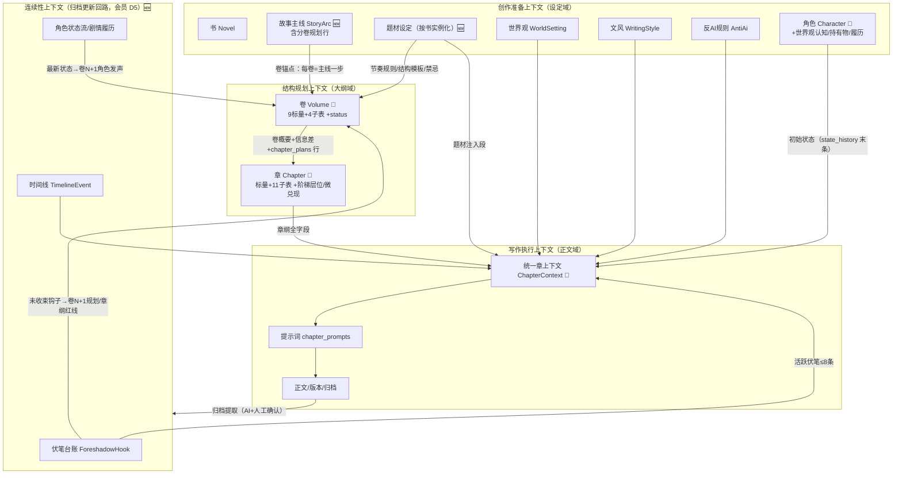
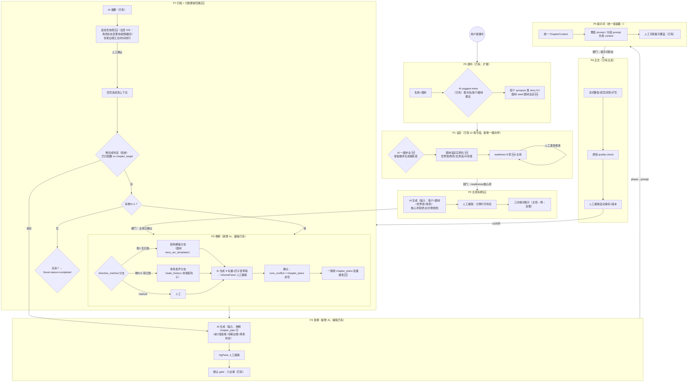

# To-Be 设计：小说创作流水线（创建 → 设定 → 主线 → 卷纲 → 章纲 → 提示词 → 正文 → 归档更新回路）

> 版本：v1.2（2026-08-24，含字段级核对补漏 + 五项拍板（D5 归档更新分层）；变更记录见 §12）
> 定位：指导下一个改进迭代的方案设计文档。对标 `awesome-novel` skill v4.13（文件型 agent 工作流）的字段体系与流程编排，落到 ai-novel C端（FastAPI + SQLite + React）的表结构与页面交互上。
> 原则：**数据 = 表**（#159-163 已全量入库）、**每个字段人类可改**（页面表单）、**每个对象 AI 可补**（按题材/简介驱动）、**写正文时提示词可由字段确定性拼装**。

---

## 1. As-is 摘要与差距总览

### 1.1 已具备（不推倒）

| 能力 | 现状 |
|---|---|
| 六阶段状态机 | `init → settings → outline → prompt → write → archive`（`workflow/engine.py`），readiness/gate 骨架完整 |
| 卷纲数据模型 | `volumes` 9 标量（direction_method/template_name/core_conflict/emotional_arc/arc_mode/primary_drive/info_gap_start·end/chapter_target）+ 四子表（stages/conflict_ladders/chapter_plans/character_voices），与 awesome-novel 卷纲规范**同源对齐** |
| 章纲数据模型 | `chapters` 标量 + 11 子表（key_points/characters/scene_cards/payoff_items/downtime_functions/key_choices/required_changes/prohibitions/knowledge_states/segments），覆盖 awesome-novel 章纲的 Memo 八段与情绪设计大部分 |
| 整章提示词组装 | `write/chapter_writer.py` ChapterContext：题材+基调+文风+反AI+前提+世界观+卷概要+章纲+前章末500字+角色状态+活跃伏笔 |
| 设定按字段 AI 生成 | `settings/ai_router.py`（world/style/hooks/characters 四类）+ 建书 `suggest-meta` + 导入反推 `ai-backfill` 两步 |
| 正文 AI 五连 | write/continue/polish/expand/quality-check + 版本快照 + 归档 |

### 1.2 核心差距（本设计要解决的 6 条）

| # | 差距 | 后果 |
|---|---|---|
| G1 | **缺「故事主线/分卷规划」对象**（awesome-novel `story.md` 主线拆纲无对应）：story KV 只有 synopsis 字符串 + genre | 卷纲没有上级锚点；AI 生成卷纲缺「这卷在主线哪一步」的输入；无完本终点 |
| G2 | **AI 生成卷纲、章纲未实现**（openspec creation-flow 明确本迭代隐藏）：卷纲四子表、章纲全字段只有人工编辑入口 | 高级字段对普通用户不可用，PRO 价值没兑现 |
| G3 | **归档更新回路缺失**（awesome-novel updater-archive 的 lore-keeping 11 步无对应）：角色 state_history 不自动追加、伏笔全局台账不随章归档汇总（hooks KV 是死数据）、时间线对象不存在 | 写到 50 章后角色状态/伏笔靠人脑记，提示词里的「角色状态/活跃伏笔」逐步失真 |
| G4 | **提示词双轨且前情来源弱**：整章 ChapterContext vs 分段 assembler 并行；前情上下文取「前章正文末 500 字」而非「上章章纲情绪设计」；缺场景权重（高/中/低）、爽点设计（micro_payoffs）、few-shot 案例段 | 提示词质量天花板低，两条路径字段语义漂移 |
| G5 | **题材设定未按书实例化**：全局 `genres` 库（tone_blueprint/story_arc_templates/taboos）≠ 本书「满足类型/节奏规则/避免套路/类型禁忌」 | 题材规范没有按书落地成可编辑设定，AI 生成卷章时无法引用本书节奏参数 |
| G6 | **角色卡缺连续性字段**：无「世界观认知（角色相信什么）」层、无情绪记录、无持有物/经历/剧情履历台账；角色级钩子无 | 长篇连续性（物品丢失/经历矛盾）无数据支撑 |

---

## 2. 领域模型与限界上下文（DDD 视图）

**边界规则**（延续 awesome-novel 的 M2 真相源原则）：

- 章级伏笔真相源 = `chapter_payoff_items`（must_resolve/must_hold/partial_advance）；全局台账是**汇总视图**，归档时由系统回写，人可改。
- 角色状态真相源 = `character.state_history`（追加型），归档更新回写（会员，D5）；不是从正文反查。
- 提示词不是真相源：执行参数（字数/情绪）只存章纲与文风，`chapter_prompts` 是生成产物 + 可人工覆盖的快照。

---

## 3. 全流程设计（100% 业务流程覆盖）

**阶段状态机不变**（六阶段维持，避免冲击五阶段 UX 设计）；主线拆纲并入 settings 的 readiness 判定（第 8 项），outline 转移的软门条件增加「主线已确认」。卷/章的推进靠已有 gate（`gate_chapter_ready` 六必填、prompt 存在性），新增卷级 gate。

---

## 4. 对象属性设计（核心章）

> 标记约定：**来源**列 `人工`=页面表单默认编辑；`AI`=可由 AI 生成/补充（标注输入）；`系统`=派生/归档自动回写，页面只读或需确认后写入——**凡「归档回写」均整块属会员权益（D5），非会员这些格子只能人工填**。**现状**列 ✅ 已有 / 🆕 新增 / 🔁 调整。

### 4.1 书 Novel（`models/project.py`，基本不动）

| 字段 | 现状 | 来源 | 说明 |
|---|---|---|---|
| name / slug / root_path | ✅ | 人工+系统 | 不变；改名不改 slug（已裁定） |
| current_phase 六阶段 | ✅ | 系统 | 不变 |
| status | 🔁 | 系统 | 枚举补 `completed`（完本判定写入） |
| source（ai/manual/import） | ✅ | 系统 | 不变 |
| tags 标签 | 🆕 | 人工 | 可选；对应 awesome-novel 元信息「标签」，建书/设定页填写 |
| ai_config_id / ai_model | ✅ | 人工 | 不变 |

### 4.2 故事主线 StoryArc 🆕（新表，G1）

单行/书。对应 awesome-novel `story.md` 的「故事主线 + 分卷规划」。这是 AI 生成卷纲的锚点输入。

| 字段 | 类型 | 必填 | 来源 | 约束 | 下游消费 |
|---|---|---|---|---|---|
| structure_type | String(20) | 是 | 人工+AI | 枚举：短篇/三卷式/五卷式/多卷连载；**事后归纳标签，允许「待定」** | 卷规划参考 |
| total_volumes | Integer/null | 是 | 人工+AI | 允许 null=待定 | 完本判定 |
| core_conflict | String(300) | 卷1前必填 | 人工+AI（输入：synopsis+genre+world） | 「谁+追求什么+对抗什么」一句话；标准=不做完所有卷答不出来；允许仅第一卷方向（类型B） | 卷纲生成核心输入；卷级三向核对 |
| endpoint_final_scene | String(300) | 否 | 人工+AI | 最后一幕画面 | 卷方向校验 |
| endpoint_protagonist | String(300) | 否 | 人工+AI | 主角最终状态 | 同上 |
| endpoint_tone | String(20) | 否 | 人工+AI | BE/HE/开放式 | 同上 |
| status | String(20) | 是 | 系统 | `draft → confirmed`；confirmed 是 outline 软门条件 | readiness 第 8 项 |

**分卷规划行 planned_volumes 🆕**（子表，sort=volume_no）：

| 字段 | 类型 | 必填 | 来源 | 约束 |
|---|---|---|---|---|
| volume_no | Integer | 是 | 系统 | 连续 |
| title | String(200) | 卷1必填 | 人工+AI | 2-4 字能概括本卷核心事件 |
| arc_position | String(10)+desc | 是 | 人工+AI | 起/承/转/合 + 功能一句话 |
| core_conflict | String(300) | 卷1必填 | 人工+AI | 必须是总主线子集；后卷允许「待定」 |
| planned_chapters | Integer | 卷1必填 | 人工+AI | ±30% 弹性，允许 null |
| row_status | String(20) | 是 | 系统 | `planned → active → done`；与 volumes.volume_no 关联，不强制外键（卷可先建后补规划） |

### 4.3 题材设定 GenreSetting 🆕（按书实例化，G5）

落 `project_settings` 新 key `genre-instance`（KV 即可，结构固定）。建书选题材时从全局 `genres` 库 seed 默认值，之后**与库脱钩**、按书可改。对应 awesome-novel `genre-setting.md` 五字段。

| 字段 | 必填 | 来源 | 约束（seed 自 genres 库，AI 可按简介改写） | 下游消费 |
|---|---|---|---|---|
| genre_id | 是 | 人工 | 指向全局库 | 提示词取 genre.prompt_injection / 题材反AI |
| satisfactions 满足类型 | 是(≥3) | AI seed+人工 | 3-5 条，每条一句话 | 章纲 AI 生成：每章至少兑现 1 种 |
| rhythm_tendency 节奏倾向 | 是 | AI seed+人工 | 行动偏多/铺垫偏多/张弛交替/全程紧绷 | 章纲 AI：控制连续同类型章 |
| tension_cycle 张力周期 | 是 | AI seed+人工 | 「N 章一小高潮，N 章一大高潮」 | 归档更新回路：超周期无高潮提醒（后置，健康检查属读侧免费） |
| setup_limit 铺垫上限 | 是 | AI seed+人工 | 整数 2-4 | 章纲 AI：接近上限必须推进展 |
| avoid_cliches 避免套路 | 是(≥3) | AI seed+人工 | 具体桥段非宽泛概念 | 提示词禁忌段 |
| taboos 类型禁忌 | 是(≥2) | AI seed+人工 | 体系崩坏/题材错位/承诺失信三类 | 提示词红线段；质检对照 |

### 4.4 世界观 / 文风 / 反AI（KV，定义结构不动存储）

- **world** 🔁：现有表单 = 地理 3（主要场景 scenes/气候 climate/地理限制 limits）+ 政治 4（统治形式/主要势力/社会分层/不服从的代价）+ 规则 3（世界级/社会级/个人级），与 awesome-novel 世界观三节基本对齐。**补一处：`creatures` 生物与怪物**（awesome-novel 模板第四节；归档更新回路的「新生物检测」写入此字段（会员））。「通行方式」并入主要场景字段的填写提示，不单列。规则字段补「能/不能/代价」三要素提示文案。约束：全文 ≤2000 字（软校验提醒）。
- **style** 🔁：现有 5 字段（叙事身份/核心原则/常见错误/描写技法/叙事基调）不变，**补 `few_shot_examples: string[]`**（风格例句 1-3 条），提示词「案例」段消费。量化蒸馏 9 维（lexicon/syntax/rhythm…）**后置迭代 C**。
- **anti-ai**：疲劳词 + 句式，不变。

### 4.5 角色 Character 🔁（KV `character:{name}`，G6）

现有字段保留（role/state_history/personality/speech/values/abilities/skills/relationships/background/appearance/environment）。补 4 项：

| 字段 | 现状 | 必填 | 来源 | 说明 | 下游消费 |
|---|---|---|---|---|---|
| worldview_belief 世界观认知 | 🆕 | AI 生成+人工 | AI | 角色自己相信的世界运作方式（≠作者设定的世界规则），能与其他角色冲突 | 章纲 AI 关键抉择校验 |
| possessions 持有物 | 🆕 | 否 | 系统（归档回写）+人工 | `{名称,类型,来源,状态[使用中/未使用/已消耗/已损毁/已转赠],备注}[]` | 提示词角色初始状态；连续性 |
| experiences 经历 | 🆕 | 否 | 系统+人工 | `{事件地点,类型,结果,状态[进行中/已完成]}[]` | 同上 |
| chronicle 剧情履历 | 🆕 | 否 | 系统（归档回写） | 每章一条 `{章ref, 行为一句话, 关系变化}` | 卷 N+1 角色发声输入 |

> 拍板（2026-08-24）：**不新增 self_image 自我定位**——角色认知模型（六层）的第 2 层即「我怎么看我自己」，该层语义已覆盖自我定位，不另立格子。

`state_history` 语义升级为**追加型状态流**：归档时自动追加变更块（会员，D5），块结构 = `位置 / 状态 / 情绪（状态+触发+方向，对应 awesome-novel 角色「情绪弧线」归档记录）/ 人际关系变化 / 能力变化 / 关键台词`（现人工填，改为人工+系统双写，冲突人工优先；非会员仅人工写）。

### 4.6 伏笔台账 ForeshadowHook 🆕（表化，G3）

现状 hooks KV（active/resolved/abandoned 三表 JSON）升级为表。**章级真相源仍是 chapter_payoff_items**，本表是全局汇总 + 规划视图，归档时系统按 payoff_items 回写（会员，D5；非会员在「伏笔」页手动维护），人可改。

| 字段 | 类型 | 必填 | 来源 | 约束 |
|---|---|---|---|---|
| id | PK | 系统 | | |
| project_id / root_path | FK | 系统 | | |
| description | String(300) | 是 | 人工+AI（设定期）+系统（章内新埋） | 大白话 |
| introduced_ref | String(64) | 是 | 系统 | vol-N-ch-M |
| status | String(20) | 是 | 系统+人工 | `pending / partial_advance / resolved / abandoned` |
| payoff_timing | String(20) | 否 | AI+人工 | immediate(1-3章)/near_term/mid_arc/slow_burn/endgame |
| priority | Integer | 否 | AI+人工 | 1 主线/2 支线/3 可选 |
| hook_type | String(20) | 否 | AI | mystery/threat/promise/clue/relationship/power/emotion/choice/desire |
| hook_strength | String(10) | 否 | AI+人工 | strong（卷末关键转折）/ medium（普通章）/ weak（过渡章）；健康检查「每 5 章至少 1 strong、连续 weak ≤3 章」依赖此列 |
| seed_text | String(300) | 否 | 系统（埋设时截取正文 1-3 句） | 埋设时的原文；兑现时锚定读者记忆，提示词可引用「当初埋的话」 |
| character_name | String(50) | 否 | AI+人工 | 可选；角色级钩子归属（对应 awesome-novel 角色文件内的钩子真相源），空=剧情级 |
| last_mentioned_ref | String(64) | 系统 | | 健康检查：高优 >5 章未提及提醒 |
| plan_resolve_ref | String(64) | 人工+AI | | 计划收束位置（规划值） |
| resolution_ref | String(64) | 系统 | 实际收束章（实际值，status→resolved 时写） |
| resolution_way | String(300) | 系统+人工 | 怎么兑现的（resolved 行的收束方式） |

**健康检查**（后置迭代 B）：高优钩子 >5 章未提及 / 连续 weak >3 章 / 每 5 章至少 1 strong——归档时计算，读侧展示，不阻断。

**状态语义取舍**：awesome-novel 有显式 `mentioned` 状态；本设计将「提及」折叠为 `last_mentioned_ref` 刷新（提及不改变钩子状态），推进不收束才进 `partial_advance`——少一个状态、台账更干净，健康检查等价。

### 4.7 时间线 TimelineEvent 🆕（表，G3）

`{id, project_id, story_time String(150), event String(300), chapter_ref String(64), characters String(200), created_at}`。归档时按章 story_time + 摘要回写一行（会员，D5；非会员可手动补行）；提示词可选注入最近时间线（近 3 行）帮助时间连贯。

### 4.8 卷 Volume 🔁（9 标量+四子表已有，补 3 项）

| 字段 | 现状 | 来源 | 说明 |
|---|---|---|---|
| status | 🆕 | 系统 | `draft → confirmed → writing → completed`；确认后允许「按规划建章」；completed 由卷完成判定按「已归档数 ≥ chapter_target 或 chapter_plans 数」写（免费，非归档更新） |
| arc_position | 🆕 | 人工+AI | 关联 planned_volumes 行（起/承/转/合），AI 生成卷纲输入 |
| ladder_layers（卷冲突阶梯） | ✅ conflict_ladders 子表 | 不变 | 已有 layer_no/chapters_range/obstacle/turning_type/turning_point |

四子表（stages / conflict_ladders / chapter_plans / character_voices）字段全部保留；character_voices 的四段（situation/unfinished/interlude_thought/next_action）与 awesome-novel 角色发声四段**已同构**，是卷 N+1 AI 生成的既有落点。

### 4.9 章 Chapter 🔁（标量+11 子表已有，补 4 项）

| 字段 | 现状 | 必填 | 来源 | 说明 | 下游消费 |
|---|---|---|---|---|---|
| ladder_position 卷阶梯层位 | 🆕 | AI+人工 | 1-4（入门/升级/转折/终极），从卷 conflict_ladders 推 | 提示词「冲突红线」段：压迫感强度 |
| ladder_steps 章内小阶梯 | 🆕（新子表） | AI+人工 | `{step_no, content}[]` 2-3 行，每级麻烦比上级更大；**拍板（2026-08-24）：显式存，不派生** | 提示词场景原材料：各场景障碍强度按台阶对齐 | 
| ladder_exit 章末落点 | 🆕（章标量） | AI+人工 | 一句话：结尾停在哪个紧张度上，须给下一章更高起点 | 下章前情上下文 |
| micro_payoffs 读者获得 | 🆕（子表或 JSON） | 软（缺则警告，D1） | AI+人工 | `{type[info/relationship/emotion/clue/ability/resource/recognition], description, location[前段/中段/后段]}[]`，每章 ≥1，过渡章也须有；不与 emotional_hook 抢章末 | 提示词「叙事目标·爽点设计」 |
| scene_cards.weight / focus | 🔁 子表加列 | AI+人工 | weight 枚举 `high/mid/low`（每章 1 high + ≥1 low）；focus 三选一 `核心冲突/人物情绪/信息差` | 提示词场景原材料：权重定笔墨分配（high ≥70% 笔墨，low ≤100 字转场） |

其余字段（summary/key_points/characters/location/story_time/pov/current_task/word_target/情绪五件套/读者预期三件套/segments 等）**全部保留**，六必填 gate 不变。

**其余 awesome-novel 章纲字段的落地取舍**：
- **章的卷走向位置**：从卷纲 chapter_plans.arc_position 派生，不在章上重复存。
- 可选题材字段（scene_type 场景类型 / immersion_type 代入感 / gold_finger 金手指，番茄向）：不进本体 schema，由题材库 prompt_injection 在生成时引导写入 key_points 内容。

### 4.10 后置对象（本迭代不建，仅预留）

- **写作记忆 WritingMemory**（awesome-novel 四阶段 memory + 晋升机制）：迭代 C。
- **文风量化 9 维 + 场景风格卡 style-profiles**：迭代 C。
- **推演沙盘 sandbox 接入章纲**：已有 story/engine.py 实验模块，迭代 C 评估。
- **质检/评审留档**：quality-check 结果现状只回显不落库，reader 式评审报告无存储——与写作记忆同期（迭代 C）建 `review_records`。

### 4.11 字段级核对结论（awesome-novel 全字段 × 本设计）

| 对象 | 核对结论 |
|---|---|
| story.md 主线拆纲 | ✅ 全覆盖（StoryArc+planned_volumes）；元信息「标签」补到 Novel.tags |
| 世界观 | 🔁 补 creatures 生物与怪物；通行方式并入提示 |
| 题材设定 | ✅ 7 字段对齐 5 组字段 |
| 文风 | ✅ 5 字段+few_shot；量化层后置 C |
| 角色 | 🔁 补 worldview_belief / 持有物 / 经历 / 履历 / 情绪记录（并入 state_history 块）；self_image 拍板不加 |
| 伏笔台账 | 🔁 表化时补 strength / seed_text / character_name / resolution_ref+way；mentioned 折叠取舍 |
| 时间线 | ✅ 新表四列对齐 |
| 卷纲 | ✅ 九标量+四子表全对齐，无漏 |
| 章纲 | 🔁 补 ladder_position / ladder_steps+ladder_exit（拍板显式存）/ micro_payoffs（拍板只警告）/ 场景卡 weight+focus |
| 提示词 | ✅ chapter_prompts（name+content）够用，产物非真相源 |
| 正文/归档 | ✅ AI 原版快照由 chapter_versions 覆盖（写完即落版本），无需新对象 |
| 写作记忆/评审留档 | 🟣 后置 C |

---

## 5. 流程与子流程设计（触发 / AI 策略 / 人工确认 / gate / 回退）

> 所有新增 AI 端点走既有 `require_ai_access` 会员门控（#152 口径）；所有 AI 产出**先落草稿态，人工确认后生效**，正文与设定数据不被 AI 直接覆盖。

### 5.1 P0 建书（扩展）

- 已有：name-only 建书、`POST /api/ai/suggest-meta`（书名/简介/题材/笔名建议）。
- 🆕 扩展：建书弹窗题材选中后，service 层 seed GenreSetting（4.3）；用户采纳 AI 简介时写入 story KV synopsis。

### 5.2 P1 设定（新增「一键补全」向导）

- 已有：`POST /settings/ai/{stype}/{field}` 按字段生成（world/style/hooks/characters）。
- 🆕 **一键补全向导**：按依赖序串行生成缺失项 `题材实例化 → 主线 → 世界观 → 角色 → 文风 → 伏笔`，每步落草稿并展示 diff，用户可单步采纳/重生成/跳过。输入链：synopsis → genre-instance → world/characters（互为 context）→ style（题材基线）→ hooks（前三者汇总）。
- readiness 从 7 项扩为 **8 项**（+主线拆纲 confirmed）；`outline` 软门增加主线确认。

### 5.3 P2 主线拆纲 🆕

- 触发：readiness 核心项（synopsis/genre/world/characters）就绪后，设定页出现「规划主线」卡。
- AI 生成输入：synopsis + 题材实例（含 genres.story_arc_templates）+ 世界观 + 角色卡。输出 StoryArc + planned_volumes 草稿（卷1 必详，后卷允许待定）。
- 人工：每字段可改；分卷行可增删。
- gate：`confirmed` 需 core_conflict 非空；页面提供「三向核对」自检提示（总主线→逐卷 / 卷序列→路径 / 任一卷→反推主线），不通过仅警示不阻断。
- 回退：unconfirm → 改 → reconfirm（卷已建不联动删除，仅提示差异）。

### 5.4 P3 卷纲（新增 AI 生成，人工编辑已有）

- **分支由 direction_method 决定**（字段已有，语义激活）：
  - `template`（卷1/无归档）：AI 读题材 story_arc_templates + 主线本卷行 → 生成 9 标量 + stages + conflict_ladders + chapter_plans 草稿。
  - `character_voice`（卷 N+1/有归档）：AI 读各活跃角色 state_history 末条 + chronicle 末几条 + 未收束伏笔台账 → 先产出 character_voices 四段（复用现有子表）展示确认 → 再据此生成其余标量与 chapter_plans。**两段式确认**，角色发声是中间产物也是可编辑数据。
  - `manual`：现状不动。
- 输出为**草稿态**（volume.status=draft），写入 VolumePanel 现有表单；用户可局部重生成（如只重生 chapter_plans）。
- gate（确认 → confirmed）：core_conflict 非空（已有 *）+ chapter_plans 非空 + planned 章数提示 vs planned_volumes.planned_chapters 差异警示。
- **一键建章 🆕**：按 chapter_plans 批量创建章（章号程序排定，#164 口径不回归），章 title/summary 预填自 chapter_plans 行，outline_status=unfilled。

### 5.5 P4 章纲（新增 AI 生成，人工编辑已有）

- AI 生成输入（对应 awesome-novel chapter-reference 五组）：
  1. 卷纲定位：本章 chapter_plans 行（title/summary/emotional_anchor/info_gap/arc_position）+ 卷 core_conflict/ladder 层位。
  2. 角色重建：出场角色 state_history 末条 +（可选）认知字段。
  3. 前章脉络：前 3 章的 mood_progression 末段、emotional_hook、required_changes、knowledge_states（**读章纲不读正文**——语义前情替代「前章末 500 字」，见 §6）。
  4. 伏笔台账：全局台账中 pending/partial_advance 项 → 建议本章 payoff_items 三分类。
  5. 题材节奏：rhythm_tendency/setup_limit/张力周期 → 本章 intensity_level 与相邻章差 ≤2。
- 输出：章纲全字段草稿（含 segments 段落规划、scene_cards 带 weight/focus、micro_payoffs、ladder_position），落 OgPane 现有表单。
- gate：六必填（已有）不变；micro_payoffs ≥1 **只警告不拦截**（拍板 2026-08-24），存量章不回溯。
- 回退：unconfirm（已有能力扩展到新字段）；重生成保留人工已改字段（diff 合并，人工优先）。
- **设定变更引导**（对应 awesome-novel「设定变更通知」）：AI 生成卷纲/章纲时若引入新角色或新世界观元素，输出附 `proposed_settings: [{type: character|world, ...}]` 清单，前端弹「去设定页补卡」引导——不自动写设定文件（与 awesome-novel updater 消费设变通知等价，但改为人工确认落地）。

### 5.6 P5 提示词（统一，见 §6）

### 5.7 P6 正文（微调）

- 五连（write/continue/polish/expand/quality-check）不动。
- 唯一调整：`build_chapter_context` 的前情来源从「前一章正文末 500 字」升级为「上章章纲情绪设计（emotional_hook + mood_progression 末段 + required_changes 摘要）+ 可选附前章末 300 字原文」。章纲未确认时回退现行为（兼容）。

### 5.8 P7 归档 + 归档更新回路 🆕（G3 核心）

归档既有动作（≥100 字、AI 摘要、phase→archive）**保持免费不变**（非会员摘要降级正文前 200 字，现状行为）。新增的**连续性快照 + 归档更新（lore-keeping，即 awesome-novel updater 归档后的设定更新）自动回写整块为会员权益（D5）**：非会员归档照常完成，但**不做任何自动设定更新**——伏笔台账、时间线、角色状态由用户在「伏笔」页/「角色」页**手动编辑维护**（台账与时间线的读写本身免费，门控的是自动回写）。

1. 归档触发时（会员，走 `require_ai_access` 同款门），AI 读本章正文 + 章纲 payoff_items/required_changes/characters/story_time，产出快照 JSON：
   - 每个出场角色：状态变更块（位置/状态/关系/能力变化/关键台词）+ 剧情履历一条 + 持有物/经历变化（如有）。
   - 伏笔操作集：新埋（partial_advance 新增项）/收束（must_resolve）/提及（正文实际 touch 的 pending 项）。
   - 时间线一行（story_time + 事件摘要）。
2. **人工确认弹窗**（会员；复用 trial 归档双 confirm 模式）：用户可编辑/勾掉任一项，确认后系统写入 state_history/chronicle/台账/时间线。跳过 = 不回写（保持现状行为，向后兼容）。
3. 卷完成判定（**免费**——属工作流状态机，不属归档更新；与 phase 流转同级）：本卷已归档章数 ≥ max(chapter_target, chapter_plans 行数) → volume.status=completed + planned_volumes 行 done + 提示「规划卷 N+1 / 完本」。
4. 幂等：按章 ref 锚点查重，重复归档只补缺（awesome-novel 幂等规则的 DB 版）。
5. 回滚（重写某章，会员）：unarchive（已有）扩展——回退该章产生的台账操作与时间线行（软删，宁少删），state_history 变更块标记 stale 供人工清理。

---

## 6. 提示词拼装规范（统一双轨，G4）

### 6.1 段落骨架（唯一组装器 `ChapterContext`，分段 assembler 复用）

| # | 段落 | 数据源（DB 字段） | 现状 |
|---|---|---|---|
| 1 | 角色定位 | style.叙事身份 + 题材（genre-instance.genre_id → genres.prompt_injection） | ✅ 已有 |
| 2 | 任务指示 | 章号 + **卷角色**（ladder_position + planned_volumes.arc_position 派生：铺垫/推进/高潮/收束）🆕 + word_target ±10% 压缩策略 🆕 + **驱动力**（卷 primary_drive + 本章信息差）✅ + **叙事目标三条**：核心悬念（问题式+解决/加深/转移）、读者情绪（primary_mood）、**爽点设计**（micro_payoffs：类型+位置）🆕 | 🔁 扩展 |
| 3 | 背景信息·前情上下文 | **上章章纲**：mood_progression 末段 + emotional_hook + required_changes 摘要 + **ladder_exit 章末落点（下一章的更高起点）**🆕 + 读者期待缺口（expectation_state/detail）；ch-1 固定「无前置章节，开篇直接切入角色当下行动」🆕；可选附上章正文末 300 字 | 🔁 来源升级 |
| 4 | 背景信息·角色初始状态 | 出场角色（≤5）state_history 末条 + 语言特征（speech）+ 本章微习惯；新角色全卡 | ✅ 已有（补 speech） |
| 5 | 背景信息·故事背景 | synopsis + 世界观（≤N 字裁剪）+ 卷概要 + 卷信息差（info_gap_start→当前位置）+ 本章 info_gap | ✅ 已有 |
| 6 | 输入·场景原材料 🆕 | scene_cards（2-5 卡）渲染为：`场景N｜location｜primary_mood 基调｜权重 high/mid/low` + 核心事件链（goal→obstacle 摄像机式，**各卡障碍强度对齐 ladder_steps 台阶**🆕）+ 信息差（knowledge_states 对应对）+ 情绪拐点（mood_progression 节点）+ 焦点三选一；**权重规则**：每章 1 个 high（≥70% 笔墨）+ ≥1 个 low（≤100 字转场） | 🆕 全新 |
| 7 | 段落分解（分段模式） | segments（或 key_points）：`¶n [功能标签]|[节奏侧重]|[注意项]`；字数倒推：word_target÷500≈段数 | ✅ 分段已有（对齐骨架） |
| 8 | 案例 🆕 | style.few_shot_examples（1-3 条）；空则跳过不注占位符 | 🆕 |
| 9 | 不可违反规则 | **红线**（required_changes「从什么变什么」+ payoff_items must_resolve/must_hold + prohibitions + 角色禁区「{角色}不会{行为}」← key_choices 推导）> 字数 > **疲劳词/句式**（anti-ai）> 题材禁忌（genre-instance.taboos + avoid_cliches）> 文风原则/描写技法 | 🔁 结构化重排（优先级降序） |
| 10 | 质感要求 🆕 | 无用细节 1-2 个 / 对话半截话与语气词 / 段落精度分层（high 场景 ≥3 处细节，low 转场模板） | 🆕 |

### 6.2 统一策略

- `build_chapter_context`（整章）与 `assemble_segment_prompt`（分段）**共用同一 context 装配层**：分段模式 = 整章 context 的 1-5/9 段 + 第 6 段只渲染该段对应场景卡 + 第 7 段单段。
- 前情上下文缺章纲（旧书/免确认直写路径）时回退「前章末 500 字」，保证兼容。
- 裁剪预算：世界观注入 ≤600 字、活跃伏笔 ≤8 条、角色 ≤5 人（awesome-novel 量化预算对齐）；占位符守卫——style/genre 未填时用题材库默认兜底并标注，不注 `{...}`。

---

## 7. 数据模型变更清单（migration 增量）

| 变更 | 对象 | 类型 |
|---|---|---|
| 新表 | `story_arcs` + `planned_volumes` | 🆕 |
| 新 KV | `project_settings` key=`genre-instance`（结构固定 JSON） | 🆕 |
| 新表 | `foreshadow_hooks`（迁移脚本：hooks KV 三表 → 行） | 🆕 |
| 新表 | `timeline_events` | 🆕 |
| 加列 | `volumes.status`、`volumes.arc_position`；`novels.tags`（可选） | 🔁 |
| 加列 | `chapters.ladder_position`、`chapters.ladder_exit` | 🔁 |
| 新子表 | `chapter_micro_payoffs`（kind/description/location）、`chapter_ladder_steps`（step_no/content） | 🆕 |
| 加列 | `chapter_scene_cards.weight`、`.focus` | 🔁 |
| 角色结构 | KV JSON 补 `worldview_belief/possessions/experiences/chronicle`；情绪记录并入 state_history 块结构（无 DDL，读侧容错） | 🔁 |
| style KV | 补 `few_shot_examples[]` | 🔁 |
| world KV | 补 `creatures` 生物与怪物（无 DDL，读侧容错） | 🔁 |
| readiness | 第 8 项 story_arc（`workflow/readiness.py` + 前端 SettingsView） | 🔁 |
| 旧数据兼容 | 存量书 genre-instance 惰性 seed（首次访问时从 genres 库生成）；hooks KV 只读不删（双读一个迁移窗口后退役） | 迁移策略 |

## 8. API 变更清单

| 端点（拟） | 方法 | 说明 |
|---|---|---|
| `/api/novels/{id}/story-arc` | GET/PUT | 主线读写 |
| `/api/novels/{id}/story-arc/ai` | POST | AI 生成主线草稿 |
| `/api/novels/{id}/story-arc/confirm` | POST | 确认（outline 软门） |
| `/api/novels/{id}/settings/genre-instance` | GET/PUT | 题材实例化读写 |
| `/api/novels/{id}/volumes/{ref}/ai` | POST | AI 生成卷纲草稿（body: mode=template/character_voice，scope=full/chapter_plans/voices 局部重生） |
| `/api/novels/{id}/volumes/{ref}/confirm` | POST | 卷确认 + 可选批量建章 |
| `/api/novels/{id}/volumes/{ref}/chapters/batch` | POST | 按 chapter_plans 批量建章 |
| `/api/novels/{id}/chapters/{ref}/outline/ai` | POST | AI 生成章纲草稿（scope 支持局部） |
| `/api/novels/{id}/chapters/{ref}/continuity-snapshot` | POST | 归档前连续性快照生成（**会员门 require_ai_access**，D5） |
| `/api/novels/{id}/chapters/{ref}/archive` | POST | 扩展 body：snapshot_confirmed + 快照内容（归档本身免费；快照写回仅会员） |
| `/api/novels/{id}/hooks` | GET/PUT | 台账读写（替换 hooks KV 端点；读写免费，自动回写才走会员） |
| `/api/novels/{id}/timeline` | GET | 时间线读（免费；归档自动回写行仅会员） |

## 9. 页面影响

| 页面 | 变更 |
|---|---|
| CreateProjectModal | 采纳 AI 简介写入；题材 seed 提示 |
| SettingsView | +「主线拆纲」卡（第 8 项）；「一键补全」向导入口；伏笔页升级为台账表格（状态徽标+计划收束列） |
| VolumePanel | +「AI 生成卷纲」（卷1/卷N+1 两模式入口）；+确认按钮（status 徽标）；「按规划建章」 |
| OgPane | +「AI 生成章纲」；+micro_payoffs 编辑列表；+章内阶梯（ladder_steps）列表与章末落点（ladder_exit）控件；场景卡 weight/focus 控件；ladder_position 选择 |
| ProsePane/PromptPane | 预览提示词展示新段落（场景原材料/案例/红线优先级） |
| 归档流 | 连续性快照确认弹窗（角色状态/台账/时间线 diff 视图，会员）；非会员归档成功 toast 提示「设定自动更新为会员功能，可在伏笔/角色页手动维护」 |
| StructureTree | 卷状态徽标（draft/confirmed/completed） |

## 10. 分期建议

| 迭代 | 范围 | 价值 |
|---|---|---|
| **A（下一个改进）** | 主线拆纲（表+页+AI）→ AI 卷纲（两分支+草稿确认+批量建章）→ AI 章纲 → 章纲新字段（ladder_steps/ladder_exit/micro_payoffs/场景卡 weight·focus）→ 提示词统一（前情升级含章末落点+场景原材料含阶梯对齐+红线重排+爽点设计） | 把 PRO 高级字段从「人工可用」变「AI 可产」，提示词质量上台阶 |
| B | 归档更新回路（连续性快照+伏笔台账表化+时间线+卷完成判定）+ 健康检查 + 会员门（D5） | 长篇连续性（会员核心价值点） |
| C | 文风量化蒸馏 + 写作记忆 + 推演沙盘接入 | 风格个性化 |

## 11. 决策记录与待拍板

### 已拍板（2026-08-24）

| # | 事项 | 决定 |
|---|---|---|
| D1 | micro_payoffs 门槛 | **只警告不拦**：章纲确认时缺「读者获得」弹提醒，不阻断；存量章不回溯 |
| D2 | 完本锁定 | **不锁**：status=completed 仅书架徽标，设定/正文/番外照常可改 |
| D3 | 角色 self_image | **不加**：认知模型第 2 层（我怎么看我自己）本身就是自我定位语义，已覆盖，不重复建格 |
| D4 | 章内小阶梯 | **显式存**：新子表 chapter_ladder_steps（2-3 行）+ 章标量 ladder_exit 章末落点 |
| D5 | 归档更新（lore-keeping）分层 | **整块归会员**：连续性快照 + 归档后设定自动更新（伏笔台账/时间线/角色状态，含从章纲结构化数据派生的规则回写）全部走 require_ai_access 会员门。归档动作本身保持免费（非会员摘要降级前 200 字，现状不变）；台账/时间线/角色页的查看与手动编辑保持免费。卷完成判定属工作流状态机不属归档更新，保持免费。曾评估过「规则回写免费+AI 提取会员」的拆层方案，未采纳——归档更新自动化整体作为长篇连续性的会员核心价值点 |

### 待拍板（进入实现前需定）

1. **AI 草稿交互形态**：草稿先写库（status=draft，表单直接可见可改）vs 仅预览区确认后写库。倾向前者（与 VolumePanel/OgPane 现有编辑模型一致，且「重生成保留人工改动」实现为字段级 diff 合并）——随迭代 A 的 AI 动作规划一起定。
2. **章纲 AI 生成分档**：整章纲一次生成（token 大）vs 分块生成（基本信息→情绪→场景卡→payoff 多轮）。建议首版整章纲（输出 JSON 已有先例 settings_*.prompt），卡顿再拆——同上随 AI 动作规划定。
3. **伏笔台账迁移窗口**：hooks KV 双读多久退役（建议 2 个迭代）。

## 12. 变更记录

| 版本 | 日期 | 变更 |
|---|---|---|
| v1.0 | 2026-08-24 | 初版：as-is 差距 6 条、领域上下文图、全流程图、对象属性设计、AI 生成策略、提示词拼装规范、数据/API/页面变更清单、分期建议 |
| v1.1 | 2026-08-24 | ① **字段级核对补漏**（§4.11）：世界观补 creatures 生物与怪物；角色情绪记录并入 state_history 变更块；伏笔台账表补 hook_strength/seed_text/character_name/resolution_ref+resolution_way；Novel 补 tags；mentioned 状态折叠为 last_mentioned_ref（取舍记录）；AI 原版快照由 chapter_versions 覆盖（无需新对象）；质检/评审留档后置迭代 C。② **四项拍板落地**（§11 D1-D4）：不加 self_image（认知模型第 2 层已覆盖自我定位语义）；章内小阶梯显式存（chapter_ladder_steps 子表 + ladder_exit 章末落点）；micro_payoffs 只警告不拦；完本不锁仅徽标。③ §1.2 G6、§6 提示词规范（前情含章末落点、场景障碍对齐阶梯）、§9 页面（OgPane 阶梯控件）、§10 迭代 A 范围（补章纲新字段）同步更新 |
| v1.2 | 2026-08-24 | **拍板 D5：归档更新（lore-keeping）整块归会员**。§5.8 重写分层口径——归档动作免费不变（摘要降级照旧），连续性快照+设定自动更新（含规则回写）整块 require_ai_access；非会员页面手动维护兜底（台账/时间线/角色页读写仍免费）；卷完成判定属状态机保持免费。§4 标记约定、§4.6/§4.7、§8 API（snapshot 会员门+hooks/timeline 读写免费注记）、§9 归档流非会员提示、§10 迭代 B 补门控，同步更新 |

## 附录 A：历史拍板决策存档（2026-08-13 收费 AI 能力规划）

> 来源：`docs/superpowers/specs/2026-08-13-paid-ai-capabilities-handoff.md`（2026-08-24 docs 清理时删除原文，拍板表并入此处存档）。原文标注「已拍板方向（勿再翻案，除非用户改口）」，约束本设计的 AI 能力边界与收费口径。

| 维度 | 决策 |
| --- | --- |
| 起草范围 | 准备层起草（设定+章纲）+ 正文联动，两层都属于 PRO AI 能力 |
| 链路起点 | AI 问答起步：先问 3-5 个轻量问题 → AI 帮填/生成 → 作者确认修定 |
| 章纲粒度 | 作者定卷/章结构（只填标题），AI 起草每章 memo+段落规划 |
| 收费单位 | 订阅解锁（现状方向）：PRO 解锁全部 AI 能力，不按次单独计费 |
| 联动增量 | 前文记忆窗 + 角色状态自动回写 + 伏笔状态自动回写（三选全选） |
