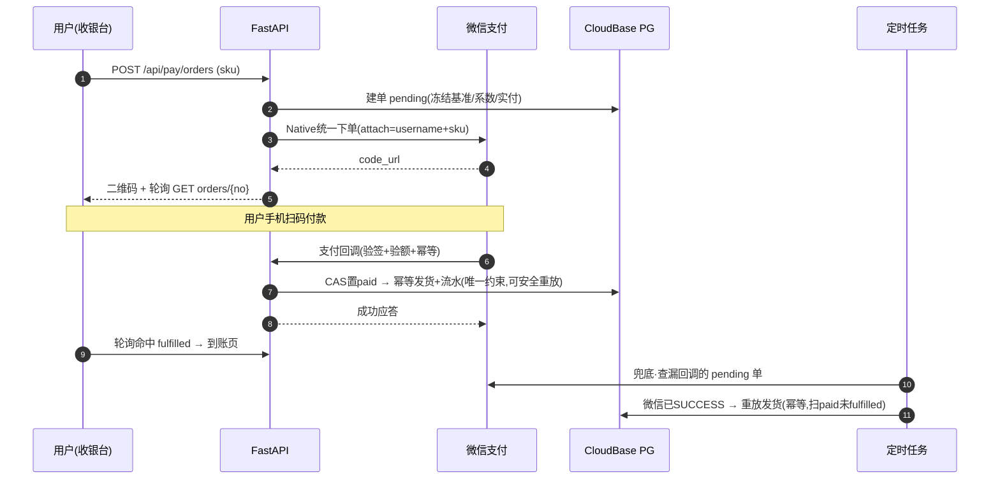
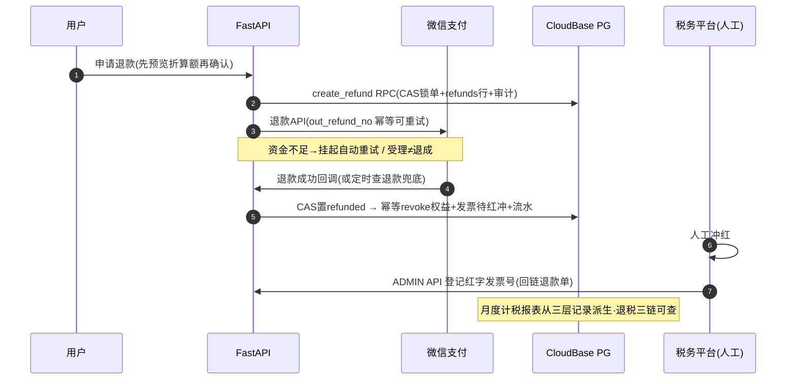

# S端 扫码支付 · 探索纪要（未立项）

> 状态：**explore 结论沉淀，尚未转 openspec change**。2026-08-28 会话产出。
> 读了本文即可接续，无需会话上下文。立项时按「十二、下一步」走。

## 一、决策面（全部已拍板）

| # | 决策 | 结论 | 拍板人 |
| --- | --- | --- | --- |
| 1 | 商户资质 | 微信支付商户号由用户负责办理（mchid + 绑定 AppID + APIv3 密钥/证书 + Native 权限产品） | 用户 |
| 2 | 商品形态 | 一次性时长包：包月 / 包季度 / 包年。不做自动续费订阅（委托代扣个人商户批不下来）→ "退订"不存在，只有"退款+权益回收" | 默认已接受 |
| 3 | 发货形态 | **到货-激活两段式（2026-08-28 修订，原"直充到账"）**：支付信号到 → 套餐落账为"待激活"；用户点「激活」才入队计时（起点=当前最远到期日）。支持囤套餐：未激活不计时、不占设备额度、**退款全额**、永不过期；「激活」作为动词解禁（激活码仍禁） | 用户 |
| 4 | 退款政策 | **发起日按剩余天数折算、原路退回**；重复支付/系统错误无条件全额退（纠错非政策） | 用户 |
| 5 | 回调链路 | FastAPI 自实现微信支付 v3 Native（不走 CloudBase 集成中心），回调走现有 `www.awesomenovel.com/api` 网关。**2026-08-28 复核**：已读集成中心官方文档——其为 console-first 模板函数（业务逻辑仍需自写进托管模板、另走部署链路、需额外 service_role 密钥回源），订单状态机/幂等/发货原子/退款/对账两条路都须自建，集成中心仅省验签与免冷启动（wechatpayv3 + 微信重试已覆盖），用户确认维持自实现 | 推荐，用户已确认 |
| 6 | 管理面 | 最小：ADMIN_TOKEN 管理 API（改价/改系数/退款处置/订单查询）+ MCP 直查 PG，不做 Web 管理页 | 默认已接受 |
| 7 | 定价与套餐配置 | **套餐 = 档位（tier）× 时长（period）二维配置**：tier 当前 PRO、规划 MAX，后台加配置行即上新套餐（零代码）；每 SKU 配 基准价/设备数/在售状态；tier 另配 等级序（归属用）/卖点/上架状态（planned=收银台预告占位）× **折扣系数（2026-08-29 修订：per-SKU，示例 包月原价/包季 9 折/包年 8 折，卡片上直接显示折扣；全局系数保留为批量工具）**；免费档与付费档同组展示对比（收银台最左"当前方案"卡） | 用户 |
| 9 | 协议确认与留痕 | **支付前弹窗确认**：点击「去支付」→ 弹窗亮《购买协议》《退款政策》要点与本单摘要 → 「阅读并同意，去支付」方可进支付（替代勾选框，对应 B5 格式条款显著公示）。**留痕**：orders 记 `agreement_version + agreed_at`，trade_events 记 `terms_agreed` 事件（append-only 举证件）；协议正文版本化运营（如 v2026.08） | 用户（2026-08-29） |
| 8.5 | 激活码渠道 | **整体丢弃（2026-08-28）**：在线购买为唯一付费通道，界面无兑换码入口；codes 表仅作内部权益台账（source=order）；现网"激活新码"功能在实现 change 中拆除；**连带后果：商户号未获批时无人工出码兜底，Plan B 降级为"暂缓上线"** | 用户 |
| 8 | 发票与税务 | **【功能暂缓（2026-08-29 拍板）：上线版本不含发票，含计税报表外的全部设计保留待启用】** 原口径：不主动提供发票入口；每笔成功交易保留开票能力（用户请求时人工经税务平台开出、系统登记台账）；已开票订单退款须红冲并留痕；系统出月度计税报表（实收/退款/净额/开票/红冲明细）供财务税务对账 | 用户（2026-08-28） |

子决策（随 #4/#7 落定）：

- **权益台账语义（2026-08-28 定稿 + 当日修订待激活态）**：每笔订单一张独立台账行，状态集 = **待激活**（已到货未入队，不计时/不占额度/退款全额/永不过期）→ **排队中**（已激活、前面有单在耗）→ **消耗中** → 耗完/已回收；激活=入队，行记 `起点+终点`（顺延衔接：新行起点=当前最远到期日）；**订单台账行不生成任何用户可见码串**（code_id 以 order_no 充当或内部生成，绝不出现兑换/输入环节）；**退款按单独立**，退某单只作废该行、其余行起止不重算；**账户剩余时长 = Σ已激活行(终点 − max(今天, 起点))**，待激活单另计"N 个待激活"不计入；与"当前是否会员"（今天落在某行区间内）是两个概念，中途退中间单产生空窗属自洽；展示口径=概览给剩余天数+最远到期日，订单明细给每行起止

- 折扣系数 = **全局一个**（默认 1.0），统一乘三档基准价；下单瞬间冻结 `基准价 + 系数 + 实付` 三字段落库（三年后看订单仍可解释金额由来；退款折算用实付额，天然不受改价影响）
- **退款冷静期（2026-08-29 三修终版）**：确认退款 → 套餐**立即冻结** + 金额按**确认时刻**锁定（秒级）→ 进入 **5 分钟冷静期**（可取消）→ 到点自动提交微信 → 成功后作废。**取消**（冷静期内）→ 解冻恢复使用、终点不变、不补偿；**失败**（提交后）→ 套餐保持冻结直至退款完成（人工跟进重试或协商，承诺"绝不钱货两空"）；冻结期间一律不补偿。实现：refund_pending（冷静期，用户可撤 → paid）/定时到点提交（→ refund_processing）；金额进冷静期即冻结，倒计时结束不改金额
- 权益回收时点 = **退款成功回调时**（申请即回收会在退款失败时吞掉用户权益）

## 一·五、术语裁定：PRO 一词退役（2026-08-28）

用户澄清：**PRO 不是品牌词**，只是早期对"免费 vs 付费"的区分叫法；付费购买的对象是**套餐**。界面词汇全面以"套餐/免费版"表达付费差异，"PRO 功能"改为"套餐功能"。**当日二次修订**：套餐分档（PRO 当前 / MAX 规划）——PRO/MAX 作为**套餐档名**回归可用（同一对象的档位系列，如"PRO · 包年"），仍禁止拿 PRO 当"付费"的同义词使用。

## 二、现状地基（支付嫁接到哪）

```
现状（无在线支付）
═══════════════════════════════════════════════════════════
 用户线下转账 ──► 人工（MCP 直插 PG codes 表出码）
                    │ codes: tier + duration_days + expires_at
                    ▼
 用户在 S端 控制台输码 ──► /api/license/activate
                    ▼
 C端 check-auth ──► License.merge(所有激活码) → effective_tier ──► C端 门控
```

关键代码事实：

- 权益本质 = `codes` 表的 `tier + duration_days`（注册送 7 天 trial 码同机制）
- **顺延已实现**（架构师评审纠正，已验证）：`activate_code.py:17-19` 激活时 `base = max(现有到期, today)` 再加时长——两份 90 天码可叠成 180 天。支付发货要做的不是"改 merge 公式"，而是**复用这套顺延计算** + 让 `License.merge` 跳过 revoked 行
- **真实暗雷 = tier 归属**：`config.py TIER_POLICY` 中 monthly/quarterly/yearly 是三个不同 tier（设备数 3/3/5）；`license.py:29` 取"到期最晚行"的 tier → 年付用户再买月付顺延后 effective_tier 掉回月付、设备数 5→3。需改为"已激活行中按 **tier 等级序** 取最高（MAX>PRO；评审 C2；2026-08-28 修订：待激活行不占额度）；注意现状 TIER_POLICY 把时长档当 tier（monthly/quarterly/yearly），实现期需重构为 tier×period 正交"
- 用户体系现成：users + device_grants（设备绑定），支付直接挂 username
- 管理面现状：admin 仅出码/查码两个 API（ADMIN_TOKEN）
- 生产建表管道：alembic 本地生成 revision → CloudBase MCP `managePgDatabase(applyMigration)` 上生产 + `alembic_version` 打标（`server/README.md:135`）
- **生产库无事务**（评审 A1，致命前提）：`DB_BACKEND=pg_http` 走 PostgREST，`commit()` 是 no-op，多表写=N 次独立 HTTP 请求——本文所有"同一 DB 事务"承诺需按 §13 A1 方案重落地
- C端 check-auth 是**启动时自愈拉取**（`useAuthHeal.ts`），非周期轮询 → "付款后多久能用" = 重启客户端即生效，C端 零改动
- 已有冷启动自愈基建（60s 超时重试 + 门户预热门闩，PR #157）复用于支付链路

## 三、目标架构

```
                    S端门户（Vue，新增购买页/收银台）
                      │ ①POST /api/pay/orders（选套餐→订单落库 pending，冻结金额）
                      ▼
        FastAPI(CloudRun) ──②统一下单(Native)──► 微信支付 v3
                      │◄──────────code_url──────────┘
                      ▼
              页面渲染二维码，轮询 GET /api/pay/orders/{no}
                      │
              用户手机扫码付款
                      │
        微信服务器 ──③回调 POST /api/pay/wxpay/notify（验签+验额+幂等，无登录鉴权）
                      ▼
              订单 paid → 发货（落权益台账行）→ 轮询命中 → 页面成功
                      │
        定时兜底：④查单补偿（漏回调）⑤关过期单 ⑥退款状态跟进 ⑦日对账
```

选自实现而非 CloudBase 集成中心的理由：支付逻辑收在唯一后端运行时（DDD 结构直接吸收）；凭据走 CloudRun 环境变量（ADMIN_TOKEN 先例）；不引入"生成函数持 service_role 密钥回调自家 PG"的第二条缝。冷启动 503 由微信回调自动重试（15s/15s/30s…）+ 主动查单兜底。

**attach 钥匙（灾难重建的前提）**：统一下单时把 `username|sku` 上送微信 `attach` 字段（≤127 字符），回调与**微信账单均原样带回**——即使本地订单数据全损，也能凭微信历史账单 + attach 重建"谁、何时、买了什么、付了多少"。

### 订单状态机

```
 pending ──支付回调/查单──► paid ──发货──► fulfilled
    │                        │
    ├─超时(15分钟)──► closed  ├──申请──► refund_pending ──受理──► refund_processing
    （failCreate=下单失败·未扣款可重试；failVerify=已收款核对冻结·无重试防重复支付）
    └─用户取消────────► closed┴─（closed→paid 复活：显式支持，见 §7 ⑤竞态）
                                    refund_processing ──成功──► refunded（权益回收）
                                    │ ├─NOT_ENOUGH──► 挂起自动重试
                                    │ └─ABNORMAL────► 告警人工
```

发货动作 = 插一张 `source=order` 的 codes 台账行（**初始态=待激活**）；退款成功 = 该行置 revoked，`License.merge` 跳过 revoked 行 → tier 自然回落。

**对象纪律（2026-08-28 评审纠正）：订单只管钱，激活只属套餐**——订单状态集 = pending/paid/退款族/exception/closed，不含"待激活"；待激活/排队中/消耗中是 codes 台账行（套餐对象）的状态，只住"我的套餐"页；订单 fulfilled = 权益行已落账（无论激活与否），钱货两讫后订单不再变化。

**单据链（2026-08-29 用户定稿：订单=付费流程，退款=流程环节，不设独立退款单）**：订单号 S-… 是全程唯一标识（下单→支付→发货→退款→完成），微信侧 `out_trade_no` 与 `out_refund_no` **均使用订单号**（一笔订单在退款环节只有一次退款动作，幂等语义天然成立；若将来开放多次部分退款，届时以订单号+序号派生）。微信支付单号 4200…/微信退款单号 5030… 为微信生成的**环节凭据**：界面上脱敏展示+一键复制+用途说明（对账/投诉/客服），用户无需记忆。`refunds` 表降级为退款环节数据载体（微信凭据/时间），不再是面向用户的"单"。**界面呈现 = 订单详情页的流程时间线**（下单→支付→申请退款→原路退回→完成，节点打勾），本单没有退款环节时时间线不含退款节点。

**对象归属矩阵（2026-08-28 本体论审计后定版）**——状态/动作/属性只住一个对象，他对象只可引用（计算、展示依据），不可拥有：

| 对象 | 拥有（状态·动作·属性） | 可被他对象引用 |
| --- | --- | --- |
| 订单 | 交易状态（等待支付/已支付/退款族/核对中/已过期）、金额、支付时间 | 金额（退款计算）、支付时间（溯源） |
| 套餐台账行 | 待激活/排队中/消耗中/**退款冻结**/已回收、起止、激活动作 | 剩余时长（退款折算依据）、档位（设备额度派生） |
| 账户 | 资料、注册、注销 | — |
| 设备 | 绑定状态、当前设备、最近活跃 | 额度上限来自套餐档（派生，非设备属性） |
| 退款单 | 金额、原因、处理状态 | 对应订单号、依据的剩余时长 |
| 发票 | 开出/待红冲/已红冲/不再开 | 关联订单与退款单 |

### 3.1 部署上下文（谁在哪跑）

```
┌──────────────┐  扫码付款   ┌──────────────┐  T+1 结算   ┌──────────────┐
│ 用户浏览器    │──────────► │   微信支付    │──────────► │ 商户银行卡    │
│ (S端 Vue 静态 │            │  (含商户平台)  │  扣手续费   │  (银行流水=   │
│  托管/收银台)  │◄────────── │              │            │   第三本账)   │
└──────┬───────┘  code_url  └──────┬───────┘            └──────────────┘
       │ 下单/轮询(登录态)                 │ 回调/查单/退款/账单(v3, 验签)
       ▼                                ▼
┌──────────────────────────────────────────────────┐
│ FastAPI @ CloudRun（novel-s-server，经 www/api 网关）│
│  payments 上下文：状态机用例 + wechatpayv3 网关适配  │
└──────────────┬───────────────────────────────────┘
               │ PostgREST(单语句CAS+唯一约束幂等,应用层补偿)
               ▼
┌──────────────────────────────────────────────────┐
│ CloudBase PG：orders/refunds/trade_events/codes/  │
│ invoices/skus/reconciliation_reports              │
└──────────────────────────────────────────────────┘
               ▲ 查单兜底/关单/退款跟进/日对账
       ┌───────┴────────┐
       │ 定时任务宿主     │（CloudBase 触发器或 GH Actions，任务幂等）
       └────────────────┘
```

### 3.2 三层一致性（钱务一致性的骨架）

| 层 | 时间尺度 | 机制 | 保证 |
| --- | --- | --- | --- |
| 微观原子 | 一步之内（毫秒） | **单语句 CAS**（`UPDATE…WHERE 状态=旧值`，PgRestClient 补 return=representation 拿受影响行）+ **唯一约束幂等**（codes.order_no / trade_events 事件键）| 单步不出错 |
| 中观幂等 | 步与步之间（秒~小时） | 显式状态机 + 幂等键（out_trade_no/out_refund_no）；断了由回调重发或定时任务重放同一步；**补偿扫描**（paid 未 fulfilled 巡检自愈，核心机制非报警器） | 断了能重来（重放 N 次=1 次） |
| 宏观收敛 | 天级 | 日对账（内部 ↔ 微信账单 ↔ 银行流水）+ 告警 | 重试救不了的能发现 |

**表即状态机（2026-08-28 定性）**：状态住表里（status 列+时间戳），转移=单条条件 UPDATE，发货与否=codes 行存在性，半截检测=查表，恢复=幂等重放，并发=唯一约束/部分唯一索引——应用层零内存状态，崩溃/重启/多实例天然安全；这也是可移植性的来源：只依赖表/列/UPDATE/唯一约束四件任何数据库都有的东西。分工一句话：微观保证"单步不出错"，中观保证"断了能重来"，宏观保证"救不了的能发现"。

### 3.3 支付主流程时序



### 3.4 退款 + 发票红冲时序



### 3.5 资金流与三本账

```
用户微信钱包 ──实付──► 微信支付 ──扣手续费(≈0.6%)──► T+1 结算 ──► 商户银行卡
                     │                                ▲
                     └────退款(原路,优先占未结算资金)◄──┘

对账三本账：内部 orders/refunds ◄──逐笔──► 微信交易账单+退款账单
            微信结算单 ◄──月度总额──► 银行流水
```

### 3.6 数据三层分离（财务/税务对账的地基）

| 层 | 表 | 性质 |
| --- | --- | --- |
| 可变操作态 | orders / refunds / invoices 的 status | 只走状态机转移，每次转移必留流水 |
| 不可变流水 | trade_events | 只增不删（触发器拒绝 UPDATE/DELETE），含微信回执摘要，留存按税法 10 年 |
| 派生报表 | reconciliation_reports / 月度计税 | 随时可由流水重算核对——任何数字可下钻到逐笔 |

### 3.7 代码落位（DDD 四层）

```
interfaces/     web_api/payments.py（下单/轮询/申请退款）· pay/notify（验签即门+限流）
application/    payments/：create_order · fulfill · poll · close_expired
                          · request_refund · revoke · reconcile · invoice 登记
domain/         payments/：状态机转移表（exception 态、closed→paid 复活）
                          纯函数：折算(按秒·零取整+clamp+封顶·分币地板)·tier 归属·金额取整（int 分）
infrastructure/ PgRestClient 补 return=representation · wechatpay 网关适配器(可 mock) · 定时触发(含补偿扫描)
```

### 3.8 为什么不上更重的（消息队列/工作流引擎/分布式事务）

回调 + 幂等定时扫描在日均几十单下就是队列的等价物；状态机是一张转移表全逻辑可见可测；跨微信边界的分布式事务物理上不存在，全行业答案都是 saga + 对账。

## 四、数据模型

| 表 | 动作 | 关键列 |
| --- | --- | --- |
| `orders` | 新增 | order_no(唯一)、username、sku、基准价、系数、实付(amount_fen)、status、wx transaction_id、code_url、paid_at、closed_at |
| `refunds` | 新增 | refund_no(唯一)、order_no、amount_fen、status、reason、operator、wx refund_id |
| `trade_events` | 新增（**append-only 审计**） | 每次状态迁移 + 回调/应答摘要 + 操作者 —— 3 年留存主载体，只增不删 |
| `reconciliation_reports` | 新增 | 日对账结果（不平明细），连绿 N 天才算管道健康 |
| `codes` | 加列 + 语义补丁 | `source`(admin/order)、`order_no`、`grant_start`（存量回填 `grant_start=activated_at`）；**发货复用 activate 的顺延计算**；merge 跳过 revoked 行；tier 归属改"按套餐等级取最高"（§2） |
| `tiers` | 新增（配置表） | key/名称/等级序（归属用，MAX>PRO）/卖点/上架状态（planned=预告占位）——**新增套餐档=加配置行，零代码** |
| `skus` | 新增（配置表） | tier × period 每行：基准价/设备数/在售/促销位标记 + 全局折扣系数（ADMIN_TOKEN API 可改） |
| `invoices` | 新增（**开票台账**） | invoice_no、order_no、类型、抬头信息、amount_fen、issued_at、status(issued/pending_red_flush/red_flushed/superseded)、red_invoice_no、red_confirmation_no（红字确认单号，与红票号是两个号码）、关联 refund_no。开票动作在税务平台人工完成，系统只做登记与退款联动；运营者日常工作流=MCP 直查 PG 的 pending_red_flush 待办 → 电子税务局冲红 → 回登记（决策 #6 口径，无 Web 管理页） |

金额铁律：全程 int 分，无浮点；资金时间以微信回执为准，DB 存 UTC。

## 五、动改面清单

**后端（FastAPI，新增 payments 限界上下文）**
- `app/domain/payments/`：Order/Refund 实体 + 状态机
- `app/application/payments/`：create_order、handle_pay_callback、poll_order、close_expired、request_refund、handle_refund_callback、reconcile
- `interfaces/web_api/payments.py`：下单/轮询/申请退款（登录态）；`/api/pay/wxpay/notify`（**验签即门**）
- 定时任务宿主（design 时二选一）：CloudBase 定时触发器（云函数薄壳 HTTP 打回带内部 token）或 GitHub Actions cron
- 依赖 `wechatpayv3`（统一下单/查单/关单/退款/退款查询/账单下载）

**S端 前端（Vue）**
- 购买页/收银台：套餐选择 → 二维码 → 轮询三态（成功/失败/过期）；沿用 pill/notice 设计词汇
- 控制台：订单历史 + 申请退款入口；文案过 §13（动词按钮、补救句带出口）
- 成功页文案：「已到账，已到货，点「立即激活」后生效（两段式口径）」

**C端（React）：零改动**

**凭据（CloudBase 控制台，永不入库/入 git）**：WXPAY_MCHID、WXPAY_APPID、APIv3 密钥、商户证书序列号、商户私钥 PEM

**测试**：后端 pytest（微信回调用固定测试向量）；S端 e2e 全 mock；上线前最小金额真实演练（§9）

**运维**：CLS 两条告警查询（回调验签失败、对账不平）

**留存落地**：三张资金表只增不删、无清理任务；将来账号注销 = 用户行逻辑删、交易表保全量（提前解掉 E3 矛盾）

## 六、资金不变量（"钱没错"的可验证定义）

| # | 不变量 | 验证手段 |
| --- | --- | --- |
| I1 | 用户实付总额 − 退款总额 = 微信侧账单净额 | 每日对账逐笔三键比对（商户单号/交易单号/金额） |
| I2 | 权益发放当且仅当订单 paid，效果恰好一次 | 单语句 CAS + 唯一约束幂等重放 + 补偿扫描（至少一次投递 × 幂等 = 恰好一次效果） |
| I3 | 退多少钱，回收多少时长 | 退款 CAS + revoke 幂等 + 补偿扫描 + 日对账 |
| I4 | 任意时刻可从三表重构完整资金视图 | append-only 审计表 |
| I5 | 下单金额 = 回调金额 = 账单金额 | 回调处理硬校验，任一不符拒绝+告警 |
| I6 | 任何消息/操作重放 N 次结果与 1 次相同 | out_trade_no/out_refund_no 幂等 + CAS 状态机 |

## 七、支付链路异常全表（①下单 → ⑥发货）

| 阶段 | 异常 | 处理 |
| --- | --- | --- |
| ①下单 | 改价并发 | 下单瞬间服务端算价并冻结三字段；前端以响应金额渲染 |
| | 客户端篡改金额 | 金额永远服务端算，客户端只传 sku_id |
| | 重复点击/多标签页 | 同用户同 sku 已有未过期 pending 单 → 复用 |
| | 未登录 | 401 引导登录，不落单 |
| ②统一下单 | 微信 5xx/超时 | out_trade_no=order_no 幂等，同参数重试安全；连续失败置下单失败可重试 |
| | 签名/证书配置错 | 明确报错（部署期问题，上线前 1 分钱验证兜住） |
| ③扫码等待 | 不付/二维码过期(2h) | 订单 15 分钟超时 → 关单（流程见⑤）；过期提示重新下单 |
| | 页面刷新/换设备 | 订单号写 URL，重开恢复轮询 |
| | 替别人付款 | 合法：钱认单不认人，权益给下单账号 |
| | **扫码后支付失败**（余额不足/银行卡限额/用户取消） | 失败发生在用户手机的微信收银台，**微信无失败回调、商户侧不通知**；二维码关单前持续有效，用户可重扫/换卡重试——页面停留等待态为正确行为。「帮我查一下」查单返回 PAYERROR/USERPAY_ERROR → waiting 内嵌 warn 反馈（重新扫码+重新下单出口）；NOTPAY → info"未查到支付记录，稍候再查" |
| | **同 sku 买多笔** | **不是错误**：直充模式多笔 = 合法叠时长，不自动退（防误伤故意囤时长用户）；真误付（以为失败又付）走人工退款流程 |
| ④回调 | 验签失败（含平台证书轮换期） | 拒绝应答让微信重试 + 告警；wechatpayv3 开平台证书自动更新 |
| | **回调金额 ≠ 订单金额** | 绝不发货；落审计+告警+人工，微信侧成功的钱走全额退款处理 |
| | 回调重放 | 幂等：已 paid 直接回成功应答 |
| | 回调 vs 查单并发 | CAS 抢状态转移，输家发现已 paid 回成功 |
| | 订单号不存在 | 孤儿事件落审计+告警 |
| | 处理到一半崩溃 | 状态转移+发货+审计事件同一事务，微信重试重来 |
| | 应答超时/CloudRun 冷启动 503 | 微信自动重试 + 幂等 + 查单兜底 |
| ⑤查单兜底 | 漏回调 | 定时扫 pending：微信已 SUCCESS → 补发货（同事务） |
| | **关单与迟付竞态（最危险）** | 铁律：**关单成功才许置 closed**。关单返回"已支付"→ 立即转发货；关单超时/未知 → 保持 pending 下轮再关。本地已 closed 又来支付回调 → 查单确认后 closed→paid **复活**并发货 |
| | 查单接口连败 | 指数退避，连续 N 轮告警 |
| ⑥发货 | 崩溃 | 事务原子性（同④） |
| | 叠加语义 | 顺延模型（§4），现存 merge max 缺陷同批修 |

## 八、退款链路异常全表（⑦申请 → ⑨对账）

| 阶段 | 异常 | 处理 |
| --- | --- | --- |
| ⑦申请 | 重复/并发申请 | 每订单同时只允许一个进行中退款（DB 部分唯一约束 + 状态机） |
| | 改价后再退 | 用订单冻结实付额折算，与现价无关 |
| **待激活/排队中单退款** | 未消耗 → **全额退**（比分算更简；排队中行 grant_start 在未来，clamp 公式天然给全额） |
| | 已过期才来退 | 剩余=0 拒绝，文案带出口 |
| | 超微信 1 年退款窗 | API 拒 → 提示窗口期，线下协商兜底 |
| | 叠加多单退中间一笔 | 只 revoke 该订单自己的台账行，其余行合成不受影响 |
| | 确认退款后套餐状态 | **立即冻结停止使用**（冻结时刻=折算基准），**保持冻结直至退款完成**（2026-08-29 修订：失败不解冻，人工跟进重试/协商其他退款方式）；冻结期间不补偿（§1 子决策冻结式） |
| ⑧退款 API | 请求超时但微信已受理 | out_refund_no=refund_no 幂等重试 |
| | 受理≠退成（异步） | refund_processing，等回调/查退款 |
| | **NOT_ENOUGH（未结算资金不足，T+1 常见）** | 挂起自动重试 + 告警；用户侧"退款处理中" |
| | 金额篡改 | 服务端按折算公式算，客户端只传 order_no+原因 |
| 回调 | 验签/金额/幂等/丢失 | 同支付三板斧 + 定时查退款兜底 |
| | 原路退回失败（银行卡销户等，ABNORMAL） | 告警+人工，微信兜底转付/挂账 |
| 回收 | 回收时点 | 退款成功才回收（§1 子决策） |
| ⑨对账 | 微信有本地无 | 漏单/异常收款 → 告警人工 |
| | 本地有微信无 | 严重 bug → 告警 |
| | 金额不平 | 告警；账单可重拉历史日期，下载失败重试 |

### 发票与计税流（决策 #8：离线开票 + 系统台账）——【整节暂缓，2026-08-29；设计保留，启用时直接复活】

- **发票入口收敛为「订单详情 → 获取发票」**（2026-08-29 修订：动作挂在订单上，收银台仍不出现；不设独立发票页）——用户填抬头+邮箱提交，运营在税务平台开出后经 ADMIN API 登记台账；未开票订单退款则该单不再开票

- **开票自动化流水线（2026-08-29 补，不用云函数——复用 FastAPI 定时宿主，避免新增运行时与第二份数据库密钥）**：
  1. 用户新申请落库 → Server酱 webhook 即时通知运营者（B3 通道）
  2. 运营者在税务平台开出 → 数电票 PDF 拖入 COS 指定目录（文件名=订单号）
  3. 定时任务扫 COS → 按订单号登记台账(issued) → SMTP 把 PDF 邮件发给用户 → PDF 归档"已处理"
  4. 红冲同理（冲红 PDF 上传 → 自动登记 red_flushed + 邮件）
  → 运营手工环节从 5 步（查/抄/开/发/登）减到 2 步（开/拖）。前置：SMTP 发信邮箱（QQ 邮箱授权码即可，新 Secret）。备选：云函数实现同等逻辑（需另发数据库密钥，否——同支付回调裁定）
  5. **开票动作本身不建议全自动**：数电票在电子税务局网页版开出，登录常需扫脸/短信认证（自动化硬墙），且税务为政府风控系统——自动化操作模式有账号限票风险。可选增强（量大后启用）：computer-use 半自动助手——自动登录+从台账预填表单，人只核对+扫脸+点提交；全自动须走税务官方 API（另一资质话题）
- 退款成功回调时联动：订单**已开票** → 发票自动标记 `pending_red_flush`，人工在税务平台冲红后登记红字发票号并与退款单互链（退税申请即"原发票+红冲发票+退款单"三链齐）；订单**未开票** → 该单发票状态置 `superseded`（退款单不再开票）
- **月度计税报表**（ADMIN 导出，**保留**——报税本身不能等发票功能）：当月实收、退款、净额（应税基础）、逐笔资金流水；~~正票/红冲明细~~（随发票功能暂缓）。报表数据全部可下钻到 trade_events
- 每笔开票/红冲/报表导出均落 trade_events 审计

## 九、横切边界与上线演练

- **手机端打开购买页**：Native 二维码是 PC 场景（C端 点升级跳浏览器 = PC，主路径成立）；手机浏览器/微信内访问提示"请在电脑端完成支付"，JSAPI/H5 列为后续迭代
- **上线验证**（微信 v3 无公开沙箱，最小金额真实演练，脚本化进 runbook）：1 分钱下单支付 / 退款 / 手动重放回调（重复）/ 注入金额不符 / 停回调端点触发查单兜底 / 关单竞态构造
- **数据库灾难修复 runbook**（支付后库挂/丢数据）：
  - 只挂不丢（最常见）：微信重试窗内迟到回调自动补 / 查单任务扫 pending 重放发货（幂等保证补多次只发一份）；当天对账 0 差异收尾，**无需人工**
  - 真丢数据：拉微信交易账单+退款账单（历史可重拉，含 attach）为唯一真值 → 与残存数据 diff → 按支付时间**顺序重放** fulfillment 与退款回收（顺延计算才正确）→ 修复动作全部落 trade_events（repair 类型，修复留痕）→ 重跑受影响日期对账，**0 差异 = 修复完成的唯一验收标准**

## 十、机制总结

所有异常归约到**四个机制 + 两条时序铁律**：

- 冻结快照（价）／CAS 状态机（态）／幂等键重试（信）／每日对账（账）
- 关单前必查单；退款成功才回收权益

## 十一、遗留待定（design 阶段拍，不阻塞立项）

1. ~~折剩余天数的取整口径~~ **已拍板（2026-08-28 终版：按秒折算）**：**时间不做任何取整，退款 = 实付 × 剩余秒数 ÷ 总秒数，金额四舍五入到分（round half up）**；折算额不足 1 分或剩余为 0（已到期）→ 拒退——"最小颗粒"由货币的 1 分自然决定，规则对任意定价成立（误差恒为 0，不随价格放大），此前 0.05 天/半日等边界口径全部作废。附带简化：秒级差值与时区无关，C4 的"北京时间日界"依赖消失（仅展示层用北京时间）。
2. 定时任务宿主二选一（CloudBase 定时触发器 vs GitHub Actions cron）
3. skus 放 global_config 还是独立表
4. 退款要不要人工审批环节（当前倾向：折算类自动、人工仅处置异常）

## 十二、下一步

1. 用户侧：办商户号（§1 #1 清单：mchid、绑定 AppID、APIv3 密钥、API 证书、Native 权限开通）。**注意（2026-08-28）：AppID 必须先有载体——当前无公众号/小程序，先注册一个小程序（个人可办）或随个体户注册服务号，否则 Native 下单接口缺必填参数**
2. 说「用openspec」→ 按流程 `openspec new change`（建议名 `s-wxpay-native`），本文 §1 决策面直接进 proposal、§3-§5 进 design、§7-§8 异常表进 specs 场景与 design 风险章，停审批口

## 十三、架构师评审补遗（2026-08-28，独立评审已采纳）

> 后端架构师对本文的对抗性评审结论。A 级为立项前必须落进 design 的硬缺口；§2/§4 已按评审修正（顺延已实现、tier 归属才是真暗雷）。

### A. 资金风险级（不补会算错钱/丢钱）

**A1 · 生产库无多表事务，I2/I3 与崩溃恢复承诺全部落空【最优先】**
生产 `DB_BACKEND=pg_http`（PostgREST）单表 CRUD、`commit()` no-op（`pg_http/client.py:98-100`），"状态转移+发货+审计"三写是三次独立 HTTP 请求；且 `update()` 不返回受影响行数，§7 的 CAS 在现 client 上无法实现；现有测试全跑 sqlite，与生产语义分叉。最危险破绽：崩溃点落在"已置 paid、未发货"，微信重试进来见已 paid 回成功应答 → 停止重试，查单又只扫 pending → **永久收款不发货且无告警**。
→ **已定稿（2026-08-28 用户拍板：方案二·纯应用层补偿式，否决 RPC 存储过程——理由是不绑定数据库特有能力、保持可移植性；仅依赖条件更新与唯一约束两条数据库基本功，换库照跑）**：① codes.order_no 唯一约束 + trade_events 事件键唯一 → 插入幂等可安全重放；② `PgRestClient.update()` 补 `Prefer: return=representation` 拿受影响行数实现真 CAS（单条 UPDATE WHERE 本身原子，任何关系库通用）；③ 幂等应答条件 = "已 paid **且已 fulfilled**"，缺一继续补做，绝不提前回成功；④ "paid 超 N 分钟未 fulfilled"补偿扫描为**核心自愈机制**——安全性从"结构不可能半截"降为"半截必被分钟级修复"，最终一致由日对账兜底；⑤ pg_http MockTransport 契约测试显式模拟每一步中途崩溃。RPC 方案降为备选存档。

**A2 · 顺延未开始行的退款折算缺 clamp，会退多于实付**
B 顺延单 grant_start 在未来，直觉公式"剩余 = expires_at − 发起日"会按未消耗口径多退（例：120/90 比例直接超实付）。
→ 折算公式定为 `剩余天数 = max(0, expires_at − max(发起日, grant_start))`，退款额 `min(折算额, 实付额)` 封顶。

**A3 · 金额边界值**：折算为 0 分时微信退款 API 拒绝（要求 >0）；折扣取整方向未定。
→ **已拍板（2026-08-28 终版：按秒折算）**：时间零取整——`R_sec = max(0, expires_at − max(发起时刻, grant_start))`（秒），`退款额 = min( round_half_up(实付 × R_sec ÷ 总秒数), 实付 )`（分）；折算额 < 1 分或剩余 0 → 拒退（0 分角落由分币地板消解）；规则价格无关（误差恒 0，不随定价放大），时区依赖同步消失（差值无时区，仅展示用北京时间）。

**A4 · 金额不符单会被查单兜底"自动发货"，与"绝不发货"自相矛盾**
→ 状态机增设 `exception` 终态（金额不符/孤儿单 CAS 进此态），兜底扫描只认 pending。

### B. 运营与合规缺口

- **B1 凭据与 CI 部署冲突**：deploy workflow 每次整写 `envParams`，控制台手配的凭据会被洗掉 → 凭据进 GitHub secrets → envParams（PEM 用 `\n` 转义或 base64）；`TCB_PG_API_KEY` 身兼 CI 登录+service_role 双职责，写明轮换流程
- **B2 迁移-部署顺序 runbook**：先 MCP applyMigration（含 codes 存量回填 SQL）→ 冒烟 → 再合触发部署的 PR；push 即自动部署会撞未迁移的库
- **B3 告警无通知通道**：CLS 查询≠推送，最低成本接 Server酱/企业微信机器人 webhook
- **B4 越权与可枚举**：订单轮询/退款申请强制属主校验（404 而非 403）；order_no 加随机段防遍历
- **B5 法律面**：下单前购买协议+退款政策勾选确认（数字商品排除七天无理由需显著公示）；~~收款纳税/发票（税局代开）决策~~ **已拍板（2026-08-28）→ 决策 #8 与"发票与计税流"**（不主动提、能开、退款红冲、月度计税报表）；留存依据引《电子商务法》31 条（3 年恰好卡线）；未成年人充值退款处置口径
- **B6 APIv3 密钥轮换**：轮换窗口回调解密失败 → 双密钥 fallback（先新后旧）+ 轮换演练
- **B7 Native 权限前置风险**：个人商户 Native 权限不一定获批 → **办证确认 Native 获批 = 立项硬门槛**；仅批 JSAPI 的降级路径（微信内打开+openid）
- **B7+ 激活码兜底已移除（2026-08-28）**：激活码人工渠道丢弃后，商户号资质从"有兜底的期望"变为"无兜底的硬依赖"——办不下来即暂缓上线，无替代收款履约通道
- **B8 回调端点不限流**：notify 是公网可 POST 端点，纳入限流（阈值放宽防误伤微信重试），验签失败只记计数
- **B9 每日逻辑备份**（2026-08-28 补）：pg_dump → COS 定时任务——量级 MB 级成本忽略；它修不了账，但把数据灾难的修复工作量从"全量重建（靠微信账单+attach）"缩到"补一天"。与 §9 灾难 runbook 配套

### C. 设计待商榷（已采纳进各节或 design 拍板）

1. ~~merge 暗雷~~（评审纠正：顺延已在 `activate_code.py` 实现，§2/§4 已改写）
2. tier 归属改"**已激活行**按套餐等级取最高"（待激活不占额度，2026-08-28 随到货-激活两段式修订）
3. revoke 后**不重算**后续行 grant_start（一行决策：退款对应空窗是自洽的）
4. ~~时间口径~~ **已随按秒折算简化（2026-08-28）**：秒级差值与时区无关，"北京时间日界"依赖消失；codes 到期时刻仍为天粒度（当日午夜），剩余秒数 = 到期时刻 − 当前时刻，精确无歧义；CloudRun UTC 容器不再引发日界差（仅展示层统一北京时间）
5. 定时宿主精度：GitHub Actions cron 可拖十几分钟（无害，关单前必查单兜着）；宿主内部 token 复用 ADMIN_TOKEN 还是新开，design 定
6. 复用 pending 单遇改价：比对冻结价与现价，不一致关旧开新
7. append-only 库层加固：trigger 拒绝 trade_events 的 UPDATE/DELETE
8. 用户主动取消同样走"关单铁律"（先微信关单成功再置 closed）
9. 对账基准：交易账单（不含手续费）+ 退款账单两份分开拉

## 十四、多视角走查补遗（2026-08-28，用户/财务/税务/渠道/隐私/触达）

> 应"从各视角屡屡全流程"的要求做的一轮全景走查。处置分两类：口径类直接定（标【已定】），产品决策类待用户拍板（标【待拍板】）。

### 用户视角
- 【已定】U2 退款申请前**预览折算金额**（"按规则预计退 X 元"）再确认
- 【已定】U3 订单页"我已支付但未到账"按钮 → 触发主动查单刷新（第一名客诉自助化）
- 【已定】U4 产品红线+文案：到期/退款**绝不触碰用户本地数据**，仅功能降级
- 【已定】U7 购买页明示"一次性购买，到期不自动扣款"
- 【已定】U5/U6 客服口径：登错账号购买=折算退款重买（订单不转移）；开发票话术（不主动提、请求即开、3 日内、登记台账）
- 【已拍板（2026-08-28）】U1 到期提醒 = **仅 C端 提示条**（打开软件即见，check-auth 已返回 expires_at，C端 唯一改动点）；公众号当前没有→不做；短信成本高→不做。四渠道对比留档：将来条件变化（办了公众号/付费量上来）可重启此条目，口径已备（选填、单一目的、验证码验真、入隐私政策）

### 财务视角
- 【已定】F1 **手续费入账**（费率约 0.6% 以签约为准）：恒等式修正——实付总额=微信账单全额；净入账=全额−手续费−退款；月报双口径（流水全额给税务 / 净入账核银行）
- 【已定】F2 结算资金池：**未结算资金定义 = 用户已付款、微信已确认、未到结算时点（默认 T+1）划给商户银行卡的钱——不可挪用、退款优先从这里划走**；待结算不足退时从可用余额/后续交易款出、再不足即 NOT_ENOUGH 挂起重试（已covered）；财务推论：到卡=前一日净额（非流水总额）、当天收当天退最干净（结算直接冲抵）
- 【已定】F3 三方对账：内部账 ↔ 微信账单 ↔ **银行流水**（月度人工核对结算总额）
- 【已定】F4 会计月度资料包一键导出：对账单+逐笔明细+发票台账红冲链

### 税务视角
- 【已定】T2 **留存年限升级：按税法账簿凭证 10 年执行**（>电商法 3 年；append-only 零成本，"存 3 年"口径作废）
- 【已定】T1 纳税义务=收款时点；增值税销售额按**全额**（手续费不冲减）；月报自动标注是否超小规模免税额度（当前政策月销 10 万以下免增值税，以最新政策为准）
- 退税三链、红冲联动已covered（§发票与计税流）

### 渠道视角（微信考核）
- 【已定】C1 投诉率/退款率进月报观测（商户考核指标，超标限权）
- 【已定】C3 运维清单：每周查看微信商户平台通知（费率/证书/风控）
- 【已定】C2 异常交易风控当前量级不做系统化，知晓即可

### 数据/隐私视角
- 【已定】P1 订单存付款人 openid（争议举证用途，字段标注）；不额外收集姓名手机号
- 【已定】P2 账号注销时交易记录去标识化（保金额时间、抹用户关联展示层），与交易不可删并行

### 触达约束（隐藏视角，硬约束）
- 账号体系**无邮箱无手机号 → 无任何主动触达渠道**；到期提醒等主动通知只能走公众号模板消息（前提：Native 绑定 AppID=公众号且用户关注，引导关注列购买成功页可选项）
- 【已定（默认不做）】G1 转化漏斗报表：现有表可算，付费量起来后随时补，本期不建
- 【新暴露的依赖（2026-08-28）】AppID 载体：Native 下单接口 appid 必填且须与商户号绑定，用户当前无公众号/小程序 → 办证前先注册**小程序**（个人可办、最快）或随个体户注册服务号，已补进 §12 办证清单
