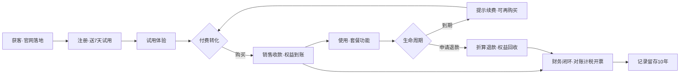
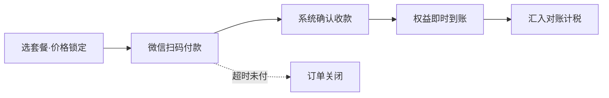
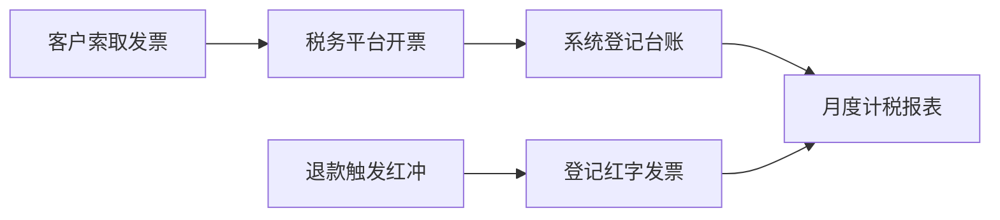
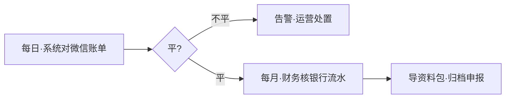
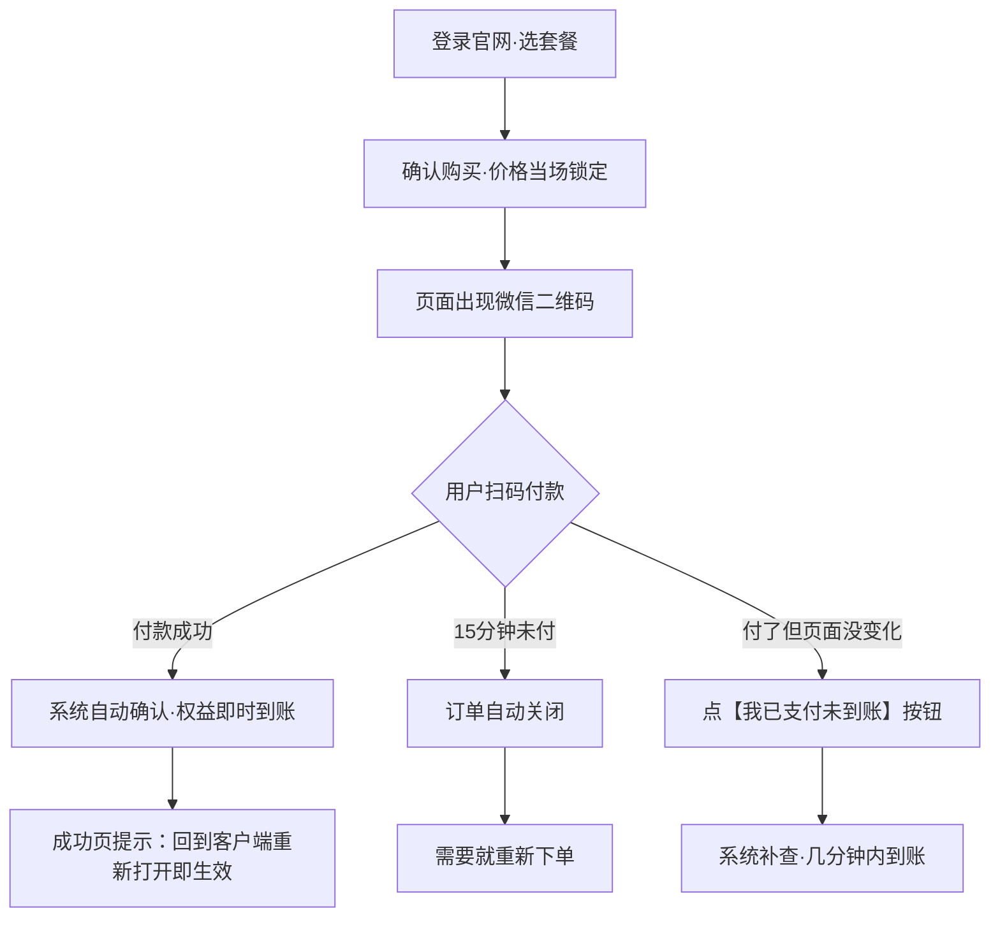
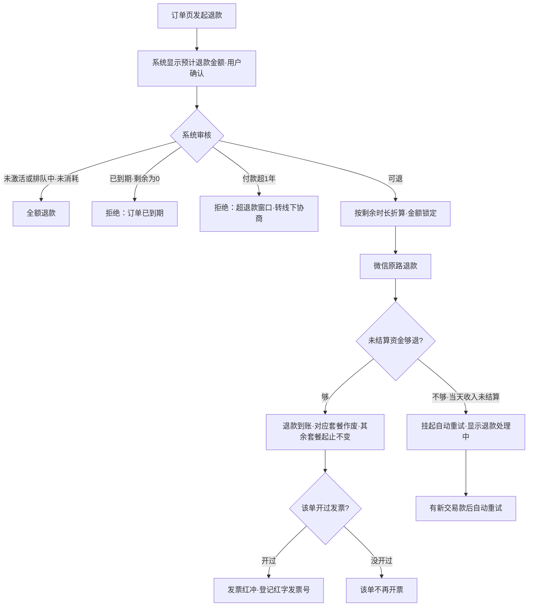
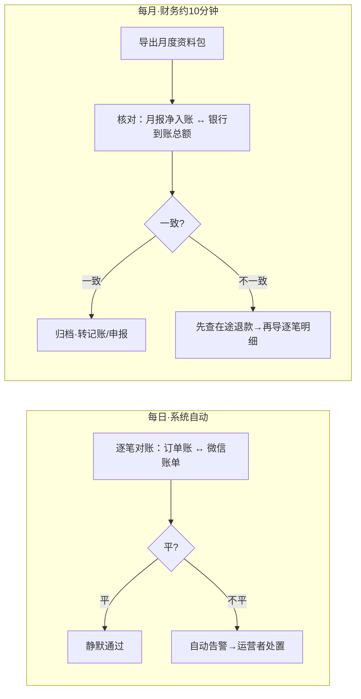
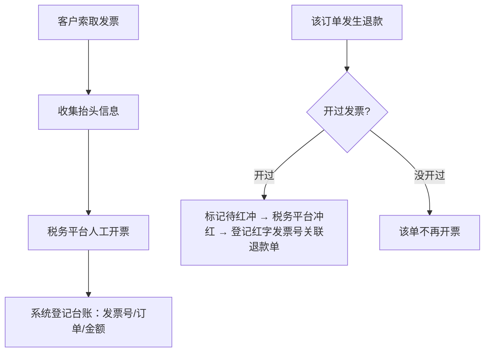

# 爱小说在线支付 · 业务与财务手册

> 给财务/记账人员看的业务口径文档。只讲钱、票、税、账，不讲技术。
> 依据：《S端 扫码支付探索纪要》（s-payment-explore.md）已拍板的全部口径。**文中价格为示例价，实际以系统后台配置为准**；商户号、结算银行卡信息由运营者提供后补记。
> 流程分三层：**L1 经营价值链（全局一条线）→ L2 业务场景组（每类事走什么路）→ L3 操作流程（具体步骤与异常分支，散在各章节）**。财务日常办事直接看 L3。

## 一、我们卖什么、怎么卖

| 项目 | 口径 |
| --- | --- |
| 商品 | 会员套餐：**档位 × 时长**——当前档位 PRO（规划中 MAX），每档按 **包月（30天）/ 包季（90天）/ 包年（365天）** 销售；新档位由后台配置上线 |
| 性质 | **一次性买断时长，到期不自动续费、不自动扣款**（购买页有明示） |
| 定价 | 各档基准价 × 该档折扣系数（示例：包月原价、包季 9 折、包年 8 折，卡片上直接显示折扣）。系数在后台按档调整，**用户下单那一刻的价格锁定**，之后调价不影响已下的单 |
| 收款渠道 | 官网（www.awesomenovel.com）在线购买，用户手机微信扫码支付 |
| 收款主体 | 微信支付商户号（结算到商户绑定的银行卡） |
| 试用 | 新用户注册送 7 天全功能试用，试用期内购买并激活，时长**接在试用期之后**开始算 |
| 激活 | **支付成功=套餐到账；在「我的套餐」点「激活」后才开始计时**。可以囤着：未激活的套餐不计时、不占设备额度、**退款全额**、长期有效不作废 |

**多买怎么算**：同一账号可以买多份，时长**先后衔接**（第一份到期后第二份开始），不是并行覆盖。例：1 月 1 日买包季（到 4 月 1 日），3 月 1 日又买包年 → 包年从 4 月 1 日算起，到次年 4 月 1 日。

**四个关键口径（每单独立）**：

0. **到货后需激活才开始计时**：支付成功套餐即到账；点「激活」后接在当前到期日之后开始。囤着的套餐随时可激活，激活前退款一律全额

1. **每笔订单可以单独退款**，退款只影响这一单对应的套餐，其他套餐的起止时间不变
2. 每份套餐**起止时间单独计算**，先买的先耗、后买的接力
3. **账户还剩多少时间 = 各订单未消耗时长累加**。例：1/1 买包季（到 4/1）、3/1 买包年（4/1 起次年 4/1 止）；3/15 退掉包季 → 包季按剩余折算退款作废，3/15~4/1 期间不是会员（退掉的这段钱已退），4/1 起包年照常生效，账户剩余 = 包年的 365 天

## 二、业务流程分层总览

### L1 · 经营价值链（全局一条线）

从获客到财务闭环的主线；**钱相关的环节（收款、退款、对账计税）全部汇入"财务闭环"**，任何一笔资金变动最终都在月度对账里收口。



### L2 · 业务场景组（四条场景线，每条一个 L2 流程）

| 场景组 | 干什么 | L3 详细流程在 |
| --- | --- | --- |
| ① 销售收款 | 下单到权益到账 | 第三节 |
| ② 退款 | 申请到权益回收、发票联动 | 第四节 |
| ③ 票税 | 开票、红冲、月度计税 | 第七节 |
| ④ 对账 | 每日自动 + 每月财务核对 | 第六节 |

**L2-① 销售收款**



**L2-② 退款**


**L2-③ 票税**



**L2-④ 对账**



### L3 · 操作流程

具体到人和系统、含异常分支的流程图，按场景挂在后续章节内（购买支付流程在第三节、退款流程在第四节、对账流程在第六节、开票红冲流程在第七节、资金状态图在第五节）。**财务日常办事照 L3 走。**

## 三、一笔交易的完整生命周期（L3 · 销售收款）

```
用户下单（价格锁定）→ 扫码付款 → 系统自动确认收款 → 权益即时到账
     →（如客户申请）退款 →（如客户索取）开发票 → 月度对账/计税
```

每一笔交易在系统里留三类记录：**订单**（谁、何时、买什么、付了多少）、**资金流水**（每一步变动的时间戳和凭据，只增不改）、**发票台账**。任何一笔钱都能从这三类记录里查清来龙去脉，保存期见第八节。

### 购买支付流程（L3）



## 四、退款规则（L3 · 退款）

**基本政策：按"退款发起日"的剩余时长折算退款，原路退回付款的微信。**

### 退款流程（L3）



### 折算怎么算

**按秒精确折算，不做任何时间取整；金额四舍五入到分。**

**退款金额 = 实付金额 × 剩余秒数 ÷ 总秒数**（用实付款算，打折买的按折后价折算，不受之后调价影响）。

两条不退的边界：

| 情形 | 处理 |
| --- | --- |
| 折算金额不足 1 分 | **不可退**（提示"剩余时长不足折算"）——这是唯一的最小颗粒，由货币自然决定 |
| 已到期（剩余为 0） | 不退 |

展示口径：订单页显示"剩余 X 天 Y 小时 Z 分，按规则预计退 ¥\*\*。\*\*"——展示用人类单位，计费精确到秒，两者互不影响。

例题（同一规则在不同定价下都成立，无需随价格调整）：

1. 月卡 30 元、剩 9 天 16 小时 48 分（9.7 天）：退 30×剩余秒÷30天总秒 = **¥9.70**
2. 月卡 60 元、剩 9 天 16 小时 48 分：**¥19.40**（同一公式，价格翻倍退款翻倍）
3. 年卡 365 元、第 100 天整退款（剩 265 天）：**¥265.00**
4. 季卡剩余 3 个月时又买了包年并激活（排队中、尚未开始消耗），当天退包年：**全额退 ¥365.00**
5. 囤单：买了包年（¥292 折后价）一直没激活，第 200 天退款：未激活=未消耗 → **全额退 ¥292.00**
6. 月卡 30 元、剩 45 分钟：30×2700÷2592000 = ¥0.03（小额也退，边缘公平）
7. 月卡 30 元、剩 10 分钟：折算 ¥0.007 → 不足 1 分 → **不可退**

### 三条特殊口径

- **重复支付无条件全额退**：用户以为付款失败又付了一笔（两笔都成功），多付的那笔全额退、不做折算
- **退款窗口期**：微信退款须在**付款后 1 年内**发起；超期系统自动拒绝，只能线下协商
- **同一人多单不是重复**：多笔付款 = 合法叠时长，**不主动退**；只有用户明确说"误付"才按上面处理

### 到账时间与失败处理

- 原路退回用户付款的微信：零钱一般实时到数分钟，银行卡 1~3 个工作日
- 当天的收入通常次日才结算，**当天退款可能因"钱还没结算"暂时退不出**——系统会自动挂起重试，用户端显示"退款处理中"，钱不会丢
- 用户微信/银行卡已注销等极端情况：微信侧会挂账，系统告警，人工与微信客服协同处理
- **确认退款后套餐立即停止使用**（折算以确认时刻为准）；若退款最终未成、经人工解冻，套餐恢复使用，按原到期日、冻结期间不补偿（确认退款即已接受停用）

## 五、钱去了哪：资金链路与三个口径的数

```
用户微信付款 30.00 元
   → 微信扣手续费（费率约 0.6%，以签约为准）= 0.18 元
   → 次日（T+1）自动结算到商户银行卡 29.82 元
   → 退款发生时：优先从"还没结算的钱"里原路退回
```

| 口径 | 含义 | 用途 |
| --- | --- | --- |
| 流水总额 | 用户实付合计（未扣手续费） | **增值税销售额按这个数** |
| 手续费 | 微信按费率扣取 | 记账时的费用科目 |
| 净入账 | 实际到银行卡的钱 | **与银行流水核对用** |

月度关系：净入账 ≈ 流水总额 − 手续费 − 当月退款。系统月报会同时给出这两个口径，不要混用。

### 未结算资金是什么（退款与对账的关键概念）

**未结算资金 = 用户已付款、微信已确认、但还没到结算时间打给商户银行卡的钱。** 钱在微信手里记在商户名下，商户不能挪用，但**可被退款优先划走**。

```
用户付款成功
   ▼
【待结算资金】─── 退款优先从这里原路退回（钱还没出门就退了）
   │ 每日自动结算（次日；扣手续费、冲抵当日退款；节假日到账可能顺延）
   ▼
 商户银行卡到账 ──► 银行流水（月度核对对象）

 待结算不够退时 → 从可用余额/后续交易款出 → 再不够 → 退款挂起，
 有新交易款进来后系统自动重试（用户端显示"退款处理中"，钱不会丢）
```

对财务的三个推论：

1. **银行卡到账 ≠ 当日流水总额**——到卡的是"前一日净额"（已扣手续费、已冲抵退款）；月度核对请用月报"净入账"口径，不要拿流水总额对银行
2. **当天收款当天退款最干净**：钱没离开过微信，结算时直接冲抵，银行端无痕
3. **退款会吃掉还没结算的钱**：某天大额退款后当日到卡金额变少甚至为零，属正常冲抵，不是短款

## 六、对账：系统做什么、财务做什么（L3 · 对账）

**系统每天自动做**：逐笔比对"系统订单账 ↔ 微信交易账单+退款账单"（订单号、微信单号、金额三键），不平自动告警，运营者会收到通知并处置。

**财务每月做两件事**（约 10 分钟）：

1. 核对**银行流水**：当月微信结算到卡总额 ↔ 系统月报"净入账"，总额一致即可
2. 导出**月度资料包**（系统一键导出）：对账单 + 逐笔明细 + 发票台账，转交记账/申报用

### 对账流程（L3 · 每日自动 + 每月人工）



月报样例结构：

| 项目 | 金额（示例） |
| --- | --- |
| 当月实收（流水总额） | ¥3,570.00 |
| 当月退款 | −¥265.00 |
| 微信手续费 | −¥21.42 |
| 净入账（应与银行流水一致） | ¥3,283.58 |
| 正常订单 / 退款订单笔数 | 119 / 2 |
| 开票 / 红冲 | 3 张 / 1 张 |

任何数字有疑问 → 系统里点开逐笔明细下钻到原始凭据，**每个数都能还原到单笔**。

## 七、发票（L3 · 票税）

- **不主动向客户推销开票**（收款页面不出现发票字样）；客户主动索取即开
- 开票方式：运营者在税务平台人工开具（个人/个体户按税局代开或数电票流程），**开完后在系统登记**：发票号、对应订单、金额、开票日期
- **已开票的订单发生退款 → 发票必须红冲**（不能作废删除），系统会自动把该发票标记"待红冲"并关联退款单；人工在税务平台冲红后，把红字发票号登记回系统
- **未开票的订单发生退款 → 不再开票**，系统自动标记
- 每月末核对发票台账：开了几张、红冲几张，与月报一致

### 开票与红冲流程（L3）



## 八、税务口径与记录留存

| 事项 | 口径 |
| --- | --- |
| 纳税义务时点 | **收款时**（即销售实现） |
| 增值税销售额 | 按**流水总额（全额）**，手续费不冲减（手续费计入费用） |
| 免税额度提示 | 月报自动标注当月销售额是否在小规模纳税人免税额度内（当前政策月销 10 万元以下免增值税，**以最新政策为准**） |
| 经营所得 | 净额口径可扣成本费用，申报时以会计处理为准 |
| 多缴退税 | 申请材料 = **原发票 + 红冲发票 + 退款单**三样，系统内一键调出（互相关联） |
| 记录留存 | 交易记录、资金流水、发票台账**保存 10 年**（满足电商法"不少于 3 年"与税法账簿凭证 10 年的双重要求）；系统层面只增不删 |
| 客户信息 | 系统不收集客户姓名、手机号；仅保留账号名与付款微信标识（争议举证用） |

## 九、常见情形处理口径（FAQ）

| 情形 | 处理 |
| --- | --- |
| 客户说"付了没到账" | 指引用订单页"我已支付但未到账"按钮（自动补查）；仍不行由运营者人工查单，几分钟内出结果 |
| 客户以为自动续费被扣钱 | 口径：一次性购买、到期不扣款；出示订单页明示 |
| 客户要求把订单转给别人 | 不转移。口径：本单折算退款，让对方用自己的账号重新购买 |
| 金额对不上的异常订单 | 系统自动冻结不发货、告警；核实后**全额退款**，绝不部分收款发货 |
| 未成年人充值退款 | 按微信支付平台争议处理流程协商；系统提供交易记录作为凭证 |
| 客户要开发票 | 能开：索取抬头信息 → 税务平台开具 → 系统登记台账，一般 3 个工作日内 |
| 财务发现月报与银行对不上 | 先查当月是否有大额退款在途（退款占未结算资金会推迟到账）；仍不平找运营者导对账明细 |

## 十、名词对照（系统里的词 → 财务的话）

| 系统术语 | 财务含义 |
| --- | --- |
| 订单（orders） | 销售单：谁、何时、买了什么档、应收/实收多少 |
| 资金流水（trade_events） | 序时账：每笔交易状态变动的原始记录，只增不改，可作对账凭据 |
| 发票台账（invoices） | 发票登记簿：票号、对应订单、红冲记录 |
| 对账报告（reconciliation） | 系统自动生成的日对账单 |
| 未结算资金 | 用户已付款、微信已确认、但还没结算到银行卡的钱；不能挪用、退款优先从这里出（详见第五节状态图） |
| 红冲 | 开一张负数发票冲抵原发票（税务上发票不能删，只能冲） |
| 净入账 | 到银行卡的钱 = 流水总额 − 手续费 − 退款 |
